## Why does RWKV matter?

At time of writing in July 2023, the best models of language are all
[Transformers](https://jalammar.github.io/illustrated-transformer/).

Their language modeling capabilities are so strong that they can be used
for a variety of cognitive tasks, from [agent
simulation](https://arxiv.org/abs/2212.01681) to [writing and debugging
code](https://arxiv.org/abs/2305.17126).

If you joined the world of neural networks [within the last two
years](https://twitter.com/charles_irl/status/1676639200131825664), you
could be forgiven for assuming that Transformers are an obvious type of
model for language, possibly going back to the beginnings of neural
networks [in the
1940s](https://www.cs.cmu.edu/~./epxing/Class/10715/reading/McCulloch.and.Pitts.pdf).

They are not.

Arguably the most natural model for language is the *recurrent neural
network*, or RNN, which is [basically "just" a
map-reduce](https://colah.github.io/posts/2015-09-NN-Types-FP/#deep-learning-functional-programming).
That is, we do a `for` loop over the input, building up a result
step-by-step.

As many Python programmers [learn early
on](https://medium.com/codex/say-goodbye-to-loops-in-python-and-welcome-vectorization-e4df66615a52),
`for` loops can be unbearably slow, and the trick to speed them up is
*vectorization*. That is, by hand or compiler, we rewrite the program to
operate on an entire sequence at once, instead of step-by-step.

Like vectorized programs, Transformers being trained operate on entire
sequences at once and so are more easily parallelizable -- and so that
training has been executed at the [molar
scale](https://twitter.com/charles_irl/status/1678815432487366656)
normally reserved for chemists, not programmers.

However, that benefit does not transfer to inference time, when we use
the Transformer to generate new sequences of text -- whether to chat
with a user or to drive a robot.

Instead, the choices that made the Transformer easy to parallelize make
inference expensive -- each time the model creates a new word, it must
in essence re-read the whole sentence up to that point, plus the new
word, before it can proceed with another.

Clever caching can convert (re-)computation to memory storage, but the
price must be paid.

But could it be different? Can we come up with an architecture that has
Transformers' non-negotiable parallelization at train time but without
the price at inference time?

Many alternative architectures have been proposed since the Transformer,
from [more efficient attention layers](https://arxiv.org/abs/2006.04768)
to [reworked convolutional networks](https://arxiv.org/abs/2302.10866).

These alternatives generally show promising results up to a certain
scale, say 1B parameters and 20B tokens, or \>50x less than less than
the current maximum scale for commercially available language models at
time of writing (70B parameters, 2T tokens).

However, they have a reputation for falling off the scaling laws at some
point shortly after.

The Receptance-Weighted Key-Value architecture, RWKV, has stayed on the
scaling laws up to 14B parameters and 331B training tokens, which makes
it, at time of writing, the largest-scale publicly-known non-Transformer
generative language model. See [the
paper](https://arxiv.org/abs/2305.13048) for details.

Through just some quick algebraic manipulation of exponentials, RWKV's
computations can be written in either of two ways: "time-parallel mode"
or "RNN mode".

Essentially, these exponentials look a bit like the softmax
normalization in Transformer attention (`exp(w * k) v / exp(w * k)`) in
time-parallel mode but look like a multiplicative decay in a memory
(`exp(-tw)`) in RNN mode. Alternatively, they look a bit like an
unrolled loop and its vectorized form.

So, with RWKV, we get to have our cakes and eat them too: parallelizable
training AND efficient inference AND Transformer-level language modeling
quality.

<b> Efficient, RNN-style inference means it's possible to run an `int8`
14B parameter RWKV model on sequences of *any* length with a constant
memory requirement of 3GB VRAM.</b> This opens up opportunities for
language model-powered cognitive features in tightly-constrained edge
environments with streaming inputs, like robotics, even if RWKV turns
out, like other Transformer alternatives, to fall off the scaling laws
eventually.

This blog post walks through how RWKV's RNN-style inference works, based
on the thesis that unvectorized code is easier to understand and gets
you most of the way to understanding the whole system.

## Why read this post?

There are other write-ups on RWKV, so why read this one?

It's a matter of taste!

-   The [RWKV paper](https://arxiv.org/abs/2305.13048), uses equations
    to explain the architecture, and this post uses Python code. The
    code is woven into the explanatory text, [literate programming
    style](https://www.youtube.com/watch?v=C8kDPmb_IKU). If you'd like
    to execute and edit that code while reading, check out the Google
    Colab version [here](https://tfs.ai/rwkv-explainer-colab). It's also
    aimed at experts, and this post starts from the beginning on
    autoregressive language modeling.

-   The (excellent) [blog post on RWKV by contributor Johan
    Wind](https://johanwind.github.io/2023/03/23/rwkv_details.html) on
    which this post is based also interweaves code with text and is
    aimed at a broad audience, but it is written in numpy. That makes a
    lot of the state-handling explicit and is great if you're familiar
    with that library, but the code looks quite different from an
    implementation in PyTorch, which is more typically used to implement
    neural networks like RWKV.

-   The [reference PyTorch
    implementation](https://github.com/BlinkDL/ChatRWKV/blob/main/RWKV_in_150_lines.py)
    is written for concision (single-letter variable names, minimal
    comments) and robustness (numerical tricks). The implementation in
    this post is written to be understood and sacrifices performance for
    clarity, e.g. including runtime type checking, but produces
    identical results.

One last note on style and audience: this is most definitely a tutorial!

**If you're already friendly with Transformers and in a hurry, feel free
to skip down to the "zero-layer RWKV" section.**

## Setup

Since we're writing real code that runs in [an executable Colab
notebook](https://tfs.ai/rwkv-explainer-colab), not pseudocode, we've
got to do a bit of setup.

### Dependencies and Utilities

There's nothing too interesting here -- we'll talk about the libraries
as they come up.

``` python
# Colab comes with lots of packages already -- see https://research.google.com/colaboratory/local-runtimes.html
# install a package for handling text input to the model
%pip install -qqq tokenizers==0.13.3 1> /dev/null
# install packages for runtime typechecking of arrays, more on this later!
%pip install -qqq beartype==0.14.1 jaxtyping==0.2.20 1> /dev/null
# install a neat little package for visualizing PyTorch graphs
%pip install -qqq torchview==0.2.6 1> /dev/null


# bring in some utilities from a GitHub gist
!wget --quiet https://tfs.ai/rwkv-explainer-utils -O utils.py

import utils  # useful stuff that distracts from the main points about RWKV and LMs
from utils import LoadingMixin, display_graph, make_graph, prep_weights
```

### Configuring Torch

We'll implement RWKV in PyTorch, a popular Python wrapper around fast
tensor math and automatic differentiation in C++.

``` python
import torch
```

But we're just talking about RWKV during inference, not training, so we
don't need the differentiation.

``` python
torch.autograd.set_grad_enabled(False);
```

We use double-precision (64 bit) floating point numbers in our tensor
math, accepting a big slow-down so that we can totally ignore numerical
stability in favor of clarity.

This is a tutorial, so our brains are the rate-limiting component, not
the machines!

``` python
torch.set_default_dtype(torch.float64)
```

### Downloading and Setting Up Weights

Like other neural networks, a trained RWKV model is defined in terms of
a large number of floating point numbers, called the "weights" or
"parameters" of the model.

We want our outputs to 1) look like real language and 2) be comparable
to [the reference
implementation](https://github.com/BlinkDL/ChatRWKV/blob/main/RWKV_in_150_lines.py),
so we pull down those trained weights for the 430M parameter RWKV-4
model.

``` python
from pathlib import Path

weights_path = Path("RWKV-4-Pile-430M-20220808-8066.pth")

if not weights_path.exists():
    !wget -q https://huggingface.co/BlinkDL/rwkv-4-pile-430m/resolve/main/{weights_path.name} 1> /dev/null

print(f"Loading {weights_path}")
weights = torch.load(weights_path, map_location="cpu")

weights = prep_weights(weights)
```

    Loading RWKV-4-Pile-430M-20220808-8066.pth

## Defining the External Interface: Strings and Tokens

We're going to work "backwards" from the model's external interface to
its internals.

So we'll spend a bit of time up front on language modeling in general.

If the phrase "Like a Transformer LM, an RWKVLM is an autoregressive
probabilistic model of sequences of linear embeddings from a vocabulary
of tokens" makes sense to you, you can skim this section and the next.
Jump back in at the "zero-layer RWKV" section.

If not, let's make it make sense!

### Tokenizer: the string-token and token-string interface

For our model, a *language* is a collection of sequences of *tokens*
from a *vocabulary* -- you might think of the tokens as letters from the
alphabet "vocabulary" forming sentences in the English language, or
bytes forming valid strings.

It's be great if our tokens [were just the bytes in
strings](https://arxiv.org/abs/2105.13626), so we could just use strings
as the interface between the world of language and our model, but the
tokens for the most capable language models, including this version of
RWKV, aren't quite so simple -- they are collections of letters that
appear together frequently.

So to define our tokens, we need to construct a `Tokenizer`, a sort of
"baby language model" that works directly on bytes/letters and feeds its
outputs to the "real language model".

In the cell below, we pull down the `Tokenizer` that goes with RWKV-4
430M.

``` python
from tokenizers import Tokenizer

tokenizer_path = Path("20B_tokenizer.json")

if not tokenizer_path.exists():
    !wget -q https://raw.githubusercontent.com/BlinkDL/ChatRWKV/main/{tokenizer_path.name} 1> /dev/null

tokenizer = Tokenizer.from_file(str(tokenizer_path))
```

The tokenizer can encode and decode `str`ings as sequences of `int`egers
identifying tokens in our vocabulary.

``` python
from collections.abc import Callable

tokenizer.token_to_id: Callable[[str], int]
```

That last line is a [type
annotation](https://realpython.com/lessons/type-hinting/) -- by itself
it doesn't do anything other than document something. In this case, it's
saying that `.token_to_id` is

-   a `Callable` method
-   that takes in `[]` a `str`ing
-   and returns an `int`eger.

Like this:

``` python
id = tokenizer.token_to_id("Drosophila")

id
```

    37815

We can also convert back to a string with our `Tokenizer`

``` python
print(tokenizer.id_to_token(id))
```

    Drosophila

So the `Tokenizer` handles both ends of the outermost interface for our
model: it translates between the strings that humans (and traditional
software!) like and our token identifiers.

The vocabulary always has a specific, finite size.

For us, it's ~50,000:

``` python
N_VOCAB = 50_277

token_id = N_VOCAB + 10
if 0 <= token_id < N_VOCAB:
    assert tokenizer.id_to_token(N_VOCAB) is None
    print(f"index {token_id} is in vocab")
else:
    assert tokenizer.id_to_token(N_VOCAB) is None
    print(f"index {token_id} is not in vocab")
```

    index 50287 is not in vocab

So we can identify a token identifier with just a single integer.

That's not a great way to represent data for a neural network, so we'll
need to do another transformation before we're ready to hand things off.

Why is an integer not a great input?

Neural networks are [trained using
calculus](https://www.youtube.com/watch?v=MDL384gsAk0&list=PLD80i8An1OEGZ2tYimemzwC3xqkU0jKUg&index=4),
so they need something smoother, like `float`s.

And they work best when there are a lot of numbers, aka on an array or
`Tensor` with large dimensions.

So let's convert our token-identifying integers into `Tensor`s full of
`float`s.

PyTorch gives us the tools we need to dynamically manipulate `Tensor`s
in Python using fast compiled C++ code. Great!

Unfortunately, providing good types for dynamic tensors is hard (for the
curious: you need type-level arithmetic, variadic generics, and more).

So there isn't great support built into the Python type system or into
PyTorch itself.

So let's pull in a typing library, `jaxtyping`, to get some nice
`Tensor` types.

``` python
from jaxtyping import Float64

Float = Float64  # convenient type synonym, good for easily switching float types later
```

Because our vocabulary is a fixed size, there's a neat, if somewhat
wasteful, way to represent the token id `ii` as a `Tensor`: make a big
`Tensor` with `0`s everywhere except in the index `ii`, which is `1`.

This is called a `One`-`Hot` representation, and it is a kind of
"sparse" tensor -- one that's mostly zeros.

``` python
OneHot = Float[torch.Tensor, f"vocabSize={N_VOCAB}"]

OneHot
```

    jaxtyping.Float64[Tensor, 'vocabSize=50277']

Notice that our type includes some nice metadata, documenting its size
and what that size means.

We're going to need `OneHot`s a lot, so let's define a function to
create them:

``` python
def to_onehot(k: int) -> OneHot:
    out = torch.zeros(N_VOCAB)
    out[k] = 1.
    return out

to_onehot(1)
```

    tensor([0., 1., 0.,  ..., 0., 0., 0.])

That type annotation is nice documentation of the intended interface for
this function.

But the [best documentation is automatically
checked](https://twitter.com/bernhardsson/status/1682162391574880256?s=20)
so that it stays in sync with the code it documents.

So let's bring in a runtime type checker! That way you know you can
trust the type signatures you're reading.

We'll use `beartype`:

``` python
from beartype import beartype, roar

to_onehot = beartype(to_onehot)

try:
    print(to_onehot("hey"))
    assert False, "the code in this blog post is wrong!"
except roar.BeartypeCallHintException:
    print("🐻 rawr! that input type is not allowed")

try:
    print(to_onehot(N_VOCAB - 1))
except roar.BeartypeCallHintException:
    assert False, "the code in this blog post is wrong!"
```

    🐻 rawr! that input type is not allowed
    tensor([0., 0., 0.,  ..., 0., 0., 1.])

In some places, we'll use `int`s as the `Id`entifiers of our `Token`s.
In others, we'll use the `OneHot` tensor.

So we define a type that is either an `int` or (`|`) a `TokenId`.

``` python
TokenId = int | OneHot

TokenId
```

    int | jaxtyping.Float64[Tensor, 'vocabSize=50277']

### `AutoregressiveLM`: a token-token interface for language modeling

Now that we can convert from strings to tokens, we have the inputs to
our language model.

To understand the output of our language model, we need to be a bit more
precise about what it does.

Language models are probabilistic. They can make *inferences* about
sequences of tokens. For example, they can predict which word is missing
from a sequence or which word might come next if it were to continue.

That means our model deals in chance or plausibility, not deterministic
outcomes. We will output `Probabilities`.

An *autoregressive language model* uses the beginning of a sequence to
predict the `Next` `Token` in the sequence.

RWKVLM is an autoregressive language model, so it will output
`NextTokenProbabilities` -- a tensor with a probability for each element
of the vocab, representing the model's estimate of the chance that token
comes next in the sequence.

``` python
NextTokenProbabilities = Float[torch.Tensor, f"vocabSize={N_VOCAB}"]

NextTokenProbabilities
```

    jaxtyping.Float64[Tensor, 'vocabSize=50277']

With these in hand, we can define the behavior of an `Autoregressive`
`L`anguage `M`odel:

``` python
class AutoregressiveLM(torch.nn.Module):
    """An LM that can continue a sequence by generating one token at a time."""

    @beartype
    def generate(self, sequence: str="", N: int=1, temperature=1.0, top_p=1.0) -> NextTokenProbabilities:
        """Generates N additional tokens that might follow the provided sequence."""

        token_ids = tokenizer.encode(sequence).ids

        if not (sequence_length := len(token_ids)):  # handle empty sequence
            probs: NextTokenProbabilities = self(0)  # 0 is a special token id, marks a boundary

        for ii in range(sequence_length + N):
            if ii < sequence_length:  # at first, tokens come from the sequence
                token = token_ids[ii]
            else:  # then after that, we're generating new tokens
                token = utils.sample(probs, temperature=temperature, top_p=top_p)

            # we get the probabilities for the next token by calling the model on the current token
            probs: NextTokenProbabilities = self(token)

            # and print the sequence as we go
            utils.streaming_print(tokenizer.decode([token]))

        return probs
```

<small> The `temperature` and `top_p` parameters are included so that we
can match the typical generation interface for models like OpenAI's
GPT-4 and Anthropic's Claude, but the details don't matter to us today,
so we've abstracted them behind the `utils.sample` function. </small>

At the core, we're just doing in Python what we said in English above:
predicting the next token in a sequence repeatedly, based on what we've
seen so far, by calling the model (`self`) on the latest `token`.

You might wonder how our model knows about the past of the sequence,
since we're just calling it with the current `token`.

The key is that we're inheriting from `torch.nn.Module` here.

A `Module` is like a function, in that its main purpose is to be called,
but it is also like an object, in that it is also able to hold onto
state from iteration to iteration.

That state is where we'll hold onto the parameters of the model. It's
also where we'll hold onto information about past tokens we've seen.

But, you might object, we skipped defining what happens when the model
is called!

That's true, but we can just define it now -- for a `Module`, that's
done via the `forward` method:

``` python
@beartype
def forward(self, token: TokenId) -> NextTokenProbabilities:
    token = to_onehot(token) if isinstance(token, int) else token

    # use that onehot to retrieve the token's dense vector representation, or "embedding"
    embedded_token: Embedding = self.embedding(token)  # yes, DNN people really do say "embedding" this much

    # apply the "meat" of the model to enrich the embedding (with sequence context plus knowledge from the weights)
    sequence_embedding: Embedding = self.blocks(embedded_token)

    # use that to assign probabilities to each possible next token
    probs: NextTokenProbabilities = self.unembedding(sequence_embedding)

    return probs


# attach forward to our AutoregressiveLM class
AutoregressiveLM.forward = forward
```

This is a neat little pattern that Python supports but which you rarely
see outside of a notebook environment: defining methods after the class
has been defined.

We'll do this throughout the post so that we can split implementations
into smaller pieces and focus on important details first.

In the cell above, we've isolated just the `forward` method.

Right now, it's pretty abstract: it calls some method called `embedding`
that returns an `Embedding`, which it passes through a method called
`blocks` that returns a new `Embedding`. That final piece is
`unembed`ded to produce the `prob`abilities we need to fit the
`AutoRegressiveLM` interface.

At this high of a level, there's no difference between an
`AutoregressiveLM` that uses Transformer-style blocks and one that uses
RWKV-style blocks.

Following our "inside-out" approach, we'll first define the `embedding`
and `unembedding`, in the next section, before we dive into the
RWKV-specific details.

We'll close out this section, and our implementation of
`AutoregressiveLM`, by defining how it's initialized:

``` python
def __init__(self, embedding_layer, blocks, unembedding_layer):
    super(AutoregressiveLM, self).__init__()
    self.embedding: TokenEmbedding = embedding_layer
    self.blocks: Callable[[Embedding], Embedding] = blocks  # RWKV will go here
    self.unembedding: Unembedding = unembedding_layer

AutoregressiveLM.__init__ = __init__
```

## Defining the Internal Interface: `Embedding`s and `Unembedding`

Our autoregressive language model uses this `Embedding` type as its
internal representation.

Let's see how it is produced from our `TokenId`s and how it gets turned
into `NextTokenProbabilities`.

### `TokenEmbedding`: From token identifiers to dense tensors

The inputs and outputs of neural networks are often sparse tensors, as
we saw with the `OneHot`s above: most of the entries are zeros.

But in their guts, neural networks are tensor calculus machines,
applying dense tensors of floats to dense tensors of floats.

So the "interface" inside of our network is a dense tensor -- and one
much smaller than our vocabulary.

The internals of our network will all "speak" dense tensor.

There are many other names for these dense float tensors, but we'll
stick with `Embedding` since that has taken off in the era of
embedding-based vector search for LLMs, and we'll use `channel` to refer
to an individual dimension, because `EmbeddingDimension` is a mouthful.

Why are they called "embeddings"? Roughly, because they are created by
taking a pointy object, like our collection of `OneHot` tensors that are
all far away from each other (imagine 50,000 vertices on a big cube),
and smushing them together into a smooth object. Vicki Boykis has a
great write-up [here](https://vickiboykis.com/what_are_embeddings/).

``` python
N_EMBD = 1024
Embedding = Float[torch.Tensor, f"channels={N_EMBD}"]
# aka internal representation, aka hidden state, aka latents, aka "residual stream"
Embedding
```

    jaxtyping.Float64[Tensor, 'channels=1024']

We build another `torch.nn.Module` to compute our `Embedding`s.

It has two steps: first we compute the dense vector from our `OneHot`
and then we normalize it, so that its length is always the same.

``` python
@beartype
def forward(self, token: TokenId) -> Embedding:
    token = to_onehot(token) if isinstance(token, int) else token
    embedded_token: Embedding = self.embedding(token)
    normalized_embedded_token = self.normalize_emb(embedded_token)

    return normalized_embedded_token
```

We'll be normalizing our embeddings a lot. You might ask why.

Like with many things in neural networks, the typical answer is "it
helps with optimization" and the real answer is "the thing stops working
if we don't".

But how exactly do we do our normalization and how do we get that dense
vector?

PyTorch has built in `nn.Module`s for these operations, so we can just
add them to our `TokenEmbedding` `Module` when it gets initialized.

``` python
def __init__(self):
    super(TokenEmbedding, self).__init__()
    self.embedding = torch.nn.Linear(in_features=N_VOCAB, out_features=N_EMBD, bias=False)
    self.normalize_emb = torch.nn.LayerNorm(N_EMBD)
```

Applying a `Linear` layer to a `OneHot` just pulls out one of the
columns.

The normalizer subtracts the mean and divides by the standard deviation,
which makes the length of the `Embedding` 1, then multiplies by a number
to set the length.

That number, and the values in the `Linear` layer's columns, aren't
based on the inputs. They are "learned parameters" of the model, learned
during training.

So we need to load the values from the `weights` that we downloaded
during the setup -- which we do by adding a janky class from our
`utils`, a `LoadingMixin`

``` python
class TokenEmbedding(LoadingMixin, torch.nn.Module):
    """A layer that converts token IDs into vectors our network's blocks can work with."""

TokenEmbedding.__init__ = __init__
TokenEmbedding.forward = forward
```

which adds a `from_weights` method that we can use to create the class
directly from our `weights`.

Now we can initialize the `TokenEmbedding` with the correct weights and
take a look at it:

``` python
embs = TokenEmbedding.from_weights(weights)

embs
```

    TokenEmbedding(
      (embedding): Linear(in_features=50277, out_features=1024, bias=False)
      (normalize_emb): LayerNorm((1024,), eps=1e-05, elementwise_affine=True)
    )

Hmm, that's kind of a lame visualization.

It's nice for printing to terminal logs, but we're in a browser, so we
can do better.

Let's use the [`torchview`
library](https://github.com/mert-kurttutan/torchview) to get something
cooler: a trace of all the pieces of our model, to a variety of levels
of detail (`depth` in our tree of `Module`s).

``` python
for depth in range(3):
    display_graph(make_graph(TokenEmbedding(), depth=depth, input_data=to_onehot(0)))
```

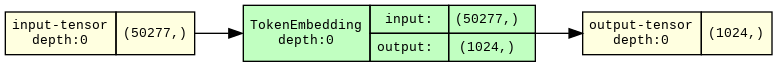

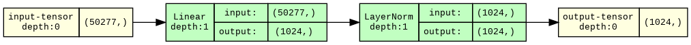

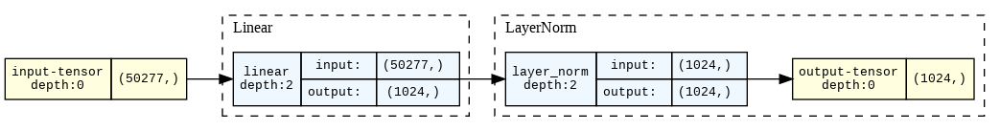

Read from top to bottom, these diagrams say:

1.  This module is called `TokenEmbedding` and takes in `50_277`
    dimensional tensors and returns `1024` dimensional tensors.
2.  That `TokenEmbedding` is made up of a `Linear` module and a
    `LayerNorm` module.
3.  The `Linear` module calls a function named `linear` amd the
    `LayerNorm` module calls a function named `layer_norm`.

### `Unembedding`: from dense vectors to token probabilities

Once we're done processing with our network, we need to get back to a
probability distribution over tokens, which we can finally turn into
specific tokens and then strings.

The `Unembedding` layer gets us from our `Embedding`s to
`NextTokenProbabilities`:

``` python
class Unembedding(LoadingMixin, torch.nn.Module):
    """A layer that converts our network's internal representation into a prediction."""

    @beartype
    def forward(self, x: Embedding) -> NextTokenProbabilities:
        normalized_embedding = self.normalize_unemb(x)
        logits = self.unembedding(normalized_embedding)  # "logits" basically means "unnormalized probabilities"

        # we convert them to probabilities with the softmax function
        probs: NextTokenProbabilities = torch.nn.functional.softmax(logits, dim=-1)

        return probs
```

For the `Unembedding`, we use the same `Module`s as the
`TokenEmbedding`, but in reverse:

``` python
def __init__(self):
    super(Unembedding, self).__init__()
    self.normalize_unemb = torch.nn.LayerNorm(N_EMBD)
    self.unembedding = torch.nn.Linear(in_features=N_EMBD, out_features=N_VOCAB, bias=False)

Unembedding.__init__ = __init__

for depth in range(3):
    display_graph(make_graph(Unembedding(), depth=depth, input_data=torch.zeros(N_EMBD)))
```

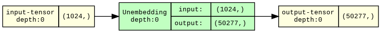

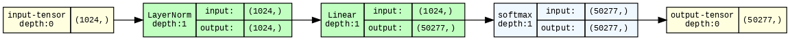

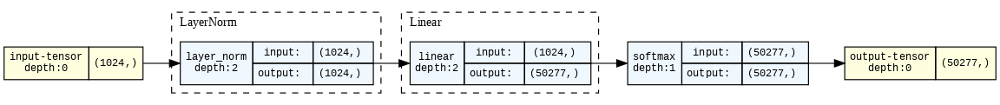

And that's it for the `Unembedding` -- we just need to load in the
weights.

``` python
unembs = Unembedding.from_weights(weights)
```

Now we can translate from our model's `Embedding`s to the `Tokenizer`'s
vocabulary and from there to strings for humans!

## A "`marwkv`" model: zero-layer RWKV

The simplest RWKV model has no blocks in the middle -- just embedding
and unembedding.

It's equivalent (up to those pesky normalization layers) to the
[zero-layer
Transformer](https://transformer-circuits.pub/2021/framework/index.html#zero-layer-transformers).

It's entirely linear -- all adds and multiplies -- so it's actually a
type of logistic regression!

And, because it has no way to track or store information over time, it
predicts the next token from just the most recent token.

A model that can only see the present value when generating the next is
known as a [*Markov chain*](https://en.wikipedia.org/wiki/Markov_chain).

So, never ones to miss a good pun, we'll call it the maRWKV model.

``` python
marwkv = AutoregressiveLM(
    embs,
    torch.nn.Identity(),  # do nothing
    unembs
)


for depth in range(4):
    viz_marwkv = AutoregressiveLM(TokenEmbedding(), torch.nn.Identity(), Unembedding())
    display_graph(make_graph(viz_marwkv, depth=depth, input_data=to_onehot(0)))
```

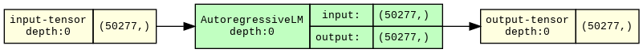

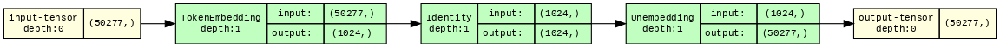

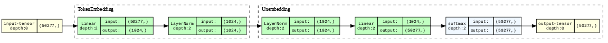

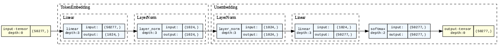

Let's see what happens when we run it.

Let's take a nice long token from the vocab -- `Drosophila`, the [genus
of fruit flies](https://en.wikipedia.org/wiki/Drosophila).

``` python
marwkv.generate("Drosophila", N=1, temperature=0.0);  # temperature == 0 means just take the most likely token
```

    Drosophila melan

Nice! That looks like the beginning of the rest of the scientific name
of *Drosophila melanogaster*, the
[dark-bellied](https://en.wiktionary.org/wiki/melanogaster#Latin) fruit
fly species used in genetic research.

Let's keep going:

``` python
marwkv.generate("Drosophila", N=2, temperature=0.0);
```

    Drosophila melanospor

Oh dear! That's not `melanogaster`!

`melanospor` is the beginning of another frequently-used scientific
name: `melanosporum`, the species name of the [French black
truffle](https://en.wikipedia.org/wiki/Tuber_melanosporum).

A Markov chain is like a game of telephone: each token is generated only
with knowledge of the one immediately previous.

This gives Markov language models a decidely "free-association" energy.

And "Drosophila melanosporum" is the scientific nomenclature equivalent
of "Harry Potter-y Barn" or "Saddam Hussein Obama".

How can we do better?

## Defining Internal Computation and Propagation: Gated MLP and Attention

For better language generation, we need two things:

-   More layers, so that we can do more complex processing on each token
-   More context, so information is preserved from more than just the
    previous token

The RWKV blocks we add will do both!

To fit multiple `RWKVBlock`s into our `AutoregressiveLM` interface,
which expects just one `Module` (and one which maps `Embedding`s to
`Embedding`s) in the middle, we'll combine them using
`torch.nn.Sequential`.

Really, we end up just calling them one after the other:

``` python
class RWKV(LoadingMixin, torch.nn.Module):

    @beartype
    def forward(self, x: Embedding) -> Embedding:
        for ii, block in enumerate(self.blocks):
            x = block(x)
        return x

    def __init__(self, rwkv_blocks: list):
        super().__init__()
        self.blocks = torch.nn.Sequential(*rwkv_blocks)
```

Before defining those `blocks`, let's get a clearer picture of just what
is meant by "doing more complex processing" and "adding more context".

This is best seen from an example, which we take from Figure 9 in the
appendix of [the RWKV paper](https://arxiv.org/abs/2305.13048),
reproduced below, which shows how the model produces the token *Paris*
to continue the sequence *The Eiffel Tower is located in the city of*.

<small> For more on how this plot is made, see [the original paper on
"causal tracing"](https://arxiv.org/abs/2202.05262).</small>


The horizonal axis is what we just added with the `RWKV` class's
`blocks` -- as we move from left to right in the graph, a given token is
being processed by more and more blocks.

The vertical axis is "time", aka "sequence length" or the "sequence
dimension". As we move from top to bottom, a token is being processed in
the context of more and more tokens.

Each time we apply our model to a token, all of the model's layers are
applied -- we move through a row of the graph.

The figure shows that the fact that Eiffel Tower is in the city of Paris
arises in an early layer: observe the dark purple color in the row for
the *el* token, beginning at layer 4/5 or so.

Put another way, the `Embedding` for the *el* token has been "enriched"
with additional information: that jumble of floating point numbers now
expresses that the noun phrase this token is part of refers to an object
in the city of Paris.

Enriching tokens with information about the world from outside the
sequence is done primarily by the MLP modules in a Transformer. In RWKV,
that will be done by a similar module, a `GatedMLP`.

Later tokens in the sequence, like *city*, do not have this information
in them -- nor should they! Despite what some Francophiles might claim,
not all cities are Paris.

Instead, that information is first propagated deeper into the network:
see the purple line moving from left to right.

At some point, that information does need to be transferred to later
tokens -- at the very least, it needs to make it to the final token in
the sequence to get added to the `NextTokenProbabilities`.

We can see that in roughly layer 20: follow the purple vertical line
downwards from the *el* token to the *of* token. From there the
information that the Eiffel Tower is in Paris propagated to the output.

Routing information across time is the responsibility of the `Attention`
modules of a Transformer. We'll give the same name to the module that
achieves the same outcome in RWKV, even though it works quite a bit more
like a memory: information is added to *all future embeddings*.

Let's put that all together:

``` python
class RWKVBlock(torch.nn.Module):
    """The core "block" in the RWKV architecture, which updates the embedding."""

    @beartype
    def forward(self, x: Embedding) -> Embedding:
        # attention enriches embedding using sequence memory
        dx: Update = self.attention(self.ln1(x))
        x: Embedding = x + dx  # preserve inputs as much as possible

        # gated MLP enriches embedding by doing computations
        dx: Update = self.gated_mlp(self.ln2(x))
        x: Embedding = x + dx  # again, preserve inputs

        return x
```

Okay, we slipped in a `l`ayer `n`ormalization, which is important but
uninteresting.

But what is an `Update`?

It's just a synonym for `Embedding`!

``` python
Update = Embedding
Update
```

    jaxtyping.Float64[Tensor, 'channels=1024']

Again, we're using the type hints for documentation -- it helps us
separate which `Tensor`s are used for what.

Now, let's define how our `Block` gets initialized:

``` python
def __init__(self):
    super(RWKVBlock, self).__init__()
    self.ln1 = torch.nn.LayerNorm(N_EMBD)
    self.attention = AttentionBlock()

    self.ln2 = torch.nn.LayerNorm(N_EMBD)
    self.gated_mlp = GatedMLP()


RWKVBlock.__init__ = __init__
```

The `LayerNorm`s we recognize.

For the other layers, let's just put in placeholders, like we did for
the RWKV blocks in the zero-layer model, so that we can visualize our
architecture again and focus on the overall flow.

``` python
class GatedMLP(torch.nn.Identity):
    """Placeholder"""

class AttentionBlock(torch.nn.Identity):
    """Placeholder"""

display_graph(make_graph(RWKVBlock(), input_data=torch.zeros(N_EMBD), depth=1, graph_dir="TD"))
```

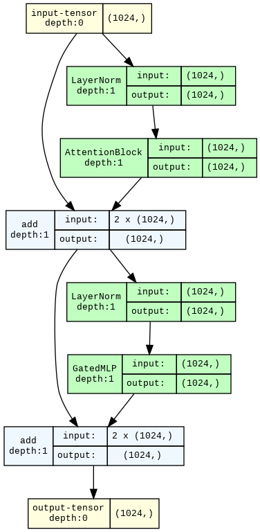

Follow that arrow on the left -- it connects the input to the output
with only additions.

This is a *residual connection*, which is also a [very important feature
of
Transformers](https://transformer-circuits.pub/2021/framework/index.html).

This residual connection is one reason why we could we could just rip
out the entire middle of the network and still get reasonable outputs:
each layer ends up just adjusting the output of the previous layer,
rather than starting from scratch, so the inputs of the first block and
the outputs of the last block are similar enough that the unembedding at
the end can read either!

It's also important, like our normalization layers, for stabilizing
optimization.

### The Gated MLP

Alright, now let's dive into the implementation of the simpler of the
two components in the block, the `GatedMLP`.

The `MLP` part is pretty standard and looks like the same part of the
Transformer but uses non-standard nomenclature -- the input layer's
weights are called `key` weights and the output layer's weights are
called `value` weights.

The other two pieces, the `mixer`s and the `gating`, are less standard.

We'll define them below.

``` python
from torch import sigmoid


class GatedMLP(torch.nn.Module):
    """Applies an MLP (matrix, nonlinearity, matrix) with gated outputs."""

    @beartype
    def forward(self, x: Embedding) -> Update:
        # "mix" current input with the previous input
        mixed_x: Embedding = self.mlp_mixer(x)
        # put that through an MLP
        mlp_outputs: Embedding = self.value(self.nonlinearity(self.key(mixed_x)))
        # non-standard nomenclature, probably because of this paper https://arxiv.org/abs/2012.14913

        # "mix" the current input with the previous input again, with different weights
        mixed_x_receptance: Embedding = self.receptance_mixer(x)
        # use that to calculate how "receptive" each dimension of embedding is to new inputs
        receptance: Embedding = self.receptance(mixed_x_receptance)

        # convert that receptance to a 0-1 value with a sigmoid
        gating_values: Embedding = sigmoid(receptance)
        # then use those as "gating" by multiplying them
        dx: Update = gating_values * mlp_outputs

        return dx
```

The `receptance`/`gating` is not present in the MLP portion of a
Transformer. It's [more of an RNN
thing](https://arxiv.org/abs/1412.3555).

If you graph it, the `sigmoid` function is shaped like an elongated *s*,
with the bottom left of the s at `(-inf, 0)` and the top-right at
`(inf, 1)`. It turns the `receptances`, which can be any floating point
number, into multiplicative `gating_values`, numbers that are between
`0` and `1`.

When the `gating_value` for a channel is close to `0`, the value of `dx`
in that channel for the `GatedMLP` is also close to `0`. Effectively, we
don't `Update` that channel of the `Embedding` with the MLP's output.

Essentially, the `mlp_output` computation decides what *might* be
returned, and the `receptance` decides *whether* it's returned.

Now, let's talk `mixer`s.

At multiple points in the RWKV architecture, information from the
current embedding is mixed with information from the most recent
embedding.

This is important when inividual tokens in the language are not very
meaningful, e.g. when you're working directly with bytes, rather than
with `Tokenizer`s that have tokens like `Drosophila`.

The mixers are probably not a critical feature of the architecture, but
they're there and working through an implementation will help us
practice handling state in PyTorch, so let's go for it!

Here's the `forward` -- notice how we use the `last_x` value as part of
our calculations and assign the `current_x` value to that variable
before we finish.

``` python
class Mixer(LoadingMixin, torch.nn.Module):
    """Returns a per-entry-weighted combination of current input and previous input."""

    @beartype
    def forward(self, current_x: Embedding) -> Embedding:
        out =  mix_embeddings(current_x, self.last_x, self.weight)
        self.last_x: Embedding = current_x  # store for later
        return out
```

The specific way these mixers combine embeddings is by a weighted
combination.

The weights are *per-channel*, i.e. different dimensions of the
embedding get mixed differently.

``` python
ChannelParameter = Float[torch.Tensor, f"params={N_EMBD}"]  # one parameter for each embedding dimension

@beartype
def mix_embeddings(x: Embedding, y: Embedding, mixing_params: ChannelParameter) -> Embedding:
    """Mixes two embeddings with weights given by the mixing_params."""
    return x * mixing_params + y * (1 - mixing_params)

mix_embeddings
```

    <function __main__.mix_embeddings(x: jaxtyping.Float64[Tensor, 'channels=1024'], y: jaxtyping.Float64[Tensor, 'channels=1024'], mixing_params: jaxtyping.Float64[Tensor, 'params=1024']) -> jaxtyping.Float64[Tensor, 'channels=1024']>

Now, let's write an `init` for the `Mixer` class.

Handling the weights is easy enough -- we've had parameters in many of
our `Module`s, but they've been handled for us by PyTorch, like in
`Linear` and `LayerNorm`.

We just need to explicitly assign a `torch.nn.Parameter` to store our
mixing weights.

But what about the `last_x`? It's not exactly a `Parameter`, but we
still need to store it.

We can use `register_buffer` to store extra, non-`Parameter` information
in our `torch.nn.Module` -- it's very similar to creating a `Parameter`,
but interacts differently with gradients during training.

``` python
def __init__(self):
    super(Mixer, self).__init__()
    self.weight = torch.nn.Parameter(torch.zeros(N_EMBD))
    self.register_buffer("last_x", torch.zeros(N_EMBD), persistent=False)  # persistent=False means "don't save to disk"

Mixer.__init__ = __init__

for depth in range(2):
    display_graph(make_graph(Mixer(), input_data=torch.zeros(N_EMBD), depth=depth))
```

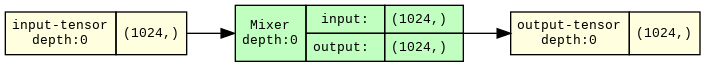

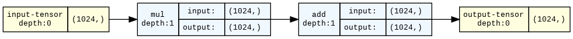

Note that the buffers and parameters don't show up in the graph! It only
shows the tensors we input or produce, not the ones we store.

Now, we can round out our `GatedMLP` implementation with an `init`:

``` python
MLP_HIDDEN_DIM = 4096  # note: 4 x N_EMBD

def __init__(self):
    super(GatedMLP, self).__init__()
    # again, non-standard terminology of RWKV: "key" is first layer of MLP, "value" is second
    self.key = torch.nn.Linear(N_EMBD, MLP_HIDDEN_DIM, bias=False)
    self.nonlinearity = SquaredReLU()  # non-standard nonlinearity
    self.value = torch.nn.Linear(MLP_HIDDEN_DIM, N_EMBD, bias=False)

    self.mlp_mixer, self.receptance_mixer = Mixer(), Mixer()
    self.receptance = torch.nn.Linear(N_EMBD, N_EMBD, bias=False)

GatedMLP.__init__ = __init__
```

Oh, one more thing, the `nonlinearity` in the middle of the MLP is
non-standard too.

It's the usual `ReLU` layer, but with the output `Squared`:

``` python
Latents = Float[torch.Tensor, f"latents={MLP_HIDDEN_DIM}"]

class SquaredReLU(torch.nn.Module):
    def forward(self, x: Latents) -> Latents:
        return torch.nn.functional.relu(x) ** 2

for depth in range(2):
    display_graph(make_graph(SquaredReLU(), input_data=torch.zeros(MLP_HIDDEN_DIM), depth=depth))
```

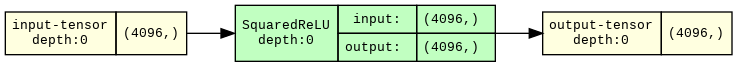

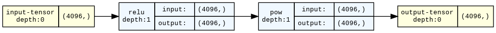

That's a complete implementation, so we can take a look at the graph.

``` python
for depth in range(2):
    display_graph(make_graph(GatedMLP(), depth=depth, input_data=torch.zeros(N_EMBD)))
```

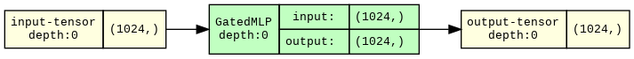

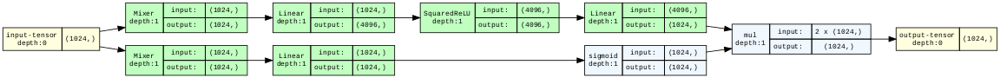

We can see the two mixers on the far left.

The one on the top feeds into a linear-nonlinear-linear cascade --
that's the `MLP`.

The one on the bottom feeds into a sigmoid before being multiplied --
that's the `Gated` part.

### The "Attention" Block

With that warm-up done, let's tackle the harder of the two pieces: the
"attention" block that handles information routing over time.

For this one, let's start with the `__init__`.

We've got a bunch of `Linear` layers, which again go by the names `key`
and `value` and `receptance`, plus one more to determine our final
`output`.

We've also got matching `Mixer`s for the `key`s, `value`s, and
`receptance`s.

The only really new piece is the `WKVMemory`.

``` python
class AttentionBlock(torch.nn.Module):
    def __init__(self):
        super().__init__()

        # linear operations
        self.key = torch.nn.Linear(N_EMBD, N_EMBD, bias=False)
        self.value = torch.nn.Linear(N_EMBD, N_EMBD, bias=False)
        self.receptance = torch.nn.Linear(N_EMBD, N_EMBD, bias=False)
        self.output = torch.nn.Linear(N_EMBD, N_EMBD, bias=False)

        # mixers
        self.key_mixer, self.value_mixer = Mixer(), Mixer()
        self.receptance_mixer = Mixer()

        # memory
        self.memory: torch.nn.Module = WKVMemory()
```

#### The secret sauce: `WKVMemory`

But it's a big piece!

The memory is the heart of the architecture, and it's both very
different from any component of a Transformer and fairly complicated.

But, as a wise model once said, ["let's work this out in a step-by-step
way to be sure we have the right
answer"](https://arxiv.org/abs/2211.01910).

We'll start with the components, which we define in the `init`.

As with the mixers, we have some parameters that operate on channels and
we have some persistent state to track.

``` python
class WKVMemory(torch.nn.Module):
    """A memory module whose contents exponentially decay over time, at a different rate per channel."""
    def __init__(self):
        super().__init__()

        # learned memory parameters -- one value for each dimension in the embeddings
        self.log_gain: ChannelParameter = torch.nn.Parameter(torch.zeros(N_EMBD))
        self.log_decay: ChannelParameter = torch.nn.Parameter(torch.zeros(N_EMBD))

        # state buffers to track information across a sequence
        contents, normalizer = torch.zeros(N_EMBD), torch.zeros(N_EMBD)
        self.register_buffer("contents", contents, persistent=False)
        self.register_buffer("normalizer", normalizer, persistent=False)
```

The names for these parameters, `gain` and `decay`, come from signal
processing.

A `gain` is used to attenuate or amplify a signal. We'll use it only on
the current embedding, so our memory can treat it specially, relative to
the stored information.

A `decay` parameter determines the rate at which a signal attenuates
over time. We'll use it on the information stored in the memory so that
it goes away over time -- fading towards `0`.

The memory has two pieces of state to track:

-   the `contents` track the information observed so far, accumulating
    over time

-   they're unnormalized, so we also track a `normalizer` for those
    `contents`.

The final "state of" or "information in" the memory is their ratio,
`contents / normalizer`.

As part of a forwards pass, we update both, so our "memory" is some kind
of average across time of what we've seen so far.

Here's what that looks like:

``` python
from typing import Tuple

ScalingWeight = Float[torch.Tensor, f"positiveEntries={N_EMBD}"]  # positive number, one per channel

@beartype
def update(self, importances: ScalingWeight, values: Embedding) -> Tuple[Update, Update]:
    """Updates the memory by incrementing time and mixing in the weighted input values."""
    # decay the information currently in memory by one step
    self.step()

    # compute new information to add to the memory
    contents_update: Update = importances * values  # scale each value by the matching importance weight
    normalizer_update: Update = importances  # keep track of the weights so we can normalize across steps

    # and then add the new information to the memory
    self.contents += contents_update
    self.normalizer += normalizer_update # -- including updating the normalizer!

    # and return it
    return contents_update, normalizer_update


WKVMemory.update = update
```

Without the decay step, the ratio of `contents` and `normalizer` would
be just a *weighted average* of past values.

That is, for each channel, we're accumulating (`+=`) the weighted
`values` into the `content` and the `weights` into `normalizer`, and
`contents/normalizer` is their ratio: the weighted average.

But once we include the decay `step`, each channel in the memory becomes
an *exponential moving* weighted average:

``` python
from torch import exp


def step(self):
    """Pushes the information currently in the memory towards zero."""
    decay_rate: ScalingWeight = exp(self.log_decay)  # exp ensures that decay rate is positive
    self.contents *= exp(-decay_rate)  # decay_rate > 0, so exp(-decay_rate) < 1
    self.normalizer *= exp(-decay_rate)  # so each .step shrinks the contents and normalizer towards 0


WKVMemory.step = step
```

That is, we repeatedly multiply the `contents` (and their `normalizer`!)
with a number between 0 and 1, determined by our `decay_rate`.

If a channel had an infinitely large `decay_rate`, its state would just
be the most recent `value` in that channel.

Channels with very large decay rates are common early in the network.

If it had a `decay_rate` of 0, the channel would go back to being a
weighted average.

That allows for longer-term integration of information, and channels
with very low decay rates are common later in the network.

Now let's look at the full `forward` pass for the memory.

It's almost as simple as

-   update the memory
-   return the memory's state, aka `contents / normalizer`

but there's one small complication -- the `gain`, which gets applied to
just the most recent value.

The `gain` ensures that the most recent value is treated differently
than all past values.

Here's what that looks like:

``` python
@beartype
def forward(self, values: Embedding, importances: ScalingWeight) -> Update:
    """Applies the RWKV "time-mixing block" forward pass, in the "RNN Cell" style.

    For details, see https://arxiv.org/abs/2305.13048, Appendix B, Eqn. 19-22 and Fig. 7."""
    # first, we update the memory and return what we just added
    latest_contents, latest_normalizer = self.update(importances, values)

    # then, we adjust the representation of the latest information
    latest_contents, latest_normalizer = self.apply_gain(latest_contents, latest_normalizer)

    # before adding it in and dividing, to get the final thing we report as output
    out: Update = (self.contents + latest_contents) /           \
                  (self.normalizer + latest_normalizer)

    return  out


WKVMemory.forward = forward
```

By the way, this is where we hit the numerical instability that requires
us to use `float64` in this implementation. We are taking exponents
(dangerous) and dividing them (doubly dangerous).

The official implementation uses several tricks to remove this
instability and allow the use of lower precision floats, but they add a
lot of complexity to code that's already pretty tough to follow.

To finish out our implementation of `WKVMemory`, let's add the `gain`:

``` python
def apply_gain(self, latest_contents, latest_normalizer):
    """Applies the channelwise gain to the latest contents and normalizer."""
    gain = exp(self.log_gain) - 1  # -1 < gain < inf

    boosted_contents = gain * latest_contents
    boosted_normalizer = gain * latest_normalizer

    return boosted_contents, boosted_normalizer


WKVMemory.apply_gain = apply_gain
```

When the gain parameter for a channel is at its lowest value, `-1`,
applying it removes the update we added. That channel is always "one
step behind" and its output only reflects the past -- useful for
spreading information across tokens.

<small>This way of writing it is another source of numerical instability
in this implementation: we add and then subtract, which is unfortunately
not quite the same as doing nothing when floats are involved.</small>

When the gain for a channel is very large, the output of the memory is
always the same as the input value in that channel -- much like having a
very large `decay_rate`.

When the gain for the channel is close to `0`, the current value is
treated the same as past values.

The graph representation isn't particularly helpful for the `WKVMemory`,
because this `Module` doesn't have any sub-modules.

But if you look closely, you can see the memory updates. They're the
`add_` operations -- `_` means "in-place" in PyTorch.

``` python
for depth in range(2):
    display_graph(make_graph(WKVMemory(), depth=depth, input_data=(torch.zeros(N_EMBD), torch.zeros(N_EMBD))))
```

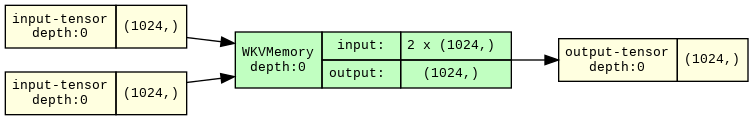

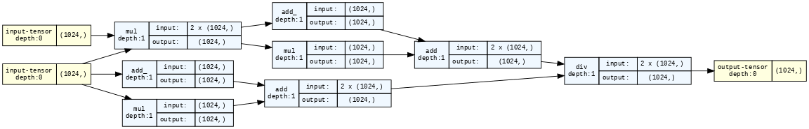

#### The rest of the `AttentionBlock`

Let's see how the memory gets incorporated into the `AttentionBlock`.

In short, we

-   calculate the `keys` and `values`, after running the `Mixer`s,
-   use the `exp`onentiated `keys` as weights to store the `values` in
    the `memory`,
-   calculate `gating` for our memory's output based on `receptance`s,
    and finally
-   use one more `Linear` layer to calculate our final `Update`.

Which looks like this:

``` python
@beartype
def forward(self, x: Embedding) -> Update:
    # as with the MLP, do mixers before anything else
    mixed_keys = self.key_mixer(x)
    keys: Embedding = self.key(mixed_keys)

    mixed_values = self.value_mixer(x)
    values: Embedding = self.value(mixed_values)

    # wkv: apply "w"eighted decay to merge
    #      current info ("k"eys and "v"alues) with past
    wkv: Embedding = self.memory(values, exp(keys))

    # decide how "r"eceptive each channel is to inputs
    mixed_receptances = self.receptance_mixer(x)
    receptances: Embedding = self.receptance(mixed_receptances)
    gating_values = sigmoid(receptances)

    # rwkv: use the "r"eceptances to gate the output of the "wkv" memory
    rwkv: Embedding = gating_values * wkv

    # and then do one final linear transform before returning it
    dx: Update = self.output(rwkv)

    return dx

AttentionBlock.forward = forward
```

The graph view, below, is a helpful summary of the flow in this block.

The three `Mixer`s-with-`Linear`-transformations appear first.

One is used via `sigmoid`-then-`mul` to gate the rest -- that'd be the
`receptances`.

The other two are used in the `WKVMemory` -- but the `keys` are first
`exp`onentiated into importance weights.

``` python
display_graph(make_graph(AttentionBlock(), depth=1, input_data=torch.zeros(N_EMBD), graph_dir="TD"))
```

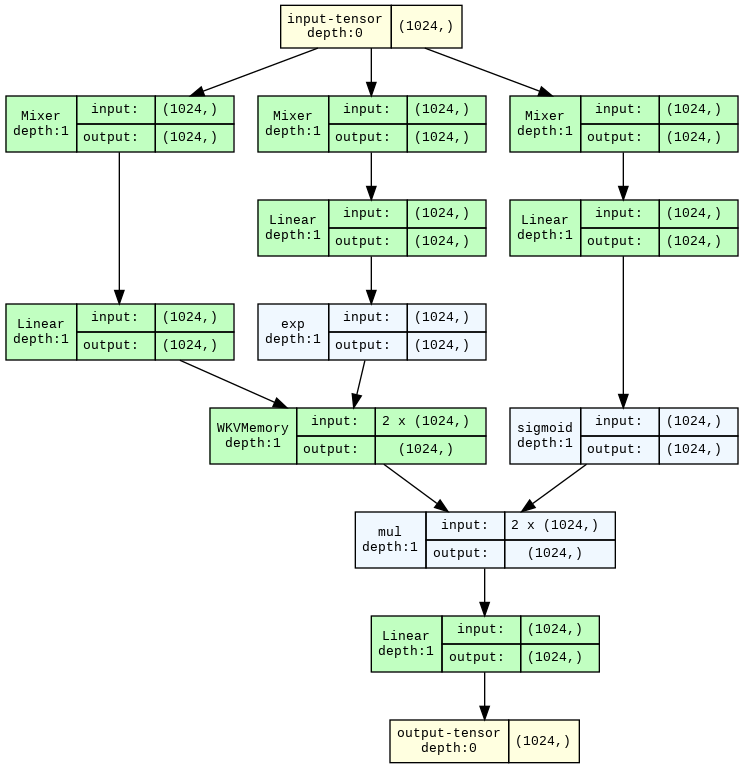

Notice that there are no "queries" -- there's nothing we compare to the
`keys` to decide which `values` are important.

That makes this very different from Transformer attention, which looks a
lot more like a lookup from a key-value store -- so much so that you can
implement it [in
Redis](https://colab.research.google.com/drive/1QC3XgiuTaryc4hipKcJG6aYeXZ0hVqtT?usp=sharing),
a popular key-value database.

Instead, determining what is relevant as we proceed through the
sequence, aka deciding what's worth our attention, is split into
deciding *what to store in memory right now* and *what from our memory
is relevant right now*.

1.  We decide what to store in our memory by calculating `values` and
    assigning them importances via the (`exp`onentiated) `keys`.
2.  We decide what's relevant right now by using the `receptances` to
    filter the `wkv` memory.

Hence `rwkv`.

<b>This is the core of what makes RWKV's inference easier on the RAM
than Transformer inference: we explicitly store information from the
past, rather than looking the information up from the past every time we
need it!</b>

It also makes the memory a bottleneck, which is one reason why you might
suspect that a model like RWKV might not be as capable as a Transformer
of the same size.

That [hasn't been the case up to 14B
parameters](https://arxiv.org/abs/2305.13048), but scale can reveal
hidden issues!

That said, 14B parameters is big enough to get some pretty useful
behavior out of a language model, so with RWKV, efficient-inference LMs
have already secured a spot in the language modeling tech stack!

## Putting it all together

Let's see what the graph view looks like for an entire `RWKVBlock`.

``` python
display_graph(make_graph(RWKVBlock(), depth=2, input_data=torch.zeros(N_EMBD), graph_dir="TD"))
```

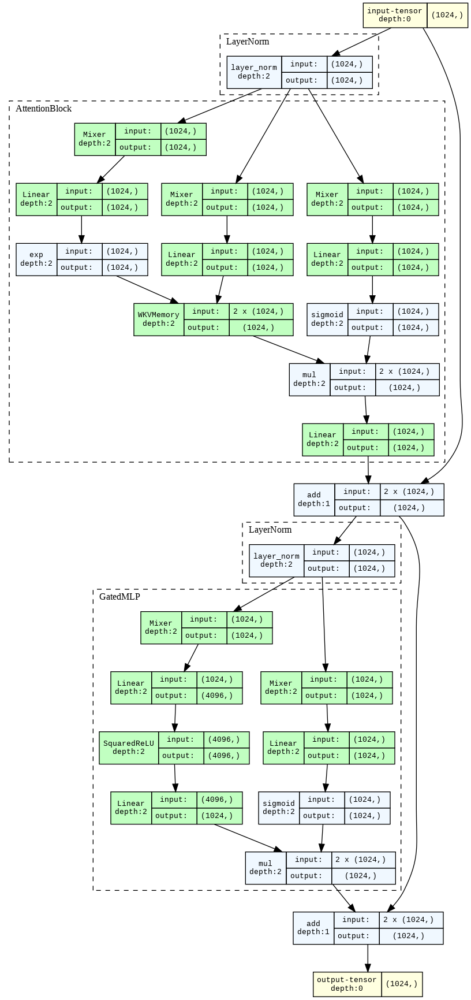

What could be simpler?

But in all seriousness: these graphs can be very helpful adjuncts to the
code!

To really grok this architecture, I recommend pulling one of the graphs
up in a separate window and mapping it onto the matching module's code.

Now, let's run a few layers and see if the added ability to store
information about past tokens solves the `Drosophila melanosporum`
problem.

``` python
k = 2
short_rwkv = RWKV.from_weights(weights, [RWKVBlock() for _ in range(k)])
short_rwkvlm = AutoregressiveLM(embs, short_rwkv, unembs)
short_rwkvlm = short_rwkvlm.eval()

out = short_rwkvlm.generate(sequence="Drosophila", N=2, temperature=0.0)
```

    Drosophila melanog

Success! We're starting to get the rest of "melanogaster", the expected
following token.

But we've got one more thing to handle: we've written how to add state
to the memory and the mixers, but we haven't written any way to remove
information, so our model will just accumulate information forever, and
we'd need to reinitialize it if we wanted to start "fresh" on a new
sequence.

Let's add a quick helper to clear out state:

``` python
def clear_buffers(module, verbose=False):
    for name, buffer in module.named_buffers():
        if verbose:
            print(f"clearing buffer {name}")
        buffer.zero_()


AutoregressiveLM.clear_buffers = clear_buffers
RWKV.clear_buffers = clear_buffers
RWKVBlock.clear_buffers = clear_buffers
```

## Running a "real" model: RWKV-4 430M

Okay, so we can run a toy model with a few layers and get three tokens
in a row to make sense.

That's cool, but what about the entire RWKV-4 430M model whose weights
we've been using?

Let's close our examination of RWKV inference with that!

First we initialize it:

``` python
N_LAYER = 24
rwkv_blocks = [RWKVBlock() for _ in range(N_LAYER)]

rwkv = RWKV.from_weights(weights, rwkv_blocks)

rwkv4 = AutoregressiveLM(embs, rwkv, unembs)
rwkv4 = rwkv4.eval()
```

And then we run it:

``` python
rwkv4.clear_buffers()

out = rwkv4.generate(sequence="Drosophila", N=8, temperature=0.0)
```

    Drosophila* and *Drosophila melanogaster*

Interestingly, it starts adding some Markdown formatting -- scientific
names are usually written *Like this*, which is formatted in Markdown
`*Like this*`.

Lastly, let's confirm that the model can generate reasonable text.

More than that, let's check that it outputs *the same text* as [the
official
reference](https://github.com/BlinkDL/ChatRWKV/blob/main/RWKV_in_150_lines.py)!

This is the main test I used to check that my implementation was really
equivalent.

``` python
rwkv4.clear_buffers()

sequence = """
In a shocking finding, scientist discovered a herd of dragons living in a remote, previously unexplored valley, in Tibet. """ + \
"Even more surprising to the researchers was the fact that the dragons spoke perfect Chinese."

rwkv4.generate(sequence, N=20, temperature=0.0);
```


    In a shocking finding, scientist discovered a herd of dragons living in a remote, previously unexplored valley, in Tibet. Even more surprising to the researchers was the fact that the dragons spoke perfect Chinese.

    The dragons were discovered by a team of researchers from the University of California, Berkeley, who

[Go
Bears](https://dailycal.org/2019/10/14/go-bears-rallying-cry-or-meme).
