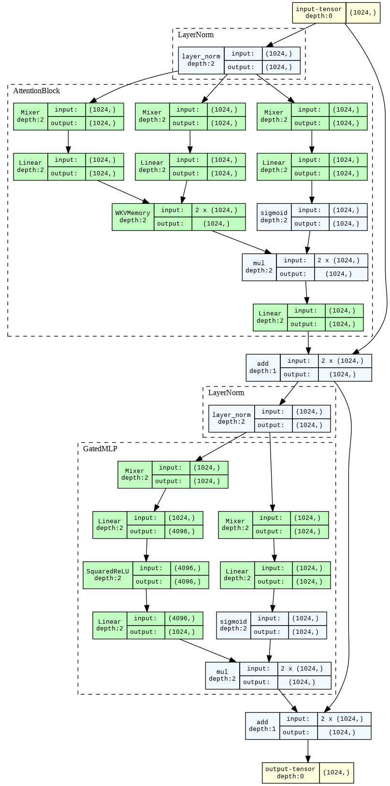
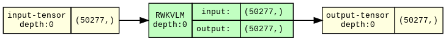
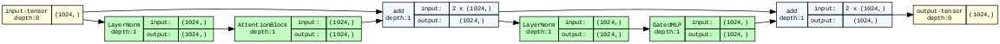
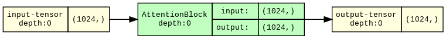
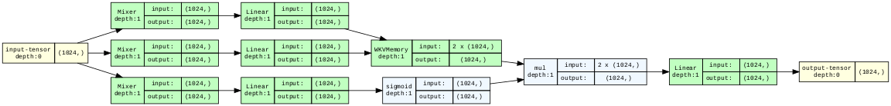
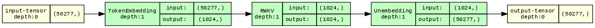
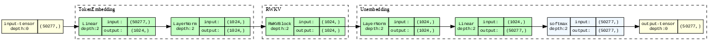
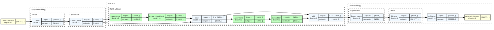
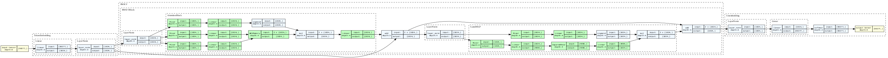
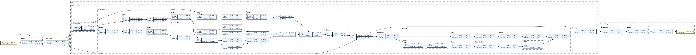

``` python
from IPython import display

# an RWKVBlock broken down into its two components: an AttentionBlock and a GatedMLP
display.Image("https://i.imgur.com/VTiPQTG.png")
```



## Why Does This Matter?

-   RNNs are natural for sequence models
    -   “Infinite” context
-   But RNNs are not as data-efficient (see Kaplan et al. paper)
-   Transformers are more data-efficient and are fast during training
    (because highly parallelizable), but that benefit doesn’t transfer
    to inference time
    -   GPUs are less useful at inference time — batch size 1
-   RWKV’s architecture cleverly uses exponentials to define memory so
    that they get both Transformer-style parallelization during training
    in a recurrent architecture
-   RWKV paper and code hard to parse — single-letter variable names and
    non-standard nomenclature.

Took the code in [this
post](https://johanwind.github.io/2023/03/23/rwkv_details.html) and
rewrote it

-   in PyTorch
-   using `Module`s
-   step-by-step with visualizations

## Setup

### Dependencies and Utilities

Nothing interesting here -- we'll talk about the libraries as they come
up!

``` python
# install a package for handling text input to the model
%pip install -qqq tokenizers==0.13.3 1> /dev/null
# install packages for runtime typechecking of arrays, more on this later!
%pip install -qqq beartype==0.14.1 jaxtyping==0.2.20 1> /dev/null
# install a neat little package for visualizing PyTorch graphs
%pip install -qqq torchview==0.2.6 1> /dev/null


# bring in some utilities from a GitHub gist
!wget --quiet https://tfs.ai/rwkv-explainer-utils -O utils.py

import utils  # useful stuff that distracts from the main point about RWKV and LMs
from utils import LoadingMixin, display_graph, make_graph, prep_weights
```

### Configuring Torch

We're implementing this in PyTorch, which provides a Python wrapper
around fast tensor math and automatic differentiation (`autograd`).

But we're just talking about RWKV inference, so no need to calculate
gradients

``` python
import torch


torch.autograd.set_grad_enabled(False);
```

We use double-precision floats, accepting a big slow-down so that we can
totally ignore numerical safety in favor of clarity.

This is a tutorial, so our brains are the slow step.

``` python
torch.set_default_dtype(torch.float64)
```

### Downloading and Setting Up Weights

``` python
from pathlib import Path

weights_path = Path("RWKV-4-Pile-430M-20220808-8066.pth")

if not weights_path.exists():
    !wget -q https://huggingface.co/BlinkDL/rwkv-4-pile-430m/resolve/main/{weights_path.name} 1> /dev/null

print(f"Loading {weights_path}")
weights = torch.load(weights_path, map_location="cpu")

weights = prep_weights(weights)
```

    Loading RWKV-4-Pile-430M-20220808-8066.pth

## Defining the External Interface: Autoregressive Language Modeling

We're going to work "backwards" from the model's external interface to
its internals.

So we'll spend a bit of time up front on language modeling.

If the phrase "Like Transformers, RWKV is an autoregressive
probabilistic model of sequences of linear embeddings from a vocabulary
of tokens" makes sense to you, you can skim this section.

Combine a new token with an existing state to predict the next token and
update the state.

WTF is a token?

``` python
from tokenizers import Tokenizer

tokenizer_path = Path("20B_tokenizer.json")

if not tokenizer_path.exists():
    !wget -q https://raw.githubusercontent.com/BlinkDL/ChatRWKV/main/{tokenizer_path.name} 1> /dev/null

tokenizer = Tokenizer.from_file(str(tokenizer_path))
```

``` python
from collections.abc import Callable

TokenId = int

tokenizer.token_to_id: Callable[[str], TokenId]
id = tokenizer.token_to_id("Drosophila")

id
```

    37815

``` python
print(tokenizer.id_to_token(id))
```

    Drosophila

``` python
N_VOCAB = 50_277

token_id = N_VOCAB
if 0 <= token_id < N_VOCAB:
    assert tokenizer.id_to_token(N_VOCAB) is None
    print(f"index {token_id} is in vocab")
else:
    assert tokenizer.id_to_token(N_VOCAB) is None
    print(f"index {token_id} is not in vocab")
```

    index 50277 is not in vocab

This is is a single integer.

Neural networks like big arrays of floats, or `Tensor`s.

Typing tensors is hard.

Let's use a friendly library, `jaxtyping`, to get some nice `Tensor`
types.

``` python
from jaxtyping import Float32, Float64
from jaxtyping import Int

Float = Float64  # convenient type synonym

OneHot = Float[torch.Tensor, f"vocabSize={N_VOCAB}"]

OneHot
```

    jaxtyping.Float64[Tensor, 'vocabSize=50277']

``` python
TokenId = int | OneHot

TokenId
```

    int | jaxtyping.Float64[Tensor, 'vocabSize=50277']

``` python
def to_onehot(k: int) -> OneHot:
    out = torch.zeros(N_VOCAB)
    out[k] = 1.
    return out

to_onehot(1)
```

    tensor([0., 1., 0.,  ..., 0., 0., 0.])

But Python type annotations are more like guidelines.

Let's bring in a runtime type checker!

`beartype` decorator.

``` python
from beartype import beartype, roar

to_onehot = beartype(to_onehot)

try:
    print(to_onehot("hey"))
    assert False, "something went horribly wrong!"
except roar.BeartypeCallHintException:
    print("🐻 rawr! that input type is not allowed")

try:
    print(to_onehot(N_VOCAB - 1))
except roar.BeartypeCallHintException:
    assert False, "something went horribly wrong!"
```

    🐻 rawr! that input type is not allowed
    tensor([0., 0., 0.,  ..., 0., 0., 1.])

A probabilistic model of sequences returns a distribution over possible
future sequences.

An *autoregressive* sequence model does that by producing a probability
distribution over the next step in the sequence.

``` python
NextTokenProbabilities = Float[torch.Tensor, f"vocabSize={N_VOCAB}"]

NextTokenProbabilities
```

    jaxtyping.Float64[Tensor, 'vocabSize=50277']

So an autoregressive language model

``` python
class RWKVLM(torch.nn.Module):
    """A language model that uses RWKV."""

    @beartype
    def forward(self, token: TokenId) -> NextTokenProbabilities:
        token = to_onehot(token) if isinstance(token, int) else token

        # use that onehot to retrieve the token's vector representation
        embedded_token: Embedding = self.embedding(token)  # yes, DNN people really do say "embedding" this much

        # apply the "meat" of the model to enrich the embedding (with sequence context plus knowledge from the weights)
        sequence_embedding: Embedding = self.blocks(embedded_token)

        # use that to assign probabilities to each possible next token
        probs: NextTokenProbabilities = self.unembedding(sequence_embedding)

        return probs


RWKVLM.forward
```

    <function __main__.RWKVLM.forward(self, token: int | jaxtyping.Float64[Tensor, 'vocabSize=50277']) -> jaxtyping.Float64[Tensor, 'vocabSize=50277']>

But how can we get tokens back from those probabilities? Shouldn't the
method for that live here?

Fun trick: you can add methods to a class after defining it in Python!

We'll do this throughout the post so that we can split implementations
into smaller pieces and focus on important details first.

We `generate` more text from a `context` by `sample`-ing according to
the `next_token_prob`abilities provided by the language model.

The `sample`-ing part isn't specific to RWKV, so we'll just use the
implementation in our `utils`.

<small> PS: don't worry too much about `temperature` and `top_p` either.
We've included them because they're used to control sampling from
language models in general, so they're also unrelated to RWKV. </small>

``` python
def generate(self, context: str="", N: int=1, temperature=1.0, top_p=1.0, verbose: bool=False):
    """Generates N additional tokens that might follow the provided context."""
    if verbose:
        print("Preprocessing context")

    context_token_ids = tokenizer.encode(context).ids

    if not (context_length := len(context_token_ids)):  # handle empty context
        next_token_probs = self(0)  # 0 is a special token, <|endoftext|>

    for ii in range(context_length + N):
        if ii < context_length:  # at first, we're consuming tokens from the context
            token = context_token_ids[ii]
        else:  # then after that, we're generating new tokens
            token = utils.sample(next_token_probs, temperature=temperature, top_p=top_p)

        utils.streaming_print(tokenizer.decode([token]))

        next_token_probs = self(token)

    return next_token_probs

RWKVLM.generate = generate
```

Let's close out this section by defining the `init` for the `RWKVLM`:

``` python
def __init__(self, embedding_layer, rwkv, unembedding_layer):
    super(RWKVLM, self).__init__()
    self.embedding: TokenEmbedding = embedding_layer
    self.blocks: RWKV = rwkv
    self.unembedding: Unembedding = unembedding_layer

RWKVLM.__init__ = __init__
```

We'll spend the rest of this post defining what each of these pieces
does and how it works -- first the `TokenEmbedding` and `Unembedding`,
then the real meat of the architecture, the `RWKV` blocks.

### Mapping tokens to embeddings: dense vectors

Dense vectors support vibes-based operations, like retrieval.

``` python
N_EMBD = 1024
Embedding = Float[torch.Tensor, f"channels={N_EMBD}"]
# aka channels, aka internal representation, aka hidden state, aka latents, aka "residual stream"
Embedding
```

    jaxtyping.Float64[Tensor, 'channels=1024']

We build a `torch.nn.Module` to compute our embeddings.

It has two steps: first we compute the embedding, then we normalize it,
so that its length is always 1.

``` python
class TokenEmbedding(LoadingMixin, torch.nn.Module):
    """A layer that converts token IDs into vectors our network can understand."""
    @beartype
    def forward(self, token: TokenId) -> Embedding:
        token = to_onehot(token) if isinstance(token, int) else token
        embedded_token: Embedding = self.embedding(token)
        normalized_embedded_token = self.normalize_emb(embedded_token)

        return normalized_embedded_token
```

Why normalize? Helps with optimization.

But how exactly do we do that?

PyTorch has built in `nn.Module`s for these operations, so we can just
add them to our `TokenEmbedding` `Module` when it gets initialized.

``` python
def __init__(self):
    super(TokenEmbedding, self).__init__()
    self.embedding = torch.nn.Linear(in_features=N_VOCAB, out_features=N_EMBD, bias=False)
    self.normalize_emb = torch.nn.LayerNorm(N_EMBD)

TokenEmbedding.__init__ = __init__
```

But where do those numbers come from? Training.

We need to load the weights -- using that `LoadingMixin`.

``` python
embs = TokenEmbedding.from_weights(weights)

embs
```

    TokenEmbedding(
      (embedding): Linear(in_features=50277, out_features=1024, bias=False)
      (normalize_emb): LayerNorm((1024,), eps=1e-05, elementwise_affine=True)
    )

Kinda lame visualization.

Let's use `torchview` to get something cooler:

``` python
for depth in range(3):
    display_graph(make_graph(TokenEmbedding(), depth=depth, input_data=to_onehot(0)))
```


### Unembedding

Once we're done processing with our network, we need to turn back into a
probability distribution over tokens.

This is the `Unembedding` layer.

``` python
class Unembedding(LoadingMixin, torch.nn.Module):
    """A layer that converts our network's internal representation into a prediction."""

    @beartype
    def forward(self, x: Embedding) -> NextTokenProbabilities:
        normalized_embedding = self.normalize_unemb(x)
        logits = self.unembedding(normalized_embedding)  # "logits" basically means "logs of probabilities"

        # we convert them to probabilities with the softmax function
        probs: NextTokenProbabilities = torch.nn.functional.softmax(logits, dim=-1)

        return probs
```

For the `Unembedding`, we use the same `Module`s as the
`TokenEmbedding`, but in reverse:

``` python
def __init__(self):
    super(Unembedding, self).__init__()
    self.normalize_unemb = torch.nn.LayerNorm(N_EMBD)
    self.unembedding = torch.nn.Linear(in_features=N_EMBD, out_features=N_VOCAB, bias=False)

Unembedding.__init__ = __init__

for depth in range(3):
    display_graph(make_graph(Unembedding(), depth=depth, input_data=torch.zeros(N_EMBD)))
```


Load in the proper weights

``` python
unembs = Unembedding.from_weights(weights)
```

### A zero-layer RWKV

The simplest RWKV model has 0 blocks in the middle.

It's (up to normalization) equivalent to the zero-layer Transformer and
is just a linear model for predicting next tokens.

Pun: it's a maRWKV model.

``` python
marwkv = RWKVLM(
    embs,
    torch.nn.Identity(),  # does nothing but return inputs, so it's Embedding -> Embedding!
    unembs
)


for depth in range(4):
    viz_marwkv = RWKVLM(TokenEmbedding(), torch.nn.Identity(), Unembedding())
    display_graph(make_graph(viz_marwkv, depth=depth, input_data=to_onehot(0)))
```




Let's see what happens when we run it.

I picked a nice long token -- `Drosophila`, the [genus of fruit
flies](https://en.wikipedia.org/wiki/Drosophila).

``` python
inpt = "Drosophila"

inpt_id = tokenizer.token_to_id(inpt)
assert inpt_id is not None, f"{inpt} is not a token"

outs: NextTokenProbabilities = marwkv(inpt_id)

outs
```

    tensor([1.7324e-31, 1.1899e-23, 9.0729e-25,  ..., 2.1713e-29, 1.5557e-25,
            1.3370e-28])

Hmm, hard to parse.

What does the model "think" is coming next?

Let's take the most likely thing:

``` python
get_max = lambda t: torch.argmax(t).item()
max_p_token_id: TokenId = get_max(outs)
print(max_p_token_id)
print(f"{inpt}{tokenizer.decode([max_p_token_id])}")
```

    15063
    Drosophila melan

That looks like the beginning of the rest of the scientific name of
*Drosophila melanogaster*, the
[dark-bellied](https://en.wiktionary.org/wiki/melanogaster#Latin) fruit
fly species used in genetic research.

We can keep going, switching over to our `generate` method to make our
lives easier:

``` python
marwkv.generate("Drosophila", N=2, temperature=0.0);
```

    Drosophila melanospor

Oh no!

`melanospor` is the beginning of another frequently-used scientific
name: `melanosporum`, the species name of the [French black
truffle](https://en.wikipedia.org/wiki/Tuber_melanosporum).

The science equivalent of "Harry Pottery Barn" or "Saddam Hussein
Obama".

A Markov model is like a game of telephone: each token is generated only
with knowledge of the one immediately previous.

This gives Markov language models a decidely "free-association" energy.

For better language modeling, we need two things:

-   More layers, so that we can do more complex processing on each token
-   More context, so information is preserved from more than just the
    previous token

## Defining the Internal Interface

Each block in the network takes in an `Embedding` and returns a new,
richer `Embedding`.

Kind of like a Transformer, there are two steps: one mostly for merging
information across the sequence and one mostly for doing computations on
the current `Embedding`.

We'll call the first one `attention`, by analogy to the layer that
serves the same function in a Transformer.

The other is *mostly* just an MLP, but with a few bonus features.

Again like a Transformer, both of them produce an `Update` that gets
added to the `Embedding`:

``` python
class RWKVBlock(torch.nn.Module):
    """The core "block" in the RWKV architecture, which updates the embedding."""

    @beartype
    def forward(self, x: Embedding) -> Embedding:
        # attention sub-block
        dx: Update = self.attention(self.ln1(x))
        x: Embedding = x + dx

        # gated MLP sub-block
        dx: Update = self.gated_mlp(self.ln2(x))
        x: Embedding = x + dx

        return x
```

But what is an `Update`?

It's just a synonym for `Embedding`!

``` python
Update = Embedding
Update
```

    jaxtyping.Float64[Tensor, 'channels=1024']

Just using it for documentation -- helps us separate which `Tensor`s are
used for what.

Now, let's define how our `Block` gets initialized:

``` python
def __init__(self):
    super(RWKVBlock, self).__init__()
    self.ln1 = torch.nn.LayerNorm(N_EMBD)
    self.attention = AttentionBlock()

    self.ln2 = torch.nn.LayerNorm(N_EMBD)
    self.gated_mlp = GatedMLP()


RWKVBlock.__init__ = __init__
```

And what are those layers?

For now, let's just put in placeholders, like we did for the RWKV blocks
in the zero-layer model, so that we can visualize our architecture
again.

``` python
class GatedMLP(torch.nn.Identity):
    """Placeholder"""

class AttentionBlock(torch.nn.Identity):
    """Placeholder"""

display_graph(make_graph(RWKVBlock(), input_data=torch.zeros(N_EMBD), depth=1))
```



Follow the arrow at the top -- just additions!

A *residual connection*.

Better for optimization, but also why we can rip out the middle of the
architecture and still get reasonable behavior: each block just slightly
adjusts the outputs of the previous block, until we get to the end and
predict.

Speaking of multiple blocks!

To fit this in our `RWKVLM` interface, we'll combine multiple
`RWKVBlock`s into a single `Module`.

``` python
class RWKV(LoadingMixin, torch.nn.Module):

    @beartype
    def forward(self, x: Embedding) -> Embedding:
        for ii, block in enumerate(self.blocks):
            x = block(x)
        return x
```

Pretty easy in PyTorch:

``` python
def __init__(self, rwkv_blocks: list[RWKVBlock]):
    super(RWKV, self).__init__()
    self.blocks = torch.nn.Sequential(*rwkv_blocks)

RWKV.__init__ = __init__
```

### The Gated MLP

Alright, now let's dive into the implementation of the simpler of the
two components in the block -- the `GatedMLP`.

``` python
from torch import sigmoid


class GatedMLP(torch.nn.Module):
    """Applies an MLP (matrix, nonlinearity, matrix) with gated outputs."""

    @beartype
    def forward(self, x: Embedding) -> Update:
        # "mix" current input with the previous input
        mixed_x: Embedding = self.mlp_mixer(x)
        # put that through an MLP
        mlp_outputs: Embedding = self.value(self.nonlinearity(self.key(mixed_x)))
        # non-standard nomenclature, probably because of this paper https://arxiv.org/abs/2012.14913

        # "mix" the current input with the previous input again, with different weights
        mixed_x_receptance: Embedding = self.receptance_mixer(x)
        # use that to calculate how "receptive" each dimension of embedding is to new inputs
        receptance: Embedding = self.receptance(mixed_x_receptance)

        # convert that receptance to a 0-1 value with a sigmoid, then use those as "gating"
        gating_values: Embedding = sigmoid(receptance)
        dx: Update = gating_values * mlp_outputs

        return dx
```

Fine, but what do we mean by "mix current input with previous input"?

The `Mixer`s in the RWKV architecture do something like this:

``` python
class Mixer(LoadingMixin, torch.nn.Module):
    """Returns a per-entry-weighted combination of current input and previous input."""

    @beartype
    def forward(self, current_x: Embedding) -> Embedding:
        out =  mix_embeddings(current_x, self.last_x, self.weight)
        self.last_x: Embedding = current_x  # store for later
        return out
```

And they do it by weighted combination:

``` python
EmbeddingwiseParam = Float[torch.Tensor, f"params={N_EMBD}"]  # one parameter for each embedding dimension

@beartype
def mix_embeddings(x: Embedding, y: Embedding, mixing_params: EmbeddingwiseParam) -> Embedding:
    """Mixes two embeddings with weights given by the mixing_params."""
    return x * mixing_params + y * (1 - mixing_params)
```

The weights are easy enough -- we've been doing something like that with
all of our `Module`s that have parameters in them, like `Linear` and
`LayerNorm`, but it was handled for us.

We need to explicitly assign a `Parameter` here.

What about the `last_x`?

We can use `register_buffer` to store extra, non-`Parameter` information
in our `torch.nn.Module` -- it's very similar to creating a `Parameter`,
but interacts differently with gradients during training.

``` python
def __init__(self):
    super(Mixer, self).__init__()
    self.weight = torch.nn.Parameter(torch.zeros(N_EMBD))
    self.register_buffer("last_x", torch.zeros(N_EMBD), persistent=False)

Mixer.__init__ = __init__

for depth in range(2):
    display_graph(make_graph(Mixer(), input_data=torch.zeros(N_EMBD), depth=depth))
```


Now, we can round out our `GatedMLP` implementation with an `init`:

``` python
MLP_HIDDEN_DIM = 4096

def __init__(self):
    super(GatedMLP, self).__init__()
    # again, non-standard terminology of RWKV: "key" is first layer of MLP, "value" is second
    self.key = torch.nn.Linear(N_EMBD, MLP_HIDDEN_DIM, bias=False)
    self.nonlinearity = SquaredReLU()  # non-standard nonlinearity
    self.value = torch.nn.Linear(MLP_HIDDEN_DIM, N_EMBD, bias=False)

    self.mlp_mixer, self.receptance_mixer = Mixer(), Mixer()
    self.receptance = torch.nn.Linear(N_EMBD, N_EMBD, bias=False)

GatedMLP.__init__ = __init__
```

Oh, one more thing, the `nonlinearity` in the middle of the MLP is
non-standard too.

It's the usual `ReLU` layer, but with the output squared:

``` python
Latents = Float[torch.Tensor, f"latents={MLP_HIDDEN_DIM}"]

class SquaredReLU(torch.nn.Module):
    def forward(self, x: Latents) -> Latents:
        return torch.nn.functional.relu(x) ** 2

for depth in range(2):
    display_graph(make_graph(SquaredReLU(), input_data=torch.zeros(MLP_HIDDEN_DIM), depth=depth))
```


Altogether:

``` python
for depth in range(2):
    display_graph(make_graph(GatedMLP(), depth=depth, input_data=torch.zeros(N_EMBD)))
```


### The "Attention" Block

With that warm-up done, let's tackle the harder of the two pieces: the
"attention" block that handles information routing over time.

For this one, let's start with the `__init__`.

We've got a bunch of `Linear` layers, which again go by the names `key`
and `value` and `receptance`, plus one more for the `output`.

We've also got matching `Mixer`s for the `key`s, `value`s, and
`receptance`s.

The only really new piece is the `WKVMemory`.

``` python
class AttentionBlock(torch.nn.Module):
    def __init__(self):
        super().__init__()

        # linear operations
        self.key = torch.nn.Linear(N_EMBD, N_EMBD, bias=False)
        self.value = torch.nn.Linear(N_EMBD, N_EMBD, bias=False)
        self.receptance = torch.nn.Linear(N_EMBD, N_EMBD, bias=False)
        self.output = torch.nn.Linear(N_EMBD, N_EMBD, bias=False)

        # mixers
        self.key_mixer, self.value_mixer = Mixer(), Mixer()
        self.receptance_mixer = Mixer()

        # memory
        self.memory = WKVMemory()
```

This piece is the heart of the architecture, it's fairly complicated,
and it can't be broken down any further into smaller components, so
let's take the code line-by-line and with heavy comments.

``` python
from torch import exp


class WKVMemory(torch.nn.Module):
    """A memory module whose contents exponentially decay over time, at a different rate per dimension."""

    def forward(self, keys, values):
        """Applies the RWKV "time-mixing block" forward pass, in the "RNN Cell" style.

        For details, see https://arxiv.org/abs/2305.13048, Appendix B, Eqn. 19-22 and Fig. 7."""
        # calculate the new information to add to the memory
        contents_update: Update = exp(keys) * values  # scale each value by the matching exponentiated key
        # the exp'd keys act like "importance weights" for the values
        normalizer_update: Update = exp(keys)  # keep track of those weights so we can normalize across steps

        # decay the information currently in memory by one step
        self.step()

        # and then add the new information to the memory
        self.contents += contents_update
        self.normalizer += normalizer_update # -- including updating the normalizer

        # finally: we add a "gain" to the current embedding before computing the outputs,
        #  so that it's always treated differently than information coming from memory

        # the larger the value of the "gain" on that channel,
        # the more that that channel's output looks like the current values
        gain = exp(self.log_gain) - 1
        # at the very smallest, the gain is -1, restoring the memory in that channel to its previous state

        # apply our gain before outputting the memory state
        out = (self.contents + gain * contents_update) /  \
              (self.normalizer + gain * normalizer_update)

        return out
```

In short: we use the `keys` to weight the `values` as we add them to the
memory's `contents` and return them as outputs.

We track the weights that have been used for `values` in each channel on
past inputs in the `normalizer`, so we're returning a weighted sum of
past `values` -- just like the attention mechanism in a Transformer
would!

But instead of directly comparing keys or values across time, we're
storing information as we encounter it.

<small> PS: this is where we run into the numerical issues that mean we
end up using 64 bit floats instead of the more typical 32 or 16 bits.
The official implementation includes some tricks that increase stability
but make it harder to tell what's going on.</small>

What happens to the stored information?

Let's take a look at the decay `.step`:

``` python
def step(self):
    """Pushes the information currently in the memory towards zero."""
    decay_rate: EmbeddingwiseParam = exp(self.log_decay)  # ensures that decay rate is positive, so we forget the past
    self.contents *= exp(-decay_rate)  # as we repeat this step, values in contents are shrunk to 0
    self.normalizer *= exp(-decay_rate)  # and we do the same for their normalizer


WKVMemory.step = step
```

On each step, we multiply by number between 0 and 1.

So the memory stores an exponential moving weighted average of the
embeddings.

Let's wrap that all up into an `init`:

``` python
def __init__(self):
    super(WKVMemory, self).__init__()

    # memory parameters -- one value for each dimension in the embeddings
    self.log_gain: EmbeddingwiseParam = torch.nn.Parameter(torch.zeros(N_EMBD))
    self.log_decay: EmbeddingwiseParam = torch.nn.Parameter(torch.zeros(N_EMBD))

    # persistent state
    contents, normalizer = torch.zeros(N_EMBD), torch.zeros(N_EMBD)
    self.register_buffer("contents", contents, persistent=False)
    self.register_buffer("normalizer", normalizer, persistent=False)

WKVMemory.__init__ = __init__
```

Let's see how that gets incorporated into the `AttentionBlock`.

We'll need to

-   calculate the `keys` and `values`, after running the `Mixer`s
-   push the `keys` and `values` through the `memory`, and
-   calculate `gating` for our memory's output based on `receptance`s
    before using a `Linear` layer to calculate our final `Update`.

Which looks like this:

``` python
@beartype
def forward(self, x: Embedding) -> Update:
    # as with the MLP, do
    mixed_keys = self.key_mixer(x)
    keys: Embedding = self.key(mixed_keys)

    mixed_values = self.value_mixer(x)
    values: Embedding = self.value(mixed_values)

    # wkv: apply "w"eighted decay to merge
    #      current info ("k"eys and "v"alues) with past
    wkv: Embedding = self.memory(keys, values)

    # decide how "r"eceptive each channel is to inputs
    mixed_receptances = self.receptance_mixer(x)
    receptances: Embedding = self.receptance(mixed_receptances)
    gating_values = sigmoid(receptances)

    # rwkv: use the receptances to gate the output of the wkv memory
    rwkv: Embedding = gating_values * wkv

    # and then do one final linear transform before returning it
    dx: Update = self.output(rwkv)

    return dx

AttentionBlock.forward = forward

for depth in range(2):
    display_graph(make_graph(AttentionBlock(), depth=depth, input_data=torch.zeros(N_EMBD)))
```





## Putting it all together

Let's see what that all looks like put together:

``` python
for depth in range(6):
    display_graph(make_graph(RWKVLM(TokenEmbedding(), RWKV([RWKVBlock()]), Unembedding()), depth=depth, input_data=to_onehot(0)))
```












Easy-peasy!

Let's run a few layers and see if the added ability to store information
about past tokens solves the fly in our truffle ointment:

``` python
k = 2
short_rwkv = RWKV.from_weights(weights, [RWKVBlock() for _ in range(k)])
short_rwkvlm = RWKVLM(embs, short_rwkv, unembs)
short_rwkvlm = short_rwkvlm.eval()

out = short_rwkvlm.generate(context="Drosophila", N=2, temperature=0.0)
```

    Drosophila melanog

Success!

But those buffers are accumulating state between runs.

Let's add something to clear that out.

``` python
def clear_buffers(module, verbose=False):
    for name, buffer in module.named_buffers():
        if verbose:
            print(f"clearing buffer {name}")
        buffer.zero_()


RWKVLM.clear_buffers = clear_buffers
RWKV.clear_buffers = clear_buffers
RWKVBlock.clear_buffers = clear_buffers
```

## Running a "Real" Language Model

Now let's do the whole model.

``` python
N_LAYER = 24
rwkv_blocks = [RWKVBlock() for _ in range(N_LAYER)]
```

``` python
rwkv = RWKV.from_weights(weights, rwkv_blocks)

rwkvlm = RWKVLM(embs, rwkv, unembs)
rwkvlm = rwkvlm.eval()
```

``` python
rwkvlm.clear_buffers()

out = rwkvlm.generate(context="Drosophila", N=8, temperature=0.0)
```

    Drosophila* and *Drosophila melanogaster*

Interestingly, it starts adding some Markdown formatting -- scientific
names are usually written *Like this*, which is formatted in Markdown
`*Like this*`.

For comparison with the official implementation, we run their prompt.

``` python
rwkvlm.clear_buffers()

context = """
In a shocking finding, scientist discovered a herd of dragons living in a remote, previously unexplored valley, in Tibet. """ + \
"Even more surprising to the researchers was the fact that the dragons spoke perfect Chinese."

rwkvlm.generate(context, N=20, temperature=0.0, top_p=1.0, verbose=True);
```

    Preprocessing context

    In a shocking finding, scientist discovered a herd of dragons living in a remote, previously unexplored valley, in Tibet. Even more surprising to the researchers was the fact that the dragons spoke perfect Chinese.

    The dragons were discovered by a team of researchers from the University of California, Berkeley, who

Go Bears.

## What Else?

So: during inference, RWKV looks like an RNN, with a memory that does
exponential decay.

But the secret to RWKV's success is that it's not just any RNN -- at
train time, it can be run in "time-parallel mode".

Time-parallel RWKV looks a lot more like a Transformer -- the memory
looks more like an attention -- and it can be parallelized like a
Transformer.

But that's a topic for another blog post!
