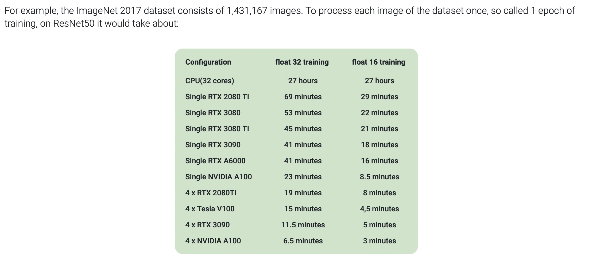

By [Sergey Karayev](https://twitter.com/sergeykarayev) and [Charles Frye](https://twitter.com/charles_irl). Updated October 30, 2023.

[Discussion of this page on Hacker News](https://news.ycombinator.com/item?id=36025099), May 21, 2023.

Training and running neural networks often requires hardware acceleration,
and the most popular hardware accelerator is the venerable _graphics processing unit_,
or GPU.

We have assembled cloud GPU vendor pricing all into tables, sortable and filterable to your liking!

We have split the vendor offerings into two classes:

- **GPU Cloud Servers**, which are long-running (but possibly pre-emptible) machines, and
- **Severless GPUs**, which are machines that scale-to-zero in the absence of traffic (like an AWS Lambda or Google Cloud Function)

**We welcome your help in adding more cloud GPU providers and keeping the pricing info current.**

Please [file an issue](https://github.com/full-stack-deep-learning/website/issues/new?assignees=sergeyk&labels=cloud-gpu&template=gpu-cloud-pricing-update.md&title=update+GPU+Cloud+Pricing) or make a pull request to [this repo](https://github.com/full-stack-deep-learning/website/), editing [this file](https://github.com/full-stack-deep-learning/website/blob/main/docs/cloud-gpus/index.md) to update the text on this page or one of the CSV files to update the data: [`cloud-gpus.csv`](https://github.com/full-stack-deep-learning/website/blob/main/docs/cloud-gpus/cloud-gpus.csv) for servers and [`serverless-gpus.csv`](https://github.com/full-stack-deep-learning/website/blob/main/docs/cloud-gpus/serverless-gpus.csv) for serverless options.

## GPU Cloud Server Comparison

### Notes

The table below does not include all possible configurations for all providers, as providers differ in their configuration strategy.

- Most providers, including AWS, Azure, and Lambda, provide instances with pre-set configurations.
- On GCP, any suitable machine can be connected to a configuration of GPUs.
- On other providers, like Oblivus Cloud, Cudo Compute, and RunPod, users have precise control over the resources they request. Note that RunPod's Community Cloud, Oblivus, and Cudo are all "open clouds", meaning compute is provided by third parties.
- For providers without pre-set instance configurations, we have selected configurations that are roughly equivalent to AWS's options. Generally, these configurations are good for workloads that require heavy inter-GPU communication.
- Where possible, regions were set to be the west or central parts of the United States. GPU availability depends on the region.
- Raw data can be found in a [csv on GitHub](https://github.com/full-stack-deep-learning/website/blob/main/docs/cloud-gpus/cloud-gpus.csv).
- Costs can be substantially reduced via preemption recovery and failover across clouds. If you don't want to roll your own, consider a tool like [SkyPilot](https://github.com/skypilot-org/skypilot). See [discussion of their launch on Hacker News](https://news.ycombinator.com/item?id=33964285), December 13, 2022.

*All prices are in $/hr.*

## Serverless GPUs

### Notes

We use the classic definition of "serverless", courtesy of [the original AWS announcement on serverless computing](https://www.jeremydaly.com/not-so-serverless-neptune/): no server management, flexible scaling, high availability, and no idle capacity. We only include services that fit this criterion in our options below.

Furthermore, we only include services that provide serverless GPUs,
which can be used to run custom workloads,
not just inference in particular models as a service.

- Direct price comparisons are trickier for serverless offerings: cold boot time and autoscaling logic can substantially impact cost-of-traffic.
- Some of the providers allow configuration of CPU and RAM resources. We have selected reasonable defaults, generally comparable to the fixed offerings of other providers.
- You can find pricing pages for the providers here: [Banana](https://banana.dev#pricing), [Baseten](https://docs.baseten.co/settings/pricing), [Beam](https://beam.cloud/pricing), [Modal](https://modal.com/pricing), [Replicate](https://replicate.com/pricing), [RunPod](https://www.runpod.io/serverless-gpu)
- Serverless GPUs are a newer technology, so the details change quickly and you can expect bugs/growing pains. Stay frosty!
- Raw data can be found in a [csv on GitHub](https://github.com/full-stack-deep-learning/website/blob/main/docs/cloud-gpus/serverless-gpus.csv).

*All prices are in $/hr.*

## How do I choose a GPU?

This page is intended to track and make explorable
the current state of pricing and hardware for cloud GPUs.

If you want advice on which machines and cards are best for your use case,
we recommend
[Tim Dettmer's blog post on GPUs for deep learning](https://timdettmers.com/2023/01/16/which-gpu-for-deep-learning).

The whole post is a tutorial and FAQ on GPUS for DNNs,
but if you just want the resulting heuristics for decision-making, see the
["GPU Recommendations" section](https://timdettmers.com/2023/01/16/which-gpu-for-deep-learning/#GPU_Recommendations),
which is the source of the chart below.

<figure markdown>
  
  <figcaption markdown>Flowchart for quickly selecting an appropriate GPU for your needs, by [Tim Dettmers](https://timdettmers.com/2023/01/16/which-gpu-for-deep-learning/)</figcaption>
</figure>

## GPU Raw Performance Numbers and Datasheets

Below are the raw TFLOPs of the different GPUs available from cloud providers.

| Model | Arch   | FP32 | Mixed-precision | FP16 | Source             |
| ----- | ------ | ---- | --------------- | ---- | ------------------ |
| A100  | Ampere | 19.5 | 156             | 312  | [Datasheet][a100]  |
| A10G  | Ampere | 35   | 35              | 70   | [Datasheet][a10g]  |
| A6000 | Ampere | 38   | ?               | ?    | [Datasheet][a6000] |
| V100  | Volta  | 14   | 112             | 28   | [Datasheet][v100]  |
| T4    | Turing | 8.1  | 65              | ?    | [Datasheet][t4]    |
| P4    | Pascal | 5.5  | N/A             | N/A  | [Datasheet][p4]    |
| P100  | Pascal | 9.3  | N/A             | 18.7 | [Datasheet][p100]  |
| K80   | Kepler | 8.73 | N/A             | N/A  | [Datasheet][k80]   |
| A40   | Ampere | 37   | 150             | 150  | [Datasheet][a40]   |

[a100]: https://www.nvidia.com/content/dam/en-zz/Solutions/Data-Center/a100/pdf/nvidia-a100-datasheet-us-nvidia-1758950-r4-web.pdf
[a10g]: https://d1.awsstatic.com/product-marketing/ec2/NVIDIA_AWS_A10G_DataSheet_FINAL_02_17_2022.pdf
[a6000]: https://www.nvidia.com/content/dam/en-zz/Solutions/design-visualization/quadro-product-literature/proviz-print-nvidia-rtx-a6000-datasheet-us-nvidia-1454980-r9-web%20(1).pdf
[v100]: https://images.nvidia.com/content/technologies/volta/pdf/tesla-volta-v100-datasheet-letter-fnl-web.pdf
[t4]: https://www.nvidia.com/content/dam/en-zz/Solutions/Data-Center/tesla-t4/t4-tensor-core-datasheet-951643.pdf
[p4]: https://images.nvidia.com/content/pdf/tesla/184457-Tesla-P4-Datasheet-NV-Final-Letter-Web.pdf
[p100]: https://www.nvidia.com/content/dam/en-zz/Solutions/Data-Center/tesla-p100/pdf/nvidia-tesla-p100-PCIe-datasheet.pdf
[k80]: https://www.nvidia.com/content/dam/en-zz/Solutions/Data-Center/tesla-product-literature/Tesla-K80-BoardSpec-07317-001-v05.pdf
[a40]: https://images.nvidia.com/content/Solutions/data-center/a40/nvidia-a40-datasheet.pdf

## GPU Performance Benchmarks

Below are some basic benchmarks for GPUs on common deep learning tasks.

<figure markdown>
  
  <figcaption markdown>Benchmark of different GPUs on a single ImageNet epoch, by [AIME](https://www.aime.info/en/blog/deep-learning-gpu-benchmarks-2021/)</figcaption>
</figure>

<figure markdown>
  
  <figcaption markdown>Benchmark of different GPUs on a mix of tasks, by [Lambda Labs](https://lambdalabs.com/gpu-benchmarks)</figcaption>
</figure>
