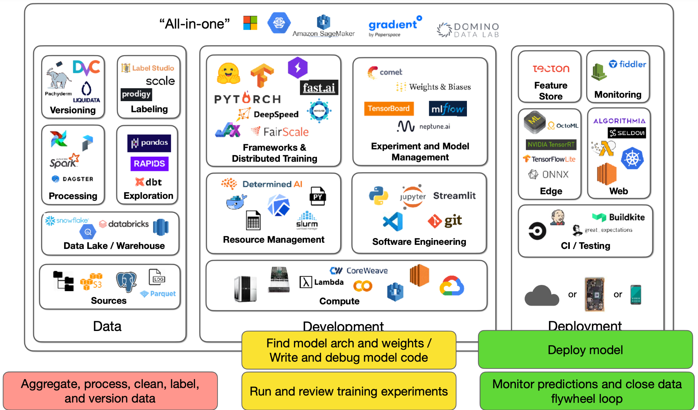
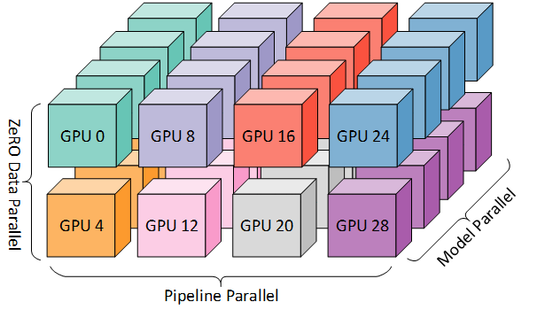
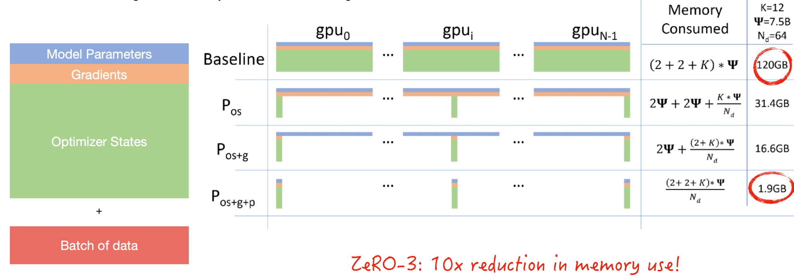
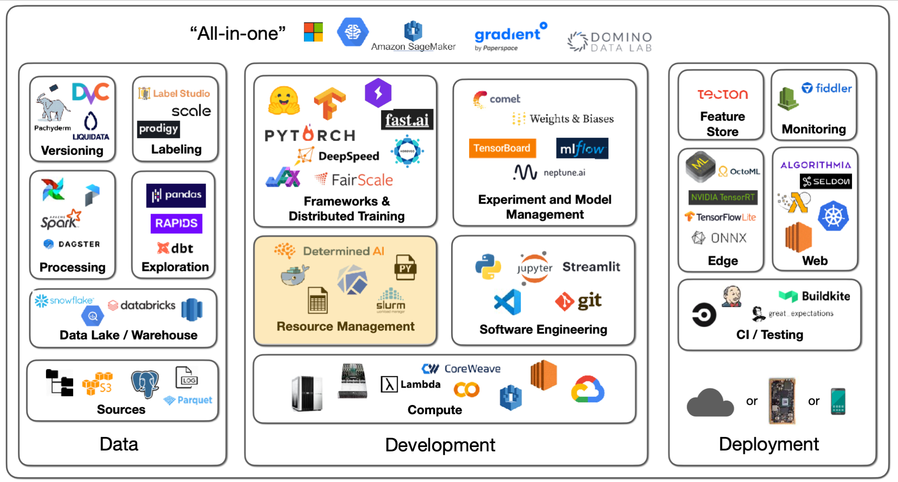

# Lecture 2: Development Infrastructure & Tooling

<iframe width="720" height="405" src="https://www.youtube.com/embed/BPYOsDCZbno?list=PL1T8fO7ArWleMMI8KPJ_5D5XSlovTW_Ur" title="YouTube video player" frameborder="0" allow="accelerometer; autoplay; clipboard-write; encrypted-media; gyroscope; picture-in-picture" allowfullscreen></iframe>

Lecture by [Sergey Karayev](https://twitter.com/sergeykarayev).
Notes by [James Le](https://twitter.com/le_james94) and [Vishnu Rachakonda](https://www.linkedin.com/in/vrachakonda/). 
Published August 15, 2022.
[Download slides](https://drive.google.com/open?id=16pEG5GesO4_UAWiD5jrIReMGzoyn165M).

## 1 - Introduction

The **dream** of ML development is that given a project spec and some
sample data, you get a continually improving prediction system deployed
at scale.

The **reality** is starkly different:

-   You have to collect, aggregate, process, clean, label, and version
the data.

-   You have to find the model architecture and their pre-trained
weights and then write and debug the model code.

-   You run training experiments and review the results, which will be
fed back into the process of trying out new architectures and
debugging more code.

-   You can now deploy the model.

-   After model deployment, you have to monitor model predictions and
close the data flywheel loop. Basically, your users generate fresh
data for you, which needs to be added to the training set.

This reality has roughly three components: data, development, and
deployment. The tooling infrastructure landscape for them is large, so
we'll have 3 lectures to cover it all. **This lecture focuses on the
development component**.

## 2 - Software Engineering

### Language

For your choice of **programming language**, Python is the clear winner
in scientific and data computing because of all the libraries that have
been developed. There have been some contenders like Julia and C/C++,
but Python has really won out.

### Editors

To write Python code, you need an **editor**. You have a wide range of
options, such as Vim, Emacs, Jupyter Notebook/Lab, VS Code, PyCharm,
etc.

-   We recommend [VS Code](https://code.visualstudio.com/)
because of its nice features such as built-in git version control,
documentation peeking, remote projects opening, linters and type
hints to catch bugs, etc.

-   Many practitioners develop in [Jupyter
Notebooks](https://jupyter.org/), which is great as
the "first draft" of a data science project. There's little
thought you have to put in before you start coding and seeing the
immediate output. However, notebooks have a variety of problems:
primitive editor, out-of-order execution artifacts, and challenges
to version and test them. A counterpoint to these problems is the
[nbdev package](https://nbdev.fast.ai/) that lets
you write and test code all in one notebook environment.

-   We recommend you use **VS Code with built-in support for
notebooks** - where you can write code in modules imported into
notebooks. It also enables awesome debugging.

If you want to build something more interactive,
[Streamlit](https://streamlit.io/) is a great choice. It
lets you decorate Python code, get interactive applets, and publish them
on the web to share with the world.

For setting up the Python environment, we recommend you see [how we did
it in the
lab.](https://github.com/full-stack-deep-learning/conda-piptools)

## 3 - Deep Learning Frameworks

Deep learning is not a code with a matrix math library such as Numpy.
But when you have to deploy your code onto CUDA for GPU-powered deep
learning, you want to consider deep learning frameworks as you might be
writing weird layer types, optimizers, data interfaces, etc.

### Frameworks

There are various frameworks, such as PyTorch, TensorFlow, and Jax. They
are all similar in the sense that you first define your model by running
Python code and then collect an optimized execution graph for different
deployment patterns (CPU, GPU, TPU, mobile).

1.  We prefer PyTorch because [it is absolutely
dominant](https://www.assemblyai.com/blog/pytorch-vs-tensorflow-in-2022/)
by measures such as the number of models, the number of papers,
and the number of competition winners. For instance, about [77%
of 2021 ML competition winners used
PyTorch](https://blog.mlcontests.com/p/winning-at-competitive-ml-in-2022?s=w).

2.  With TensorFlow, you have TensorFlow.js (that lets you run deep
learning models in your browser) and Keras (an unmatched developer
experience for easy model development).

3.  Jax is a meta-framework for deep learning.

[PyTorch](https://pytorch.org/) has excellent developer
experience and is production-ready and even faster with TorchScript.
There is a great distributed training ecosystem. There are libraries for
vision, audio, etc. There are also mobile deployment targets.

[PyTorch Lightning](https://www.pytorchlightning.ai/)
provides a nice structure for organizing your training code, optimizer
code, evaluation code, data loaders, etc. With that structure, you can
run your code on any hardware. There are nice features such as
performance and bottleneck profiler, model checkpointing, 16-bit
precision, and distributed training libraries.

Another possibility is [FastAI
software](https://www.fast.ai/), which is developed
alongside the fast.ai course. It provides many advanced tricks such as
data augmentations, better initializations, learning rate schedulers,
etc. It has a modular structure with low-level API, mid-level API,
high-level API, and specific applications. The main problem with FastAI
is that its code style is quite different from mainstream Python.

At FSDL, we prefer PyTorch because of its strong ecosystem, but
[TensorFlow](https://www.tensorflow.org/) is still
perfectly good. If you have a specific reason to prefer it, you are
still going to have a good time.

[Jax](https://github.com/google/jax) is a more recent
project from Google that is not specific to deep learning. It provides
general vectorization, auto-differentiation, and compilation to GPU/TPU
code. For deep learning, there are separate frameworks like Flax and
Haiku. You should only use Jax for a specific need.

### Meta-Frameworks and Model Zoos

Most of the time, you will start with at least a model architecture that
someone has developed or published. You will use a specific architecture
(trained on specific data with pre-trained weights) on a model hub.

-   [ONNX](https://onnx.ai/) is an open standard for
saving deep learning models and lets you convert from one type of
format to another. It can work well but can also run into some
edge cases.

-   [HuggingFace](https://huggingface.co/) has become an
absolutely stellar repository of models. It started with NLP tasks
but has then expanded into all kinds of tasks (audio
classification, image classification, object detection, etc.).
There are 60,000 pre-trained models for all these tasks. There is
a Transformers library that works with PyTorch, TensorFlow, and
Jax. There are 7,500 datasets uploaded by people. There's also a
community aspect to it with a Q&A forum.

-   [TIMM](https://github.com/rwightman/pytorch-image-models)
is a collection of state-of-the-art computer vision models and
related code that looks cool.

## 4 - Distributed Training

Given the scenario that we have multiple machines represented by little
squares above (with multiple GPUs in each machine). You are sending
batches of data to be processed by a model with parameters. The data
batch can fit on a single GPU or not. The model parameters can fit on a
single GPU or not.

The best case is that both your data batch and model parameters fit on a
single GPU. That's called **trivial parallelism**. You can either launch
more independent experiments on other GPUs/machines or increase the
batch size until it no longer fits on one GPU.

### Data Parallelism

If your model still fits on a single GPU, but your data no longer does,
you have to try out **data parallelism** - which lets you distribute a
single batch of data across GPUs and average gradients that are computed
by the model across GPUs. A lot of model development work is cross-GPU,
so you want to make sure that GPUs have fast interconnects.

If you are using a server card, then expect [a linear
speedup](https://lambdalabs.com/blog/best-gpu-2022-sofar/)
in training time. If you are using a consumer card, then expect [a
sublinear
speedup](https://lambdalabs.com/blog/titan-v-deep-learning-benchmarks/)
instead.

Data parallelism is implemented in PyTorch with the robust
[DistributedDataParallel
library](https://pytorch.org/tutorials/intermediate/ddp_tutorial.html).
[Horovod](https://github.com/horovod/horovod) is another
3rd-party library option. PyTorch Lightning makes it dead simple to use
either one of these two libraries - where [speedup seems to be the
same](https://www.reddit.com/r/MachineLearning/comments/hmgr9g/d_pytorch_distributeddataparallel_and_horovod/).

A more advanced scenario is that you can't even fit your model on a
single GPU. You have to spread the model over multiple GPUs. There are
three solutions to this.

### Sharded Data-Parallelism

Sharded data parallelism starts with the question: What exactly takes up
GPU memory?

-   The **model parameters** include the floats that make up our model
layers.

-   The **gradients** are needed to do back-propagation.

-   The **optimizer states** include statistics about the gradients

-   Finally, you have to send a **batch of data** for model development.

Sharding is a concept from databases where if you have one source of
data, you actually break it into shards of data that live across your
distributed system. Microsoft implemented an approach called
[ZeRO](https://arxiv.org/pdf/1910.02054.pdf) that shards
the optimizer states, the gradients, and the model parameters. **This
results in an insane order of magnitude reduction in memory use, which
means your batch size can be 10x bigger.** You should [watch the video
in this
article](https://www.microsoft.com/en-us/research/blog/zero-deepspeed-new-system-optimizations-enable-training-models-with-over-100-billion-parameters/)
to see how model parameters are passed around GPUs as computation
proceeds.

Sharded data-parallelism is implemented by Microsoft's
[DeepSpeed](https://github.com/microsoft/DeepSpeed)
library and Facebook's
[FairScale](https://github.com/facebookresearch/fairscale)
library, as well as natively by PyTorch. In PyTorch, it's called
[Fully-Sharded
DataParallel](https://pytorch.org/blog/introducing-pytorch-fully-sharded-data-parallel-api/).
With PyTorch Lightning, you can try it for a massive memory reduction
without changing the model code.

This same ZeRO principle can also be applied to a single GPU. You can
train a 13B-parameter model on a single V100 (32GB) GPU. Fairscale
implements this (called
[CPU-offloading](https://fairscale.readthedocs.io/en/stable/deep_dive/offload.html)).

### Pipelined Model-Parallelism

**Model parallelism means that you can put each layer of your model on
each GPU**. It is trivial to implement natively but results in only one
GPU being active at a time. Libraries like DeepSpeed and FairScale make
it better by pipelining computation so that the GPUs are fully utilized.
You need to tune the amount of pipelining on the batch size to the exact
degree of how you will split up the model on the GPU.

### Tensor-Parallelism

Tensor parallelism is another approach, which observes that there is
nothing special about matrix multiplication that requires the whole
matrix to be on one GPU. **You can distribute the matrix over multiple
GPUs**. NVIDIA published [the Megatron-LM
repo](https://github.com/NVIDIA/Megatron-LM), which does
this for the Transformer model.

You can actually use all of the three techniques mentioned above if you
really want to scale a huge model (like a GPT-3 sized language model).
Read [this article on the technology behind BLOOM
training](https://huggingface.co/blog/bloom-megatron-deepspeed)
for a taste.

In conclusion:

-   If your model and data fit on one GPU, that's awesome.

-   If they do not, and you want to speed up training, try
DistributedDataParallel.

-   If the model still doesn't fit, try ZeRO-3 or Full-Sharded Data
Parallel.

For more resources to speed up model training, take a look at [this
list compiled by
DeepSpeed](https://www.deepspeed.ai/training/),
[MosaicML](https://www.mosaicml.com), and
[FFCV](https://ffcv.io).

## 5 - Compute

Compute is the next essential ingredient to developing machine learning
models and products.

The compute-intensiveness of models has grown tremendously over the last
10 years, as the below charts from OpenAI and HuggingFace show. (slide
65) Recent developments, including models like GPT-3, have accelerated
this trend. These models are extremely large and require a large number
of petaflops to train.

To effectively train deep learning models, GPUs are required. NVIDIA has
been the singular choice for GPU vendors, though Google has introduced
TPUs (Tensor Processing Units) that are effective but are only available
via Google Cloud. There are three main considerations when choosing
GPUs:

1.  How much data fits on the GPU?

2.  How fast can the GPU crunch through data? To evaluate this, is your
data 16-bit or 32-bit? The latter is more resource intensive.

3.  How fast can you communicate between the CPU and the GPU and between
GPUs?

In looking at recent NVIDIA GPUs, it becomes clear that a new
high-performing architecture is introduced every few years. There's a
difference for these chips in which ones are licensed for personal use
as opposed to corporate use; businesses should only use **server**
cards.

(slide 69)

Key factors to evaluate for GPUs are RAM and Tensor TFlops. The more
RAM, the better the GPU is at containing large models and datasets.
Tensor TFlops are special tensor cores that NVIDIA includes specifically
for deep learning operations and can handle more intensive mixed
precision operations. A tip: leveraging 16 bit training can effectively
double your RAM capacity!

While these theoretical benchmarks are userful, how do GPUs perform
practically? Lambda Labs offers the best benchmarking. Their results
show that the most recent server-grade NVIDIA GPU (A100) is more than
2.5 times faster than the classic V100 GPU. RTX chips also outperform
the V100. AIME is also another source of GPU benchmarks.

Cloud services such as Microsoft Azure, Google Cloud Platform, and
Amazon Web Services are the default place to buy access to GPUs. Startup
cloud providers like Paperspace, CoreWeave, and Lambda Labs also offer
such services.

Let's briefly discuss TPUs. There are four generations of TPUs, and the
most recent v4 is the fastest possible accelerator for deep learning.
The below charts compare TPUs to the fastest A100 NVIDIA chip. V4 TPUs
are not generally available yet, but TPUs generally excel at scaling to
larger and model sizes.

(slide 73)

It can be overwhelming to compare the cost of cloud access to GPUs, so
we made a tool that solves this problem! Feel free to contribute to our
repository of Cloud GPU cost metrics. The tool has all kinds of nifty
features like enabling filters for only the most recent chip models,
etc.

If we combine the cost metrics with performance metrics, we find that
**the most expensive per hour chips are not the most expensive per
experiment!** Case in point: running the same Transformers experiment on
4 V100s costs \$1750 over 72 hours, whereas the same experiment on 4
A100s costs \$250 over only 8 hours. Think carefully about cost and
performance based on the model you're trying to train. Some helpful
heuristics here are A) **use the most expensive per hour GPU in the
least expensive cloud** and B) **startups (e.g. Paperspace) tend to be
cheaper than major cloud providers.**

For on-prem use cases, you can build your own pretty easily or opt for a
pre-built computer from a company like NVIDIA. You can build a good,
quiet PC with 128 GB RAM and 2 RTX 3909's for about \$7000 and have it
set up in a day. Going beyond this can start to get far more expensive
and difficult. Lambda Labs offers a \$60,000 machine with 8 A100's
(super fast!). Tim Dettmers offers a great (slightly outdated)
perspective on building a machine
[here](https://timdettmers.com/2020/09/07/which-gpu-for-deep-learning/).

Some tips on on-prem vs. cloud use:

-   It can be useful to have your own GPU machine to shift your mindset
from minimizing cost to maximizing utility.

-   To truly scale out experiments, you should probably just use the
most expensive machines in the least expensive cloud.

-   TPUs are worth experimenting with for large-scale training, given
their performance.

-   Lambda Labs is a sponsor, and we highly encourage looking at them
for on-prem and cloud GPU use!

## 6 - Resource Management

Now that we've talked about raw compute, let's talk abou options for how
to manage our compute resources. Let's say we want to manage a set of
experiments. Broadly speaking, we'll need hardware in the form of GPUs,
software requirements (e.g. PyTorch version), and data to train on.

Leveraging best practices for specifying dependencies (e.g. Poetry,
conda, pip-tools) makes the process of spinning up such experiments
quick and easy on a single machine. If, however, you have a cluster of
machines to run experiments on, SLURM is the tried and true solution for
workload management that is still widely used. For more portability,
Docker is a way to package up an entire dependency stack into a
lighter-than-a-VM package. Kuberenetes is the most popular way to run
many Docker containers on top of a cluster. The OSS Kubeflow project
helps manage ML projects that rely on Kubernetes. These projects are
useful, but they may not be the easiest or best choice. They're great if
you already have a cluster up and running, but how do you actually set
up a cluster or compute platform?

*A note before proceeding: FSDL prefers open source and/or transparently
priced products. We discuss tools that fall into these categories, not
SaaS with opaque pricing.*

For practitioners all in on AWS, AWS Sagemaker offers a convenient end
to end solution for building machine learning models, from labeling data
to deploying models. Sagemaker has a ton of AWS-specific configuration,
which can be a turn off, but it brings a lot of easy-to-use old school
algorithms for training and allows you to BYO algorithms as well.
They're increasing support for PyTorch as well, though the markup for
PyTorch is about 15-20% more expensive.

Anyscale is a company created by the makers of the Berkeley OSS project
Ray. Anyscale recently launched Ray Train, which they claim is faster
than Sagemaker with a similar value proposition. Anyscale makes it
really easy to provision a compute cluster, but it's considerably more
expensive than alternatives.

Grid.ai is created by the PyTorch Lightning creators. Grid allows you to
specify what compute parameters to use easily with "grid run" followed
by the types of compute and options you want. You can use their
instances or AWS under the hood. Grid has an uncertain future, as its
future compatibility with Lightning (given their rebrand) has not been
clarified.

There are a number of non-ML options for spinning up compute too!
Writing your own scripts, using various libraries, or even Kubernetes
are all options. This route is harder.

Determined.AI is an OSS solution for managing on-prem and cloud
clusters. They offer cluster management, distributed training, and more.
It's quite easy to use and is in active development.

With all this said, there is still room to improve the ease of
experience for launching training on many cloud providers.