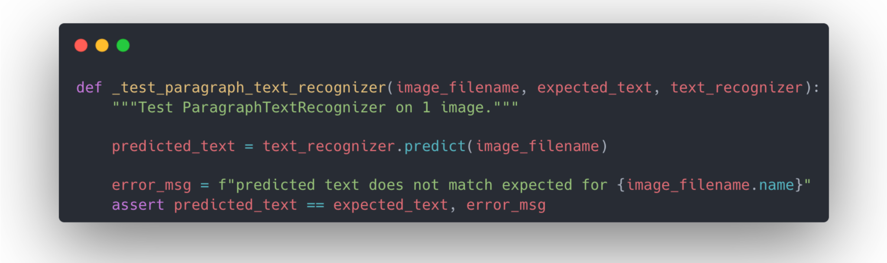
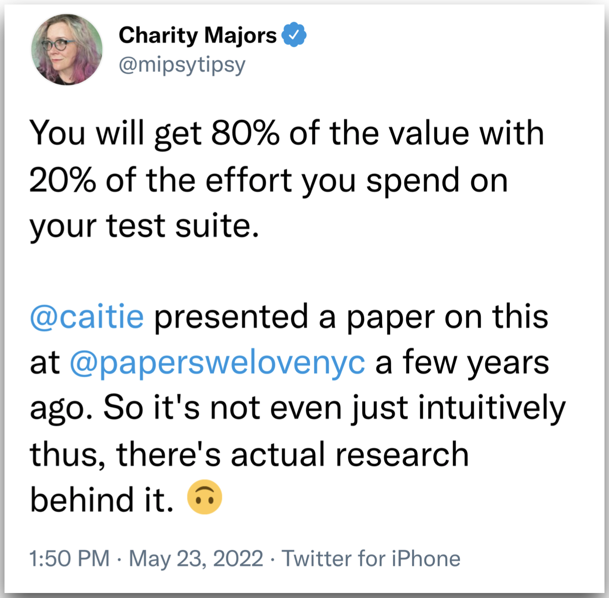
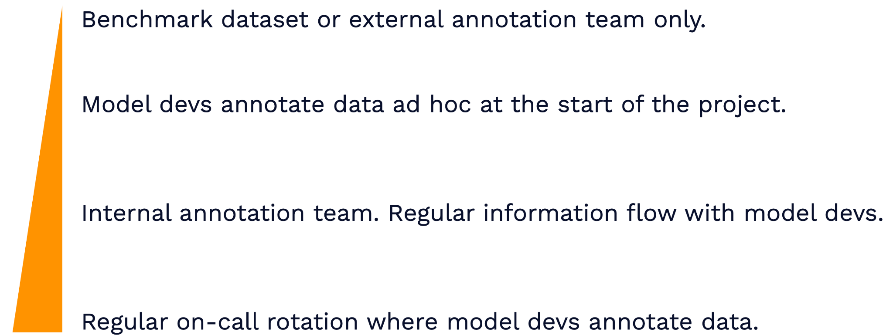
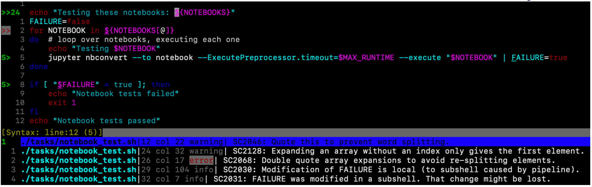
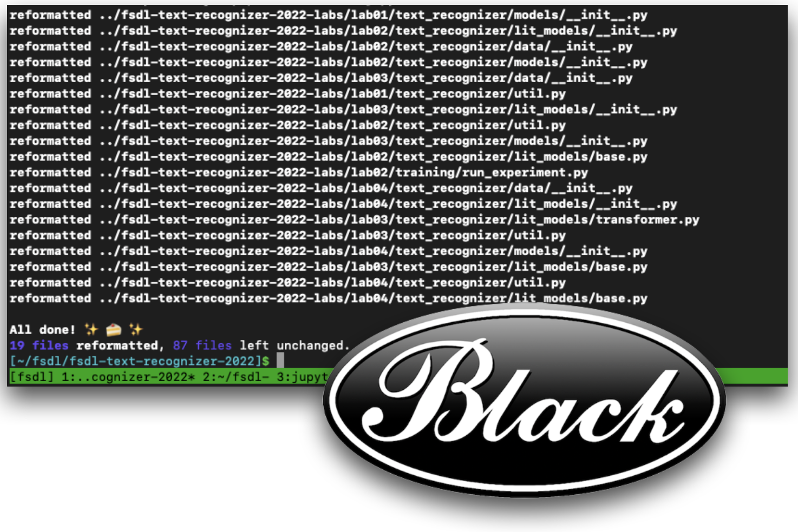
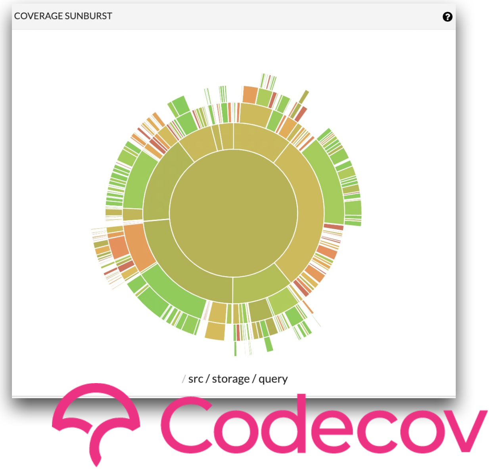
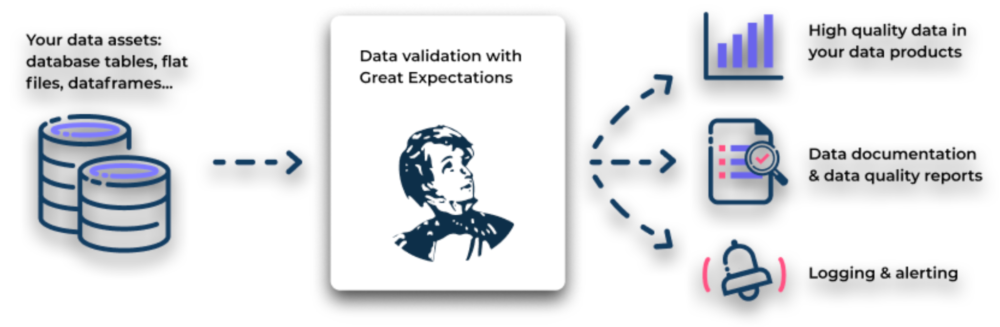
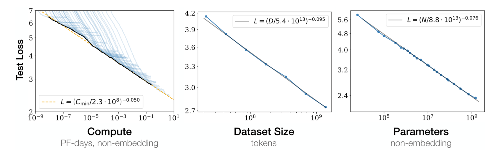

# Lecture 3: Troubleshooting & Testing

<iframe width="720" height="405" src="https://www.youtube-nocookie.com/embed/RLemHNAO5Lw?list=PL1T8fO7ArWleMMI8KPJ_5D5XSlovTW_Ur" title="YouTube video player" frameborder="0" allow="accelerometer; autoplay; clipboard-write; encrypted-media; gyroscope; picture-in-picture" allowfullscreen></iframe>

Lecture by [Charles Frye](https://twitter.com/charles_irl). 
Notes by [James Le](https://twitter.com/le_james94) and [Vishnu Rachakonda](https://www.linkedin.com/in/vrachakonda/). 
Published August 22, 2022.
[Download slides](https://fsdl.me/2022-lecture-03-slides).

## 1 - Testing Software

1.  The general approach is that tests will help us ship faster with
fewer bugs, but they won't catch all of our bugs.

2.  That means we will use testing tools but won't try to achieve 100%
coverage.

3.  Similarly, we will use linting tools to improve the development
experience but leave escape valves rather than pedantically
following our style guides.

4.  Finally, we'll discuss tools for automating these workflows.

### 1.1 - Tests Help Us Ship Faster. They Don't Catch All Bugs

**Tests are code we write that are designed to fail intelligibly when
our other code has bugs**. These tests can help catch some bugs before
they are merged into the main product, but they can't catch all bugs.
The main reason is that test suites are not certificates of correctness.
In some formal systems, tests can be proof of code correctness. But we
are writing in Python (a loosely goosey language), so all bets are off
in terms of code correctness.

[Nelson Elhage](https://twitter.com/nelhage?lang=en)
framed test suites more like classifiers. The classification problem is:
does this commit have a bug, or is it okay? The classifier output is
whether the tests pass or fail. We can then **treat test suites as a
"prediction" of whether there is a bug**, which suggests a different way
of designing our test suites.

When designing classifiers, we need to trade off detection and false
alarms. **If we try to catch all possible bugs, we can inadvertently
introduce false alarms**. The classic signature of a false alarm is a
failed test - followed by a commit that fixes the test rather than the
code.

To avoid introducing too many false alarms, it's useful to ask yourself
two questions before adding a test:

1.  Which real bugs will this test catch?

2.  Which false alarms will this test raise?

If you can think of more examples for the second question than the first
one, maybe you should reconsider whether you need this test.

One caveat is that: **in some settings, correctness is important**.
Examples include medical diagnostics/intervention, self-driving
vehicles, and banking/finance. A pattern immediately arises here: If you
are operating in a high-stakes situation where errors have consequences
for people's lives and livelihoods, even if it's not regulated yet, it
might be regulated soon. These are examples of **low-feasibility,
high-impact ML projects** discussed in the first lecture.

### 1.2 - Use Testing Tools, But Don't Chase Coverage

-   *[Pytest](https://docs.pytest.org/)* is the standard
tool for testing Python code. It has a Pythonic implementation and
powerful features such as creating separate suites, sharing
resources across tests, and running parametrized variations of
tests.

-   Pure text docs can't be checked for correctness automatically, so
they are hard to maintain or trust. Python has a nice module,
[*[doctests]*](https://docs.python.org/3/library/doctest.html),
for checking code in the documentation and preventing rot.

-   Notebooks help connect rich media (charts, images, and web pages)
with code execution. A cheap and dirty solution to test notebooks
is adding some *asserts* and using *nbformat* to run the
notebooks.

Once you start adding different types of tests and your codebase grows,
you will want coverage tools for recording which code is checked or
"covered" by tests. Typically, this is done in lines of code, but some
tools can be more fine-grained. We recommend
[Codecov](https://about.codecov.io/), which generates nice
visualizations you can use to drill down and get a high-level overview
of the current state of your testing. Codecov helps you understand your
tests and can be incorporated into your testing. You can say you want to
reject commits not only where tests fail, but also where test coverage
goes down below a certain threshold.

However, we recommend against that. Personal experience, interviews, and
published research suggest that only a small fraction of the tests you
write will generate most of your value. **The right tactic,
engineering-wise, is to expand the limited engineering effort we have on
the highest-impact tests and ensure that those are super high quality**.
If you set a coverage target, you will instead write tests in order to
meet that coverage target (regardless of their quality). You end up
spending more effort to write tests and deal with their low quality.

### 1.3 - Use Linting Tools, But Leave Escape Valves

**Clean code is of uniform and standard style**.

1.  Uniform style helps avoid spending engineering time on arguments
over style in pull requests and code review. It also helps improve
the utility of our version control by cutting down on noisy
components of diffs and reducing their size. Both benefits make it
easier for humans to visually parse the diffs in our version
control system and make it easier to build automation around them.

2.  Standard style makes it easier to accept contributions for an
open-source repository and onboard new team members for a
closed-source system.

One aspect of consistent style is consistent code formatting (with
things like whitespace). The standard tool for that in Python is
[the] *[black]* [Python
formatter](https://github.com/psf/black). It's a very
opinionated tool with a fairly narrow scope in terms of style. It
focuses on things that can be fully automated and can be nicely
integrated into your editor and automated workflows.

For non-automatable aspects of style (like missing docstrings), we
recommend [*[flake8]*](https://flake8.pycqa.org/). It comes
with many extensions and plugins such as docstring completeness, type
hinting, security, and common bugs.

ML codebases often have both Python code and shell scripts in them.
Shell scripts are powerful, but they also have a lot of sharp edges.
*[shellcheck](https://www.shellcheck.net/)* knows all the
weird behaviors of bash that often cause errors and issues that aren't
immediately obvious. It also provides explanations for why it's raising
a warning or an error. It's very fast to run and can be easily
incorporated into your editor.

One caveat to this is: **pedantic enforcement of style is obnoxious.**
To avoid frustration with code style and linting, we recommend:

1.  Filtering rules down to the minimal style that achieves the goals we
set out (sticking with standards, avoiding arguments, keeping
version control history clean, etc.)

2.  Having an "opt-in" application of rules and gradually growing
coverage over time - which is especially important for existing
codebases (which may have thousands of lines of code that we need
to be fixed).

### 1.4 - Always Be Automating

**To make the best use of testing and linting practices, you want to
automate these tasks and connect to your cloud version control system
(VCS)**. Connecting to the VCS state reduces friction when trying to
reproduce or understand errors. Furthermore, running things outside of
developer environments means that you can run tests automatically in
parallel to other development work.

Popular, open-source repositories are the best place to learn about
automation best practices. For instance, the PyTorch Github library has
tons of automated workflows built into the repo - such as workflows that
automatically run on every push and pull.

The tool that PyTorch uses (and that we recommend) is [GitHub
Actions](https://docs.github.com/en/actions), which ties
automation directly to VCS. It is powerful, flexible, performant, and
easy to use. It gets great documentation, can be used with a YAML file,
and is embraced by the open-source community. There are other options
such as [pre-commit.ci](https://pre-commit.ci/),
[CircleCI](https://circleci.com/), and
[Jenkins](https://www.jenkins.io/); but GitHub Actions
seems to have won the hearts and minds in the open-source community in
the last few years.

To keep your version control history as clean as possible, you want to
be able to run tests and linters locally before committing. We recommend
*[pre-commit](https://github.com/pre-commit/pre-commit)*
to enforce hygiene checks. You can use it to run formatting, linting,
etc. on every commit and keep the total runtime to a few seconds.
*pre-commit* is easy to run locally and easy to automate with GitHub
Actions.

**Automation to ensure the quality and integrity of our software is a
productivity enhancer.** That's broader than just CI/CD. Automation
helps you avoid context switching, surfaces issues early, is a force
multiplier for small teams, and is better documented by default.

One caveat is that: **automation requires really knowing your tools.**
Knowing Docker well enough to use it is not the same as knowing Docker
well enough to automate it. Bad automation, like bad tests, takes more
time than it saves. Organizationally, that makes automation a good task
for senior engineers who have knowledge of these tools, have ownership
over code, and can make these decisions around automation.

### Summary

1.  Automate tasks with GitHub Actions to reduce friction.

2.  Use the standard Python toolkit for testing and cleaning your
projects.

3.  Choose testing and linting practices with the 80/20 principle,
shipping velocity, and usability/developer experience in mind.

## 2 - Testing ML Systems

1.  Testing ML is hard, but not impossible.

2.  We should stick with the low-hanging fruit to start.

3.  Test your code in production, but don't release bad code.

### 2.1 - Testing ML Is Hard, But Not Impossible

Software engineering is where many testing practices have been
developed. In software engineering, we compile source code into
programs. In machine learning, training compiles data into a model.
These components are harder to test:

1.  Data is heavier and more inscrutable than source code.

2.  Training is more complex and less well-defined.

3.  Models have worse tools for debugging and inspection than compiled
programs.

In this section, we will focus primarily on "smoke" tests. These tests
are easy to implement and still effective. They are among the 20% of
tests that get us 80% of the value.

### 2.2 - Use Expectation Testing on Data

**We test our data by checking basic properties**. We express our
expectations about the data, which might be things like there are no
nulls in this column or the completion date is after the start date.
With expectation testing, you will start small with only a few
properties and grow them slowly. You only want to test things that are
worth raising alarms and sending notifications to others.

We recommend
[*[great_expectations]*](https://greatexpectations.io/) for
data testing. It automatically generates documentation and quality
reports for your data, in addition to built-in logging and alerting
designed for expectation testing. To get started, check out [this
MadeWithML tutorial on
great_expectations](https://github.com/GokuMohandas/testing-ml).

To move forward, you want to stay as close to the data as possible:

1.  A common pattern is that there's a benchmark dataset with
annotations (in academia) or an external annotation team (in the
industry). A lot of the detailed information about that data can
be extracted by simply looking at it.

2.  One way for data to get internalized into the organization is that
at the start of the project, model developers annotate data ad-hoc
(especially if you don't have the budget for an external
annotation team).

3.  However, if the model developers at the start of the project move on
and more developers get onboarded, that knowledge is diluted. A
better solution is an internal annotation team that has a regular
information flow with the model developers is a better solution.

4.  The best practice ([recommended by Shreya
Shankar](https://twitter.com/sh_reya/status/1521903046392877056))
is t**o have a regular on-call rotation where model developers
annotate data themselves**. Ideally, these are fresh data so that
all members of the team who are developing models know about the
data and build intuition/expertise in the data.

### 2.3 - Use Memorization Testing on Training

**Memorization is the simplest form of learning**. Deep neural networks
are very good at memorizing data, so checking whether your model can
memorize a very small fraction of the full data set is a great smoke
test for training. If a model can't memorize, then something is clearly
very wrong!

Only really gross issues with training will show up with this test. For
example, your gradients may not be calculated correctly, you have a
numerical issue, or your labels have been shuffled; serious issues like
these. Subtle bugs in your model or your data are not going to show up.
A way to catch smaller bugs is to include the length of run time in your
test coverage. It's a good way to detect if smaller issues are making it
harder for your model to learn. If the number of epochs it takes to
reach an expected performance suddenly goes up, it may be due to a
training bug. PyTorch Lightning has an "*overfit_batches*" feature that
can help with this.

**Make sure to tune memorization tests to run quickly, so you can
regularly run them**. If they are under 10 minutes or some short
threshold, they can be run every PR or code change to better catch
breaking changes. A couple of ideas for speeding up these tests are
below:

Overall, these ideas lead to memorization tests that implement model
training on different time scale and allow you to mock out scenarios.

A solid, if expensive idea for testing training is to **rerun old
training jobs with new code**. It's not something that can be run
frequently, but doing so can yield lessons about what unexpected changes
might have happened in your training pipeline. The main drawback is the
potential expense of running these tests. CI platforms like
[CircleCI](https://circleci.com/) charge a great deal for
GPUs, while others like Github Actions don't offer access to the
relevant machines easily.

The best option for testing training is to **regularly run training with
new data that's coming in from production**. This is still expensive,
but it is directly related to improvements in model development, not
just testing for breakages. Setting this up requires **a data flywheel**
similar to what we talked about in Lecture 1. Further tooling needed to
achieve will be discussed down the line.

### 2.4 - Adapt Regression Testing for Models

**Models are effectively functions**. They have inputs and produce
outputs like any other function in code. So, why not test them like
functions with regression testing? For specific inputs, we can check to
see whether the model consistently returns the same outputs. This is
best done with simpler models like classification models. It's harder to
maintain such tests with more complex models. However, even in a more
complex model scenario, regression testing can be useful for comparing
changes from training to production.

A more sophisticated approach to testing for ML models is to **use loss
values and model metrics to build documented test suites out of your
data**. Consider this similar to [the test-driven
development](https://en.wikipedia.org/wiki/Test-driven_development)
(TDD) code writing paradigm. The test that is written before your code
in TDD is akin to your model's loss performance; both represent the gap
between where your code needs to be and where it is. Over time, as we
improve the loss metric, our model is getting closer to passing "the
test" we've imposed on it. The gradient descent we use to improve the
model can be considered a TDD approach to machine learning models!

While gradient descent is somewhat like TDD, it's not *exactly* the same
because simply reviewing metrics doesn't tell us how to resolve model
failures (the way traditional software tests do).

To fill in this gap, **start by [looking at the data points that have
the highest loss](https://arxiv.org/abs/1912.05283)**. Flag
them for a test suite composed of "hard" examples. Doing this provides
two advantages: it helps find where the model can be improved, and it
can also help find errors in the data itself (i.e. poor labels).

As you examine these failures, you can aggregate types of failures into
named suites. For example in a self-driving car use case, you could have
a "night time" suite and a "reflection" suite. **Building these test
suites can be considered the machine learning version of regression
testing**, where you take bugs that you've observed in production and
add them to your test suite to make sure that they don't come up again.

The method can be quite manual, but there are some options for speeding
it up. Partnering with the annotation team at your company can help make
developing these tests a lot faster. Another approach is to use a method
called [Domino](https://arxiv.org/abs/2203.14960) that
uses foundation models to find errors. Additionally, for testing NLP
models, use the
[CheckList](https://arxiv.org/abs/2005.04118) approach.

### 2.5 - Test in Production, But Don't YOLO

It's crucial to test in true production settings. This is especially
true for machine learning models, because data is an important component
of both the production and the development environments. It's difficult
to ensure that both are very close to one another.

**The best way to solve the training and production difference is to
test in production**.

Testing in production isn't sufficient on its own. Rather, testing in
production allows us to develop tooling and infrastructure that allows
us to resolve production errors quickly (which are often quite
expensive). It reduces pressure on other kinds of testing, but does not
replace them.

We will cover in detail the tooling needed for production monitoring and
continual learning of ML systems in a future lecture.

### 2.6 - ML Test Score

So far, we have discussed writing "smoke" tests for ML: expectation
tests for data, memorization tests for training, and regression tests
for models.

**As your code base and team mature, adopt a more full-fledged approach
to testing ML systems like the approach identified in the [ML Test
Score](https://research.google/pubs/pub46555/) paper**. The
ML Test Score is a rubric that evolved out of machine learning efforts
at Google. It's a strict rubric for ML test quality that covers data,
models, training, infrastructure, and production monitoring. It overlaps
with, but goes beyond some of the recommendations we've offered.

It's rather expensive, but worth it for high stakes use cases that need
to be really well-engineered! To be really clear, this rubric is
*really* strict. Even our Text Recognizer system we've designed so far
misses a few categories. Use the ML Test Score as inspiration to develop
the right testing approach that works for your team's resources and
needs.

## 3 - Troubleshooting Models

**Tests help us figure out something is wrong, but troubleshooting is
required to actually fix broken ML systems**. Models often require the
most troubleshooting, and in this section we'll cover a three step
approach to troubleshooting them.

1.  "Make it run" by avoiding common errors.

2.  "Make it fast" by profiling and removing bottlenecks.

3.  "Make it right" by scaling model/data and sticking with proven
architectures.

### 3.1 - Make It Run

This is the easiest step for models; only a small portion of bugs cause
the kind of loud failures that prevent a model from running at all.
Watch out for these bugs in advance and save yourself the trouble of
models that don't run.

The first type of bugs that prevent models from running at all are
**shape errors.** When the shape of the tensors don't match for the
operations run on them, models can't be trained or run. Prevent these
errors by keeping notes on the expected size of tensors, annotate the
sizes in the code, and even step through your model code with a debugger
to check tensor size as you go.

The second type of bugs is out of **memory errors**. This occurs when
you try to push a tensor to a GPU that is too large to fit. PyTorch
Lightning has good tools to prevent this. Make sure you're using the
lowest precision your training can tolerate; a good default is 16 bit
precision. Another common reason for this is trying to run a model on
too much data or too large a batch size. Use the autoscale batch size
feature in PyTorch Lightning to pick the right size batch. You can use
gradient accumulation if these batch sizes get too small. If neither of
these options work, you can look into manual techniques like tensor
parallelism and gradient checkpoints.

**Numerical errors** also cause machine learning failures. This is when
NaNs or infinite values show up in tensors. These issues most commonly
appear first in the gradient and then cascade through the model. PyTorch
Lightning has a good tool for tracking and logging gradient norms. A
good tip to check whether these issues are caused by precision issues is
to switch to Python 64 bit floats and see if that causes these issues to
go away. Normalization layers tend to cause these issues, generally
speaking. So watch out for how you do normalization!

### 3.2 - Make It Fast

Once you can run a model, you'll want it to run fast. This can be tricky
because the performance of DNN training code is very counterintuitive.
For example, transformers can actually spend more time in the MLP layer
than the attention layer. Similarly, trivial components like loading
data can soak up performance.

To solve these issues, the primary solution is to **roll up your sleeves
and profile your code**. You can often find pretty easy Python changes
that yield big results. Read these two tutorials by
[Charles](https://wandb.ai/wandb/trace/reports/A-Public-Dissection-of-a-PyTorch-Training-Step--Vmlldzo5MDE3NjU?galleryTag=&utm_source=fully_connected&utm_medium=blog&utm_campaign=using+the+pytorch+profiler+with+w%26b)
and [Horace](https://horace.io/brrr_intro.html) for more
details.

### 3.3 - Make It Right

After you make it run fast, make the model right. Unlike traditional
software, machine learning models never are truly perfect. Production
performance is never perfect. As such, it might be more appropriate to
say "make it as right as needed".

Knowing this, making the model run and run fast allows us to make the
model right through applying **scale.** To achieve performance benefits,
scaling a model or its data are generally fruitful and achievable
routes. It's a lot easier to scale a fast model. [Research from OpenAI
and other institutions](https://arxiv.org/abs/2001.08361)
is showing that benefits from scale can be rigorously measured and
predicted across compute budget, dataset size, and parameter count.

If you can't afford to scale yourself, consider finetuning a model
trained at scale for your task.

So far, all of the advice given has been model and task-agnostic.
Anything more detailed has to be specific to the model and the relevant
task. Stick close to working architectures and hyperparameters from
places like HuggingFace, and try not to reinvent the wheel!

## 4 - Resources

Here are some helpful resources that discuss this topic.

### Tweeters

1.  [Julia Evans](https://twitter.com/b0rk)

2.  [Charity Majors](https://twitter.com/mipsytipsy)

3.  [Nelson Elhage](https://twitter.com/nelhage)

4.  [kipply](https://twitter.com/kipperrii)

5.  [Horace He](https://twitter.com/cHHillee)

6.  [Andrej Karpathy](https://twitter.com/karpathy)

7.  [Chip Huyen](https://twitter.com/chipro)

8.  [Jeremy Howard](https://twitter.com/jeremyphoward)

9.  [Ross Wightman](https://twitter.com/wightmanr)

### Templates

1.  [Lightning Hydra
Template](https://github.com/ashleve/lightning-hydra-template)

2.  [NN Template](https://github.com/grok-ai/nn-template)

3.  [Generic Deep Learning Project
Template](https://github.com/sudomaze/deep-learning-project-template)

### Texts

1.  [Reliable ML Systems
talk](https://www.usenix.org/conference/opml20/presentation/papasian)

2.  ["ML Test Score"
paper](https://research.google/pubs/pub46555/)

3.  ["Attack of the Cosmic
Rays!"](https://blogs.oracle.com/linux/post/attack-of-the-cosmic-rays)

4.  ["Computers can be
understood"](https://blog.nelhage.com/post/computers-can-be-understood/)

5.  ["Systems that defy detailed
understanding"](https://blog.nelhage.com/post/systems-that-defy-understanding/)

6.  [Testing section from MadeWithML course on
MLOps](https://madewithml.com/courses/mlops/testing/)
