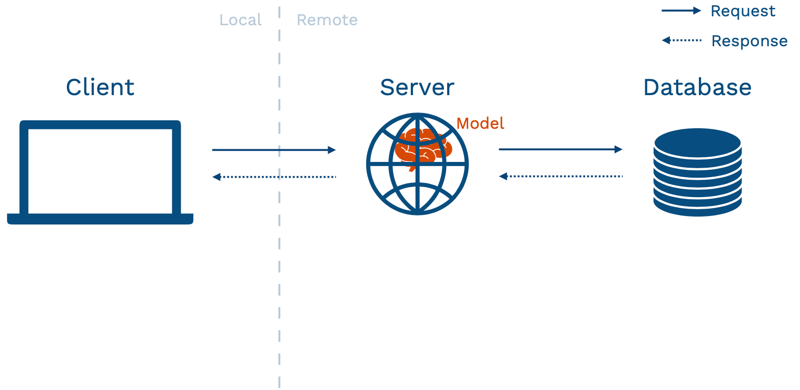
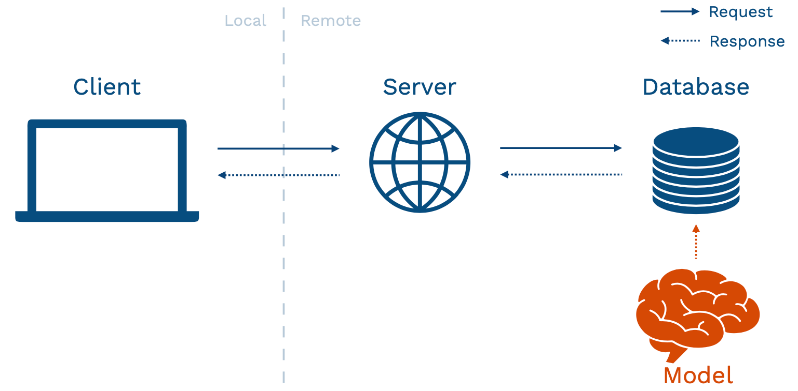
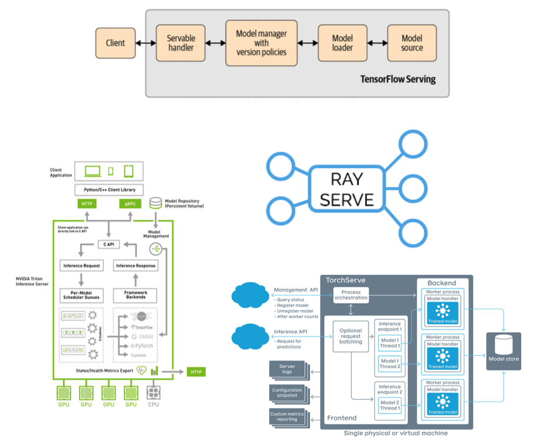
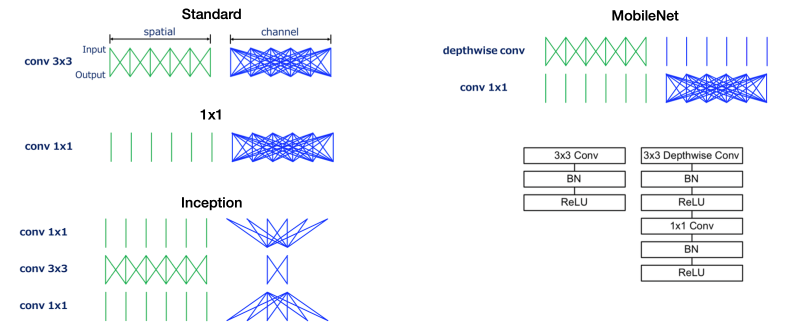

# Lecture 5: Deployment

<iframe width="720" height="405" src="https://www.youtube-nocookie.com/embed/W3hKjXg7fXM?list=PL1T8fO7ArWleMMI8KPJ_5D5XSlovTW_Ur" title="YouTube video player" frameborder="0" allow="accelerometer; autoplay; clipboard-write; encrypted-media; gyroscope; picture-in-picture" allowfullscreen></iframe>

Lecture by [Josh Tobin](https://twitter.com/josh_tobin_). 
Notes by [James Le](https://twitter.com/le_james94) and [Vishnu Rachakonda](https://www.linkedin.com/in/vrachakonda/). 
Published September 5, 2022.
[Download slides](https://fsdl.me/2022-lecture-05-slides).

## Introduction

Deploying models is a critical part of making your models good, to begin
with. When you only evaluate the model offline, it's easy to miss the
more subtle flaws that the model has, where it doesn't actually solve
the problem that your users need it to solve. Oftentimes, when we deploy
a model for the first time, only then do we really see whether that
model is actually doing a good job or not. Unfortunately, for many data
scientists and ML engineers, model deployment is an afterthought
relative to other techniques we have covered.

Much like other parts of the ML lifecycle, we'll focus on deploying a
minimum viable model as early as possible, which entails **keeping it
simple and adding complexity later**. Here is the process that this
lecture covers:

-   Build a prototype

-   Separate your model and UI

-   Learn the tricks to scale

-   Consider moving your model to the edge when you really need to go
fast

## 1 - Build a Prototype To Interact With

There are many great tools for building model prototypes.
[HuggingFace](https://huggingface.co/) has some tools
built into its playground. They have also recently acquired a startup
called [Gradio](https://gradio.app/), which makes it easy
to wrap a small UI around the model.
[Streamlit](https://streamlit.io/) is another good option
with a bit more flexibility.

Here are some best practices for prototype deployment:

1.  **Have a basic UI**: The goal at this stage is to play around with
the model and collect feedback from other folks. Gradio and
Streamlit are your friends here - often as easy as adding a couple
of lines of code to create a simple interface for the model.

2.  **Put it behind a web URL**: An URL is easier to share. Furthermore,
you will start thinking about the tradeoffs you'll be making when
dealing with more complex deployment schemes. There are cloud
versions of [Streamlit](https://streamlit.io/cloud)
and [HuggingFace](https://huggingface.co/) for this.

3.  **Do not stress it too much**: You should not take more than a day
to build a prototype.

A model prototype won't be your end solution to deploy. Firstly, a
prototype has limited frontend flexibility, so eventually, you want to
be able to build a fully custom UI for the model. Secondly, a prototype
does not scale to many concurrent requests. Once you start having users,
you'll hit the scaling limits quickly.

Above is an abstract diagram of how your application might look. The
**client** is your user's device that interacts with your application.
This device can be a browser, a vehicle, or a mobile phone. This device
calls over a network to a **server**. The server talks to a **database**
(where data is stored), used to power the application.

There are different ways of structuring your application to fit an ML
model inside. The prototype approach mentioned in the beginning fits
into the **model-in-service** approach - where your hosted web server
has a packaged version of the model sitting inside it. This pattern has
pros and cons.

The biggest pro is that if you are doing something complex, you get to
reuse your existing infrastructure. It does not require you as a model
developer to set up new things from scratch.

However, there is a number of pronounced cons:

1.  **Your web server may be written in a different language**, so
getting your model into that language can be difficult.

2.  **Models may change more frequently than server code** (especially
early in the lifecycle of building your model). If you have a
well-established application and a nascent model, you do not want
to redeploy the entire application every time that you make an
update to the model (sometimes multiple updates per day).

3.  If you have a large model to run inference on, you'll have to load
that model on your web server. **Large models can eat into the
resources for your web server**. That might affect the user
experience for people using that web server, even if they are not
interacting with the model.

4.  **Server hardware is generally not optimized for ML workloads**. In
particular, you rarely will have a GPU on these devices.

5.  **Your model and application may have different scaling
properties**, so you might want to be able to scale them
differently.

## 2 - Separate Your Model From Your UI

### 2.1 - Batch Prediction

The first pattern to pull your model from your UI is called **batch
prediction**. You get new data in and run your model on each data point.
Then, you save the results of each model inference into a database. This
can work well under some circumstances. For example, if there are not a
lot of potential inputs to the model, you can re-run your model on some
frequency (every hour, every day, or every week). You can have
reasonably fresh predictions to return to those users that are stored in
your database. Examples of these problems include the early stages of
building recommender systems and internal-facing tools like marketing
automation.

To run models on a schedule, you can leverage the data processing and
workflow tools mentioned in our previous lecture on data management. You
need to re-run data processing, load the model, run predictions, and
store those predictions in your database. This is exactly a **Directed
Acyclic Graph workflow of data operations** that tools like
[Dagster](https://dagster.io/),
[Airflow](https://airflow.apache.org/), or
[Prefect](https://www.prefect.io/) are designed to solve.
It's worth noting that there are also tools like
[Metaflow](https://metaflow.org/) that are designed more
for ML or data science use cases that might be potentially even an
easier way to get started.

Let's visit the pros and cons of this batch prediction pattern. Starting
with the pros:

1.  Batch prediction is **simple to implement** since it reuses existing
batch processing tools that you may already be using for training
your model.

2.  It **scales very easily** because databases have been engineered for
decades for such a purpose.

3.  Even though it looks like a simple pattern, it has been **used in
production by large-scale production systems for years**. This is
a tried-and-true pattern you can run and be confident that it'll
work well.

4.  It is **fast to retrieve the prediction** since the database is
designed for the end application to interact with.

Switching to the cons:

1.  Batch prediction **doesn't scale to complex input types**. For
instance, if the universe of inputs is too large to enumerate
every single time you need to update your predictions, this won't
work.

2.  **Users won't be getting the most up-to-date predictions from your
model**. If the feature that goes into your model changes every
hour, minute, or subsecond, but you only run your batch prediction
job every day, the predictions your users see might be slightly
stale.

3.  **Models frequently become "stale."** If your batch jobs fail for
some reason, it can be hard to detect these problems.

### 2.2 - Model-as-Service

The second pattern is called **model-as-service**: we run the model
online as its own service. The service is going to interact with the
backend or the client itself by making requests to the model service and
receiving responses back.

The pros of this pattern are:

1.  **Dependability** - model bugs are less likely to crash the web
application.

2.  **Scalability** - you can choose optimal hardware for the model and
scale it appropriately.

3.  **Flexibility** - you can easily reuse a model across multiple
applications.

The cons of this pattern are:

1.  Since this is a separate service, you add a network call when your
server or client interacts with the model. That can **add
latency** to your application.

2.  It also **adds infrastructural complexity** because you are on the
hook for hosting and managing a separate service.

Even with these cons, **the model-as-service pattern is still a sweet
spot for most ML-powered products** since you really need to be able to
scale independently of the application in most complex use cases. We'll
walk through the basic components of building your model service -
including REST APIs, dependency management, performance optimization,
horizontal scaling, rollout, and managed options.

#### REST APIs

**Rest APIs** serve predictions in response to canonically-formatted
HTTP requests. There are other alternative protocols to interact with a
service that you host on your infrastructures, such as
[GRPC](https://grpc.io/) (used in TensorFlow Serving) and
[GraphQL](https://graphql.org/) (common in web development
but not terribly relevant to model services).

Unfortunately, there is currently no standard for formatting requests
and responses for REST API calls.

1.  [Google Cloud](https://cloud.google.com/) expects a
batch of inputs structured as a list called "instances" (with keys
and values).

2.  [Azure](https://azure.microsoft.com/en-us/) expects a
list of things called "data", where the data structure itself
depends on what your model architecture is.

3.  [AWS Sagemaker](https://aws.amazon.com/sagemaker/)
expects instances that are formatted differently than they are in
Google Cloud.

Our aspiration for the future is to move toward **a standard interface
for making REST API calls for ML services**. Since the types of data
that you might send to these services are constrained, we should be able
to develop a standard as an industry.

#### Dependency Management

Model predictions depend on **code**, **model weights**, and
**dependencies**. In order for your model to make a correct prediction,
all of these dependencies need to be present on your web server.
Unfortunately, dependencies are a notorious cause of trouble as it is
hard to ensure consistency between your development environment and your
server. It is also hard to update since even changing a TensorFlow
version can change your model.

At a high level, there are two strategies for managing dependencies:

1.  **Constrain the dependencies for your model** by saving your model
in an agnostic format that can be run anywhere.

2.  **Use containers** to constrain the entire inference program.

##### Constraining Model Dependencies

The primary way to constrain the dependencies of just your model is
through a library called [ONNX](https://onnx.ai/) - the
Open Neural Network Exchange. The goal of ONNX is to be **an
interoperability standard for ML models**. The promise is that you can
define a neural network in any language and run it consistently
anywhere. The reality is that since the underlying libraries used to
build these models change quickly, there are often bugs in the
translation layer, which creates even more problems to solve for you.
Additionally, ONNX doesn't deal with non-library code such as feature
transformations.

##### Containers

To understand how to manage dependencies with containers, we need to
understand [the differences between Docker and Virtual
Machines](https://medium.freecodecamp.org/a-beginner-friendly-introduction-to-containers-vms-and-docker-79a9e3e119b),
how Docker images are built via Docker files and constructed via layers,
the ecosystem around Docker, and specific wrappers around Docker that
you can use for ML.

In a **virtual machine**, you package up the entire operating system
(OS) as well as the libraries and applications that are built on top of
that OS. A virtual machine tends to be very heavyweight because the OS
itself has a lot of code and is expensive to run. A **container** such
as Docker removes that need by packaging the libraries and applications
together. A Docker engine that runs on top of your OS knows how to
virtualize the OS and run the libraries/applications.

By virtue of being **lightweight**, Docker is used differently than how
Virtual Machines were used. A common pattern is to spin up [a new
Docker container](https://www.docker.com/what-container)
for every discrete task. For example, a web application might have four
containers: a web server, a database, a job queue, and a worker. These
containers are run together as part of an orchestration system.

Docker containers are created from [Docker
files](https://docs.docker.com/engine/reference/builder/).
Each Docker file runs a sequence of steps to define the environment
where you will run your code. Docker also allows you to build, store,
and pull Docker containers from a Docker Hub that is hosted on some
other servers or your cloud. You can experiment with a code environment
that is on your local machine but will be identical to the environment
you deploy on your server.

Docker is separated into [three different
components](https://docs.docker.com/engine/docker-overview):

1.  The **client** is where you'll be running on your laptop to build an
image from a Dockerfile that you define locally using some
commands.

2.  These commands are executed by a **Docker Host**, which can run on
either your laptop or your server (with more storage or more
performance).

3.  That Docker Host talks to a **registry** - which is where all the
containers you might want to access are stored.

With this separation of concerns, you are not limited by the amount of
compute and storage you have on your laptop to build, pull, and run
Docker images. You are also not limited by what you have access to on
your Docker Host to decide which images to run.

In fact, there is a powerful ecosystem of Docker images that are
available on different public Docker Hubs. You can easily find these
images, modify them, and contribute them back to the Hubs. It's easy to
store private images in the same place as well. Because of this
community and the lightweight nature of Docker, it has become
[incredibly popular in recent
years](https://www.docker.com/what-container#/package_software)
and is ubiquitous at this point.

There is a bit of a learning curve to Docker. For ML, there are a few
open-source packages designed to simplify this:
[Cog](https://github.com/replicate/cog),
[BentoML](https://github.com/bentoml/BentoML), and
[Truss](https://github.com/trussworks). They are built by
different model hosting providers that are designed to work well with
their model hosting service but also just package your model and all of
its dependencies in a standard Docker container format.

These packages have **two primary components**: The first one is a
standard way of defining your prediction service. The second one is a
YAML file that defines the other dependencies and package versions that
will go into the Docker container running on your laptop or remotely.

If you want to have the advantages of using Docker for making your ML
models reproducible but do not want to go through the learning curve of
learning Docker, it's worth checking out these three libraries.

#### Performance Optimization

!!! info "What about performance _monitoring_?"
    In this section, we focus on ways to improve the performance of your
    models, but we spend less time on how exactly that performance is monitored,
    which is a challenge in its own right.

    Luckily, one of the
    [student projects](../project-showcase/) for the 2022 cohort,
    [Full Stack Stable Diffusion](../project-showcase/#full-stack-stable-diffusion),
    took up that challenge and combined
    [NVIDIA's Triton Inference Server](https://developer.nvidia.com/nvidia-triton-inference-server),
    the [Prometheus monitoring tool](https://en.wikipedia.org/wiki/Prometheus_(software)),
    and
    the [Grafana analytics dashboarding tool](https://en.wikipedia.org/wiki/Grafana)
    to monitor a robust, scalable, and observable deployment of Stable Diffusion models.

    Check out the repo on GitHub
    [here](https://github.com/okanlv/fsdl-full-stack-stable-diffusion-2022)
    if you want to see a worked example of a fully-monitored DL-powered application.

To make model inference on your machine more efficient, we need to
discuss GPU, concurrency, model distillation, quantization, caching,
batching, sharing the GPU, and libraries that automate these tasks for
you.

##### GPU or no GPU?

There are some advantages to hosting your model on a GPU:

1.  It's probably the same hardware you train your model on, to begin
with. That can eliminate any lost-in-translation issues.

2.  As your model gets big and your techniques get advanced, your
traffic gets large. GPUs provide high throughput to deal with
that.

However, GPUs introduce a lot of complexity:

1.  They are more complex to set up.

2.  They are more expensive.

As a result, **just because your model is trained on a GPU does not mean
that you need to actually host it on a GPU in order for it to work**. In
the early version of your model, hosting it on a CPU should suffice. In
fact, it's possible to get high throughput from CPU inference at a low
cost by using some other techniques.

##### Concurrency

With **concurrency**, multiple copies of the model run in parallel on
different CPUs or cores on a single host machine. To do this, you need
to be careful about thread tuning. There's [a great Roblox
presentation](https://www.youtube.com/watch?v=Nw77sEAn_Js)
on how they scaled BERT to serve a billion daily requests, just using
CPUs.

##### Model Distillation

With **model distillation**, once you have a large model that you've
trained, you can train a smaller model that imitates the behavior of
your larger one. This entails taking the knowledge that your larger
model learned and compressing that knowledge into a much smaller model
that you may not have trained to the same degree of performance from
scratch. There are several model distillation techniques pointed out in
[this blog
post](https://heartbeat.comet.ml/research-guide-model-distillation-techniques-for-deep-learning-4a100801c0eb).
They can be finicky to do by yourself and are infrequently used in
practice. An exception is distilled versions of popular models (such as
[DistilBERT](https://huggingface.co/docs/transformers/model_doc/distilbert)).

##### Quantization

With **quantization**, you execute some or potentially all of the
operations in your model in a lower fidelity representation of the
numbers that you are doing the math. These representations can be 16-bit
floating point numbers or 8-bit integers. This introduces some tradeoffs
with accuracy, but it's worth making these tradeoffs because the
accuracy you lose is limited relative to the performance you gain.

The recommended path is to use built-in quantization methods in
[PyTorch](https://pytorch.org/blog/introduction-to-quantization-on-pytorch/)
and TensorFlow. More specifically, [HuggingFace
Optimum](https://huggingface.co/docs/optimum) is a good
choice if you have already been using HuggingFace's pre-trained models.
You can also run **quantization-aware training**, which often results in
higher accuracy.

##### Caching

With **caching**, you realize that for some ML models, some inputs are
more common than others. Instead of always calling the model every time
a user makes a request, let's store the common requests in a cache.
Then, let's check that cache before running an expensive operation.
Caching techniques can get fancy, but the basic way of doing this is to
use [functools library in
Python](https://docs.python.org/3/library/functools.html).

##### Batching

With **batching**, you take advantage of the fact that ML models often
achieve a higher throughput when doing prediction in parallel,
especially in a GPU. To accomplish this, you need to gather predictions
until you have a batch, run those predictions, and return them to your
user. You want to tune the batch size that deals optimally with the
latency-throughput tradeoff. You also need to have a way to shortcut the
process if latency becomes too long. Batching is complicated to
implement, so you probably do not want to implement this yourself.

##### Sharing the GPU

Your model may not take up all of the GPU memory with your inference
batch size. **Why don't you run multiple models on the same GPU?** This
is a place where you want to use a model serving solution that supports
GPU sharing out of the box.

##### Libraries

There are offerings from TensorFlow, PyTorch, and third-party tools from
NVIDIA and Anyscale. NVIDIA's choice is probably the most powerful but
can be difficult to get started with. Starting with Anyscale's [Ray
Serve](https://docs.ray.io/en/latest/serve/index.html) may
be an easier way to get started.

#### Horizontal Scaling

If you're going to scale up to a large number of users interacting with
your model, it's not going to be enough to get the most efficiency out
of one server. At some point, you'll need to scale horizontally to have
traffic going to multiple copies of your model running on different
servers. This is called **horizontal scaling**. This technique involves
taking traffic that would usually go to a single machine and splits
across multiple machines.

Each machine has a copy of the service, and a tool called a load
balancer distributes traffic to each machine. In practice, there are two
ways to do this: with either **container orchestration** (e.g.
Kubernetes) or **serverless** (e.g. AWS Lambda).

##### Container Orchestration

In container orchestration, we use
[Kubernetes](https://kubernetes.io/) to help manage
containerized applications (in Docker containers, for example) and run
them across machines.

Kubernetes is quite interesting, but it's probably overkilled to learn
too much about it if your only goal is to deploy machine learning
models. There are a number of frameworks that make it easiest to deploy
ML models with Kubernetes, including
[Kubeflow](https://www.kubeflow.org/),
[Seldon](https://www.seldon.io/), etc.

##### Serverless

If Kubernetes isn't the path for you (e.g. you don't want to have to
worry about infrastructure at all), serverless is another option for
deploying models. In this paradigm, app code and dependencies are
packaged into .zip files or Docker containers with a single entry point
function, which is a single function (e.g. *model.predict()*) that will
be run repeatedly. This package is then deployed to a service like [AWS
Lambda](https://aws.amazon.com/lambda/), which almost
totally manages the infrastructure required to run the code based on the
input. Scaling to thousands of requests and across multiple machines is
taken care of by these services. In return, you pay for the compute time
that you consume.

Since model services tend to run discretely and not continuously (like a
web server), serverless is a great fit for machine learning deployment.

**Start with serverless!** It's well worth the time saved in managing
infrastructure and dealing with associated challenges. There are still
some problems you should be aware of though.

1.  First, the size of the actual deployment package that can be sent to
a serverless service tends to be limited, which makes large models
impossible to run.

2.  Second, there is also a cold start problem. If there is no traffic
being sent to the service in question, the service will "wind
down" to zero compute use, at which point it takes time to start
again. This lag in starting up upon the first request to the
serverless service is known as the "cold start" time. This can
take seconds or even minutes.

3.  Third, it can be hard to actually build solid software engineering
concepts, like pipelines, with serverless. Pipelines enable rapid
iteration, while serverless offerings often do not have the tools
to support rapid, automated changes to code of the kind pipelines
are designed to do.

4.  Fourth, state management and deployment tooling are related
challenges here.

5.  Finally, most serverless functions are CPU only and have limited
execution time. If you need GPUs for inference, serverless might
not be for you quite yet. There are, however, new offerings like
[Banana](https://www.banana.dev/) and
[Pipeline](https://www.pipeline.ai/) that are
seeking to solve this problem of serverless GPU inference!

#### Model Rollouts

If serving is how you turn a model into something that can respond to
requests, rollouts are how you manage and update these services. To be
able to make updates effectively, you should be able to do the
following:

1.  **Roll out gradually**: You may want to incrementally send traffic
to a new model rather than the entirety.

2.  **Roll back instantly**: You may want to immediately pull back a
model that is performing poorly.

3.  **Split traffic between versions**: You may want to test differences
between models and therefore send some traffic to each.

4.  **Deploy pipelines of models**: Finally, you may want to have entire
pipeline flows that ensure the delivery of a model.

Building these capabilities is a reasonably challenging infrastructure
problem that is beyond the scope of this course. In short, managed
services are a good option for this that we'll now discuss!

#### Managed Options

All of the major cloud providers offer their managed service options for
model deployment. There are a number of startups offering solutions as
well, like BentoML or Banana.

The most popular managed service is [AWS
Sagemaker](https://aws.amazon.com/sagemaker/). Working with
Sagemaker is easier if your model is already in a common format like a
Huggingface class or a SciKit-Learn model. Sagemaker has convenient
wrappers for such scenarios. Sagemaker once had a reputation for being a
difficult service to work with, but this is much less the case for the
clear-cut use case of model inference. Sagemaker, however, does have
real drawbacks around ease of use for custom models and around cost. In
fact, Sagemaker instances tend to be 50-100% more expensive than EC2.

### 2.3 - Takeaways

To summarize this section, remember the following:

1.  You *probably* don't need GPU inference, which is hard to access and
maintain. Scaling CPUs horizontally or using serverless can
compensate.

2.  Serverless is probably the way to go!

3.  Sagemaker is a great way to get started for the AWS user, but it can
get quite expensive.

4.  Don't try to do your own GPU inference; use existing tools like
TFServing or Triton to save time.

5.  Watch out for new startups focused on GPU inference.

## 3 - Move to the Edge?

Let's now consider the case of moving models out of web service and all
the way to the "edge", or wholly on-device. Some reasons you may need to
consider this include a lack of reliable internet access for users or
strict data security requirements.

If such hard and fast requirements aren't in place, you'll need to take
into account the tradeoff between accuracy and latency and how this can
affect the end-user experience. Put simply, **if you have exhausted all
options to reduce model prediction time (a component of latency),
consider edge deployment**.

Edge deployment adds considerable complexity, so it should be considered
carefully before being selected as an option. In edge prediction, model
weights are directly loaded on our client device after being sent via a
server (shown above), and the model is loaded and interacted with
directly on the device.

This approach has compelling pros and cons:

1.  Some pros to particularly call out are the latency advantages that
come without the need for a network and the ability to scale for
"free," or the simple fact that you don't need to worry about the
challenges of running a web service if all inference is done
locally.

2.  Some specific cons to call out are the often limited hardware and
software resources available to run machine learning models on
edge, as well as the challenge of updating models since users
control this process more than you do as the model author.

### 3.1 - Frameworks

Picking the right framework to do edge deployment depends both on how
you train your model and what the target device you want to deploy it on
is.

-   [TensorRT](https://developer.nvidia.com/tensorrt): If
you're deploying to NVIDIA, this is the choice to go with.

-   [MLKit](https://developers.google.com/ml-kit) and
[CoreML](https://developer.apple.com/documentation/coreml)**:**
For phone-based deployment on either Android **or** iPhone, go
with MLKit for the former and CoreML for the latter.

-   [PyTorch Mobile](https://pytorch.org/mobile)**:** For
compatibility with both iOS and Android, use PyTorch Mobile.

-   [TFLite](https://www.tensorflow.org/lite): A great
choice for using TensorFlow in a variety of settings, not just on
a phone or a common device.

-   [TensorFlow JS](https://www.tensorflow.org/js)**:**
The preferred framework for deploying machine learning in the
browser.

-   [Apache TVM](https://tvm.apache.org/): A library
agnostic, target device agnostic option. This is the choice for
anyone trying to deploy to as diverse a number of settings as
possible.

Keep paying attention to this space! There are a lot of startups like
[MLIR](https://mlir.llvm.org/),
[OctoML](https://octoml.ai/),
[TinyML](https://www.tinyml.org/), and
[Modular](https://www.modular.com/) that are aiming to
solve some of these problems.

### 3.2 - Efficiency

No software can help run edge-deployed models that are simply too large;
**model efficiency** is important for edge deployment! We previously
discussed quantization and distillation as options for model efficiency.
However, there are also network architectures specifically designed to
work better in edge settings like
[MobileNets](https://medium.com/@yu4u/why-mobilenet-and-its-variants-e-g-shufflenet-are-fast-1c7048b9618d).
MobileNets replace the more expensive computations typical of server-run
models with simpler computations and achieve acceptable performance
oftentimes.

MobileNets are a great tool for model deployments and are a great case
study in model efficiency. Another similarly great case study is
[DistillBERT](https://medium.com/huggingface/distilbert-8cf3380435b5).

### 3.3 - Mindsets

As we wrap up this lecture, keep in mind the following mindsets as you
consider edge deployment:

1.  **Start with the edge requirement, not the architecture choice**.
It's easy to pick a high-performing model architecture, only to
then find it impossible to run on the edge device. Avoid this
scenario at all costs! Tricks like quantization can account for up
to 10x improvement, but not much more.

2.  **Once you have a model that works on the edge, you can iterate
locally without too much additional re-deployment.** In this case,
make sure to add metrics around the model size and edge
performance to your experiment tracking.

3.  **Treat tuning the model as an additional risk and test
accordingly.** With the immaturity of edge deployment frameworks,
it's crucial to be especially careful when testing your model on
the exact hardware you'll be deploying on.

4.  **Make sure to have fallbacks!** Models are finicky and prone to
unpredictable behavior. In edge cases, it's especially important
to have easily available fallback options for models that aren't
working.

### 3.4 - Conclusion

To summarize this section:

1.  Web deployment is easier, so use edge deployment only if you need
to.

2.  Choose your framework to match the available hardware and
corresponding mobile frameworks, or try Apache TVM to be more
flexible.

3.  Start considering hardware constraints at the beginning of the
project and choose architectures accordingly.
