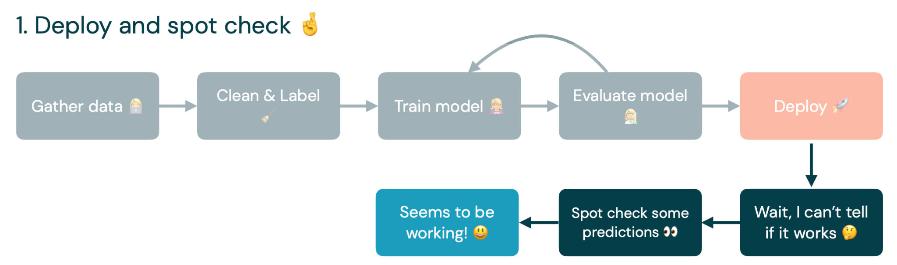
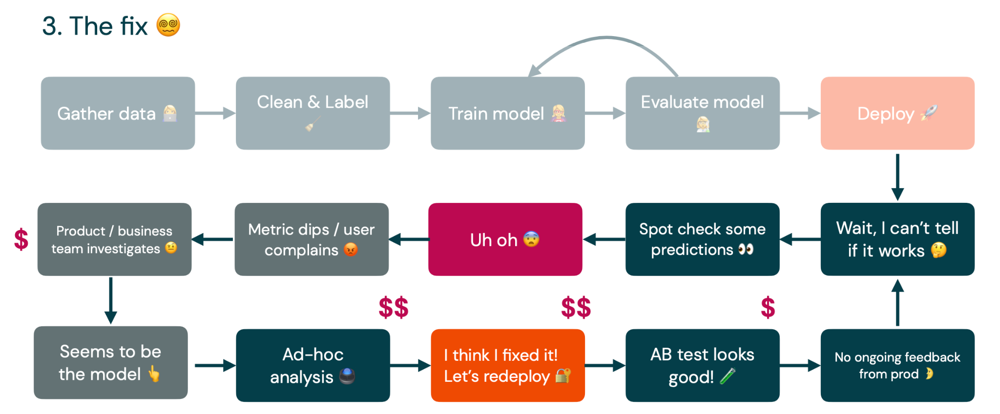
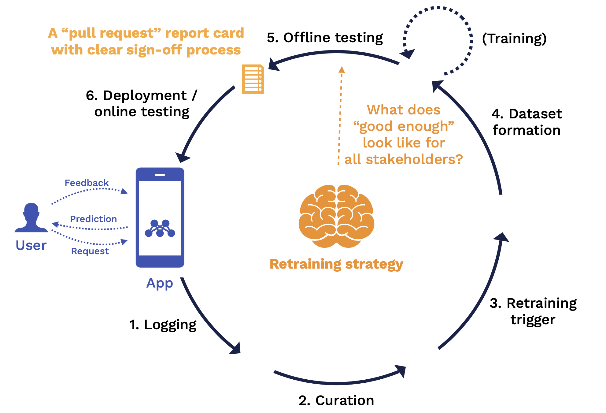
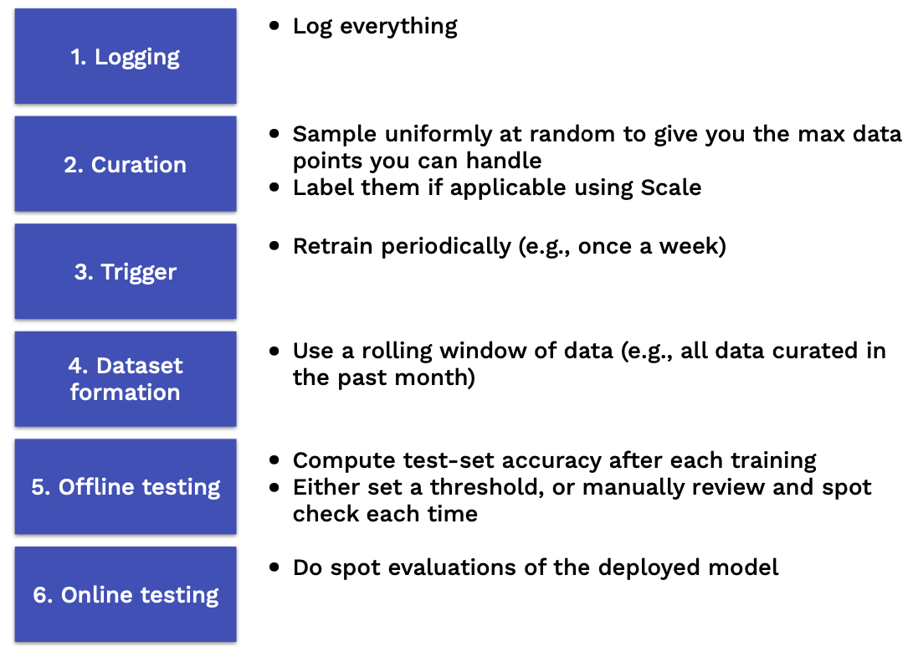
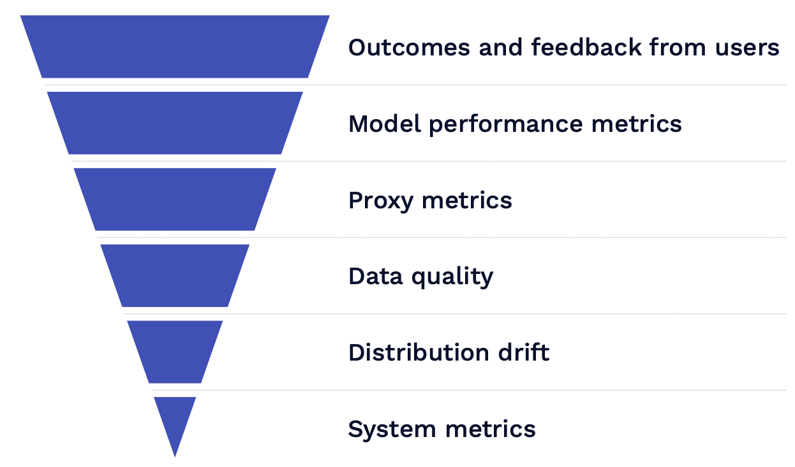
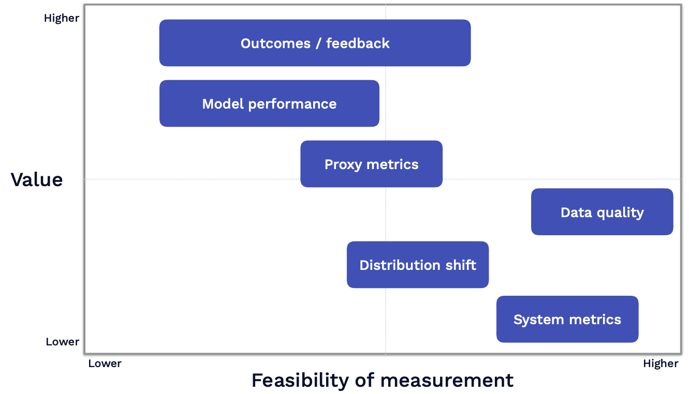

# Lecture 6: Continual Learning

<iframe width="720" height="405" src="https://www.youtube-nocookie.com/embed/nra0Tt3a-Oc?list=PL1T8fO7ArWleMMI8KPJ_5D5XSlovTW_Ur" title="YouTube video player" frameborder="0" allow="accelerometer; autoplay; clipboard-write; encrypted-media; gyroscope; picture-in-picture" allowfullscreen></iframe>

Lecture by [Josh Tobin](https://twitter.com/josh_tobin_). 
Notes by [James Le](https://twitter.com/le_james94) and [Vishnu Rachakonda](https://www.linkedin.com/in/vrachakonda/). 
Published September 12, 2022.
[Download slides](https://fsdl.me/2022-lecture-06-slides).

## 1 - Overview

The core justification for continual learning is that, unlike in
academia, we never deal with static data distributions in the real
world. The implication is that: **if you want to use ML in production
and build ML-powered products, you need to think about your goal of
building a continual learning system, not just a static model**.

Recalling the data flywheel that we've described in this class before:
as you get more users, those users bring more data. You can use the data
to make a better model. A better model helps you attract even more users
and build a better model over time. Andrej Karpathy described the most
optimistic version of it as "[Operation
Vacation](https://www.youtube.com/watch?v=hx7BXih7zx8)" -
if we make our continual learning system good enough, it'll get better
on its own over time, and ML engineers can just go on vacation.

The reality is quite different. Initially, we gather, clean, and label
some data. We train a model on that data. Then we evaluate the model and
loop back to training the model to improve it based on our evaluations.
Finally, we get a minimum viable model and deploy it into production.

The problem begins after we deploy the model: we generally don't have a
great way of measuring how our models are actually performing in
production. Often, we just spot-check some predictions to see if they
are doing what they are supposed to do. If it seems to work, then it's
great. We move on to work on other things.

Unfortunately, the ML engineer is probably not the one who discovers the
problems, to begin with. Some business user or product manager gets
complaints from users about a dipping metric, which leads to an
investigation. This already costs the company money because the product
and business teams must investigate the problem.

Eventually, they point back to the ML engineer and the model he is
responsible for. At this point, we are stuck on doing ad-hoc analyses
because we don't know what caused the model failure. Eventually, we can
run a bunch of SQL queries and paste together some Jupyter notebooks to
figure out what the problem is. If we are lucky, we can run an A/B test.
If the test looks good, we'll deploy it into production. Then, we are
back to where we started - **not getting ongoing feedback about how the
model is doing in production**.

The upshot is that **continual learning is the least well-understood
part of the production ML lifecycle**. Very few companies are doing this
in production today. This lecture focuses on how to improve different
steps of the continual learning process, pointers to learn about each
step, and recommendations for doing it pragmatically and adopting it
gradually.

## 2 - How to Think About Continual Learning

Our opinionated view about continual learning is **training a sequence
of models that can adapt to a continuous stream of data that comes into
production.** You can think about continual learning as an outer loop in
your training process. On one end of the loop is your application, which
consists of a model and some other code that users interact with that
application by submitting requests, getting predictions back, and
submitting feedback about how well the model did at providing that
prediction.

The continual learning loop starts with **logging**, which is how we get
all the data into the loop. Then we have **data curation**, **triggers**
for the retraining process, **dataset formation** to pick the data to
retrain on, the **training** process itself, and **offline testing** to
validate whether the retrained model is good enough to go into
production. After the model is deployed, we have **online testing**, and
that brings the next version of the model into production, where we can
start the loop all over.

Each of these stages passes the output to the next step. Output is
defined by a set of rules. These rules combine to form our **retraining
strategy**. Let's discuss what the retraining strategy looks like for
each stage:

At the **logging** stage, the key question answered by the retraining
strategy is **what data should we store**? At the end of this stage, we
have an "infinite stream" of potentially unlabeled data coming from
production and can be used for downstream analysis.

At the **curation** stage, the key rules we need to define are **what
data from that infinite stream will we prioritize for labeling and
potential retraining?** At the end of this stage, we have a reservoir of
candidate training points that have labels and are fully ready to be fed
back into a training process.

At the **retraining trigger** stage, the key question is **when should
we retrain?** The output of this stage is a signal to kick off a
retraining job.

At the **dataset formation** stage, the key rules we need to define are
**from this entire reservoir of data, what specific subset of that data
are we using to train on for this particular training job?** The output
of this stage is a view into that reservoir or training data that
specifies the exact data points to be used for the training job.

At the **offline testing** stage, the key rule we need to define is
**what "good enough" looks like for all stakeholders.** The output of
this stage is equivalent to a "pull request" report card for your model
with a clear sign-off process. Once you are signed off, the new model
will roll out into production.

Finally, at the **deployment and online testing** stage, the key rule to
define is **how do we know if this deployment was successful?** The
output of this stage is a signal to roll this model out fully to all of
your users.

In an idealized world, from an ML engineer's perspective, once the model
is deployed, the first version of the model is to not retrain the model
directly. Instead, we want the model to sit on top of the retraining
strategy and try to improve that strategy over time. Rather than
training models daily, we look at metrics about how well the strategy is
working and how well it's solving the task of improving our model over
time in response to changes in the world. The input that we provide is
by tuning the strategy to do a better job of solving that task.

For most ML engineers, our jobs don't feel like that at a high level.
**Our retraining strategy is just retraining models whenever we feel
like it**. We can get good results from ad-hoc retraining, but when you
start getting consistent results and no one is actively working on the
model day to day anymore, then it's worth starting to add some
automation. Alternatively, if you find yourself needing to retrain the
model more than once a week (or even more frequently than that) to deal
with changing results in the real world, then it's worth investing in
automation just to save yourself.

## 3 - Periodic Retraining

The first baseline retraining strategy that you should consider after
you move on from ad-hoc is just **periodic retraining**:

1.  At the logging stage, we simply log everything.

2.  At the curation stage, we sample uniformly at random from the data
that we've logged up until we get the maximum number of data
points that we are able to handle. Then we label them using some
automated tools.

3.  Our retraining trigger will just be periodic.

4.  We train once a week, but we do it on the last month's data, for
example.

5.  Then we compute the test set accuracy after each training, set a
threshold on that, or more likely manual review the results each
time, and spot-check some of the predictions.

6.  When we deploy the model, we do spot evaluations of that deployed
model on a few individual predictions to make sure things look
healthy.

Periodic retraining won't work in every circumstance. There are several
failure modes:

1.  The first category is that you have more data than you can log or
label. If you have a **high volume** of data, you might need to be
more careful about what data to sample and enrich, particularly if
that data comes from **a long-tail distribution** - where you have
edge cases that your model needs to perform well on, but those
edge cases might not be caught by just doing standard uniform
sampling. Or if that data is expensive to label like in a
**human-in-the-loop** scenario - where you need custom labeling
rules or labeling is a part of the product. In either of those
cases, you need to be more careful about what subset of your data
you log and enrich to be used down the road.

2.  The second category has to do with **managing the cost of
retraining**. If your model is expensive to retrain, retraining it
periodically is not going to be the most cost-efficient way to go,
especially if you do it on a rolling window of data every single
time. You will leave a lot of performance on the table by not
retraining more frequently. You can partially solve this by
increasing the retraining frequency, but this will increase the
costs even further.

3.  The final failure mode is situations where you have **a high cost of
bad predictions**. Every time you retrain your model, it
introduces risk, which comes from the fact that the data you're
training the model on might be bad in some way. It might be
corrupted, might have been attacked by an adversary, or might not
be representative anymore of all the cases that your model needs
to perform well on. The more frequently you retrain and the more
sensitive you are to model failures, the more thoughtful you need
to be about careful model evaluation such that you are not unduly
taking on too much risk from frequent retraining.

## 4 - Iterating On Your Retraining Strategy

The main takeaway from this section is that **we will use monitoring and
observability to determine what changes we want to make to our
retraining strategy**.

1.  We'll do that by monitoring just the metrics that actually that
matter and using all other metrics for debugging.

2.  When we debug an issue with our model, that will lead to potentially
retraining our model. But more broadly than that, we can think of
it as a change to the retraining strategy - changing our
retraining triggers, our offline tests, our sampling strategies,
the metrics for observability, etc.

3.  As we get more confident in our monitoring, we can introduce more
automation to our system.

There are no real standards or best practices on model monitoring yet.
The main principles we'll follow are: (1) We'll focus on monitoring what
matters and what breaks empirically; and (2) We'll compute other signals
too but use them for observability and debugging.

What does it mean to monitor a model in production? We think about it
as: You have some metric to assess the model quality (i.e, accuracy) and
a time series of how that metric changes over time. The question you try
to answer is: **Is this bad or okay?** Do you need to pay attention to
this degradation or not?

The questions we'll need to answer are:

1.  What metrics should we be looking at when we are monitoring?

2.  How can we tell if those metrics are bad and warrant an
intervention?

3.  What are the tools that help us with this process?

### What Metrics to Monitor

Choosing the right metric to monitor is probably the most important part
of this process. Below you can find different types of metrics ranked in
order of how valuable they are.

#### Outcomes and Feedback From Users

The most valuable one to look at is **outcome data or feedback from your
users**. Unfortunately, there are no one-size-fits-all ways to do this
because it depends a lot on the specifics of the product you are
building. This is more of a product management question of how to design
your product in a way that you can capture feedback from your users as
part of the product experience.

#### Model Performance Metrics

The next most valuable signal to look at is **model performance
metrics**. These are offline metrics such as accuracy. This is less
useful than user feedback because of loss mismatch. A common experience
many ML practitioners have is that improving model performance leads to
the same or worse outcome. There's very little excuse for not doing
this. To some degree, you can label some production data each day by
setting up an on-call rotation or throwing a labeling party. These
practices will give you some sense of how your model performance trends
over time.

#### Proxy Metrics

The next best thing to look at is **proxy metrics**, which are
correlated with bad model performance. These are mostly domain-specific.
For example, if you are building text generation with a language model,
two examples would be repetitive and toxic outputs. If you are building
a recommendation system, an example would be the share of personalized
responses. **Edge cases** can be good proxy metrics. If there are
certain problems you know that you have with your model, if those
increase in prevalence, that might mean your model is not doing very
well.

There's an academic direction that aims at being able to take any metric
you care about and approximate it on previously unseen data. How well do
we think our model is doing on this new data? Which would make these
proxy metrics a lot more practically useful? There are a number of
different approaches here: from training an auxiliary model to predict
how well your main model might do on this offline data, to using
heuristics and human-in-the-loop methods.

An unfortunate result from this literature is that it's not possible to
have a single method you use in all circumstances to approximate how
your model is doing on out-of-distribution data. Let's say you are
looking at the input data to predict how the model will perform on those
input points. Then the label distribution changes. As a result, you
won't be able to take into account that change in your approximate
metric.

#### Data Quality

The next signal to look at is **data quality.** [Data quality
testing](https://lakefs.io/data-quality-testing/) is a set
of rules you apply to measure the quality of your data. This deals with
questions such as: How well does a piece of information reflect reality?
Does it fulfill your expectations of what's comprehensive? Is your
information available when you need it? Some common examples include
checking whether the data has the right schema, the data is in the
expected range, and the number of records is not anomalous.

This is useful because data problems tend to be the most common issue
with ML models in practice. In [a Google
report](https://www.usenix.org/conference/opml20/presentation/papasian)
which covered 15 years of different pipeline outages with a particular
ML model, most of the outages that happened with that model were
distributed systems problems, commonly data problems.

#### Distribution Drift

##### Why Measure Distribution Drift?

Your model's performance is only guaranteed on **data sampled from the
same distribution** as it was trained on. This can have a huge impact in
practice. A recent example includes changes in model behavior during the
pandemic. A bug in the retraining pipeline caused the recommendations
not to be updated for new users, leading to millions of dollars in
revenue lost.

##### Types of Distribution Drift

Distribution drift manifests itself in different ways in the wild:

1.  **Instantaneous drift** happens when a model is deployed in a new
domain, a bug is introduced in the pre-processing pipeline, or a
big external shift like COVID occurs.

2.  **Gradual drift** happens when users\' preferences change or new
concepts get introduced to the corpus over time.

3.  **Periodic drift** happens when users' preferences are seasonal or
people in different time zones use your model differently.

4.  **Temporary drift** happens when a malicious user attacks your
model, a new user tries your product and churns, or someone uses
your product in an unintended way.

##### How to Measure It?

How to tell if your distribution is drifted?

1.  Your first **select a window of "good" data to serve as a
reference**. To select that reference, you can use a fixed window
of production data you believe to be healthy. [Some
papers](https://arxiv.org/abs/1908.04240) advocate
for using a sliding window of production data. In practice, most
of the time you probably should use your validation data as the
reference.

2.  Once you have that reference data, you **select a new window of
production data to measure your distribution distance on**. This
is not a super principled approach and tends to be
problem-dependent. A pragmatic solution is to pick one or several
window sizes with a reasonable amount of data and slide them.

3.  Finally, once you have your reference window and production window,
you **compare the windows using a distribution distance metric**.

##### What Metrics To Use?

Let's start by considering the one-dimensional case, where you have a
particular feature that is one-dimensional and can compute a density of
that feature on your reference/production windows. You want some metric
that approximates the distance between these two distributions.

There are a few options here:

1.  The commonly recommended ones are the KL divergence and the KS test.
But they are actually bad choices.

2.  Sometimes-better options would be (1) infinity norm or 1-norm of the
diff between probabilities for each category, and (2)
Earth-mover's distance (a more statistically principled approach).

Check out [this Gantry blog
post](https://gantry.io/blog/youre-probably-monitoring-your-models-wrong/)
to learn more about why the commonly recommended metrics are not so good
and the other ones are better.

##### Dealing with High-Dimensional Data

In the real world for most models, we have potentially many input
features or even unstructured data that is very high-dimensional. How do
we deal with detecting distribution drift in those cases?

1.  You can measure **drift on all of the features independently**: If
you have a lot of features, you will hit [the multiple hypothesis
testing
problem](https://multithreaded.stitchfix.com/blog/2015/10/15/multiple-hypothesis-testing/).
Furthermore, this doesn't capture cross-correlation.

2.  You can measure **drift on only the important features**: Generally
speaking, it's a lot more useful to measure drift on the outputs
of the model than the inputs. You can also [rank the importance
of your input
features](https://christophm.github.io/interpretable-ml-book/feature-importance.html)
and measure drift on the most important ones.

3.  You can look at **metrics that natively compute or approximate the
distribution distance between high-dimensional distributions**:
The two that are worth checking out are [maximum mean
discrepancy](https://jmlr.csail.mit.edu/papers/v13/gretton12a.html)
and [approximate Earth-mover's
distance](https://arxiv.org/abs/1904.05877). The
caveat here is that they are pretty hard to interpret.

A more principled way to measure distribution drift for high-dimensional
inputs to the model is to use **projections**. The idea of a projection
is that:

1.  You first take some high-dimensional input to the model and run that
through a function.

2.  Each data point your model makes a prediction on gets tagged by this
projection function. The goal of this projection function is to
reduce the dimensionality of that input.

3.  Once you've reduced the dimensionality, you can do drift detection
on that lower-dimensional representation of the high-dimensional
data.

This approach works for any kind of data, no matter what the
dimensionality is or what the data type is. It's also highly flexible.
There are different types of projections that can be useful:
**analytical projections** (e.g., mean pixel value, length of sentence,
or any other function), **random projections** (e.g., linear), and
**statistical projections** (e.g., autoencoder or other density models,
T-SNE).

##### Cons of Looking at Distribution Drift

**Models are designed to be robust to some degree of distribution
drift**. The figure on the left above shows a toy example to demonstrate
this point. We have a classifier that's trained to predict two classes.
We've induced a synthetic distribution shift to shift the red points on
the top left to bottom. These two distributions are extremely different,
but the model performs equally well on the training data and the
production data. In other words, knowing the distribution shift doesn't
tell you how the model has reacted to that shift.

The figure on the right is a research project that used data generated
from a physics simulator to solve problems on real-world robots. The
training data was highly out of distribution (low-fidelity, random
images). However, by training on this set of training data, the model
was able to generalize to real-world scenarios on the test data.

Beyond the theoretical limitations of measuring distribution drift, this
is just hard to do in practice. You have to window size correctly. You
have to keep all this data around. You need to choose metrics. You need
to define projections to make your data lower-dimensional.

#### System Metrics

The last thing to consider looking at is your standard **system
metrics** such as CPU utilization, GPU memory usage, etc. These don't
tell you anything about how your model is actually performing, but they
can tell you when something is going wrong.

#### Practical Recommendations

We also want to look at how hard it is to compute the aforementioned
stages in practice. As seen below, the Y-axis shows the **value** of
each signal and the X-axis shows the **feasibility** of measuring each
signal.

1.  Measuring outcomes or feedback has pretty wide variability in terms
of how feasible it is to do, as it depends on how your product is
set up.

2.  Measuring model performance tends to be the least feasible thing to
do because it involves collecting some labels.

3.  Proxy metrics are easier to compute because they don't involve
labels.

4.  System metrics and data quality metrics are highly feasible because
you have off-the-shelf tools for them.

Here are our practical recommendations:

1.  Basic data quality checks are zero-regret, especially if you are
retraining your model.

2.  Get some way to measure feedback, model performance, or proxy
metrics, even if it's hacky or not scalable.

3.  If your model produces low-dimensional outputs, monitoring those for
distribution shifts is also a good idea.

4.  As you evolve your system, practice the **observability** mindset.

While you can think of monitoring as measuring the known unknowns (e.g.,
setting alerts on a few key metrics), [observability is measuring
unknown
unknowns](https://www.honeycomb.io/blog/observability-a-manifesto/)
(e.g., having the power to ask arbitrary questions about your system
when it breaks). An observability mindset means two implications:

1.  You should keep around the context or raw data that makes up the
metrics that you are computing since you want to be able to drill
all the way down to potentially the data points themselves that
make up the degraded metric.

2.  You can go crazy with measurement by defining a lot of different
metrics. You shouldn't necessarily set alerts on each of those
since you don't want too many alerts. Drift is a great example
since it is useful for debugging but less so for monitoring.

Finally, it's important to **go beyond aggregate metrics**. If your
model is 99% accurate in aggregate but only 50% accurate for your most
important user, is it still "good"? The way to deal with this is by
flagging important subgroups or cohorts of data and alerting on
important metrics across them. Some examples are categories you don't
want to be biased against, "important" categories of users, and
categories you might expect to perform differently on (languages,
regions, etc.).

### How To Tell If Those Metrics are "Bad"

We don't recommend statistical tests (e.g., KS-Test) because they try to
return a p-value for the likelihood that the data distributions are not
the same. When you have a lot of data, you will get very small p-values
for small shifts. This is not what we actually care about since models
are robust to a small number of distribution shifts.

Better options than statistical tests include fixed rules, specific
ranges, predicted ranges, and unsupervised detection of new patterns.
[This article on dynamic data
testing](https://blog.anomalo.com/dynamic-data-testing-f831435dba90?gi=fb4db0e2ecb4)
has the details.

### Tools for Monitoring

The first category is **system monitoring** tools, a premature category
with different companies in it
([Datadog](https://www.datadoghq.com/),
[Honeycomb](https://www.honeycomb.io/), [New
Relic](https://newrelic.com/), [Amazon
CloudWatch](https://aws.amazon.com/cloudwatch/), etc.).
They help you detect problems with any software system, not just ML
models. They provide functionality for setting alarms when things go
wrong. Most cloud providers have decent monitoring solutions, but if you
want something better, you can look at monitoring-specific tools to
monitor anything.

This raises the question of whether we should just use these system
monitoring tools to monitor ML metrics as well. [This blog
post](https://www.shreya-shankar.com/rethinking-ml-monitoring-3/)
explains that it's feasible but highly painful due to many technical
reasons. Thus, it's better to use ML-specific tools.

Two popular open-source monitoring tools are
[EvidentlyAI](https://github.com/evidentlyai) and
[whylogs](https://github.com/whylabs/whylogs).

-   Both are similar in that you provide them with samples of data and
they produce a nice report that tells you where their distribution
shifts are.

-   The big limitation of both is that they don't solve the data
infrastructure and the scale problem. You still need to be able to
get all that data into a place where you can analyze it with these
tools.

-   The main difference between them is that whylogs is more focused on
gathering data from the edge by aggregating the data into
statistical profiles at inference time. You don't need to
transport all the data from your inference devices back to your
cloud.

Lastly, there are a bunch of different SaaS vendors for ML monitoring
and observability: [Gantry](https://gantry.io/),
[Aporia](https://www.aporia.com/),
[Superwise](https://superwise.ai/),
[Arize](https://arize.com/),
[Fiddler](https://www.fiddler.ai/),
[Arthur](https://arthur.ai/), etc.