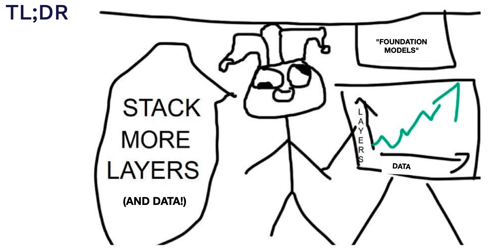
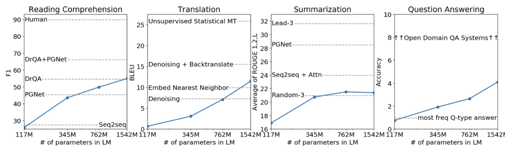
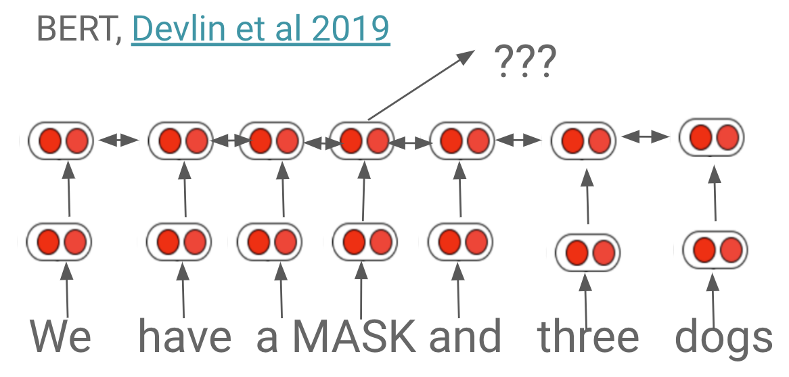
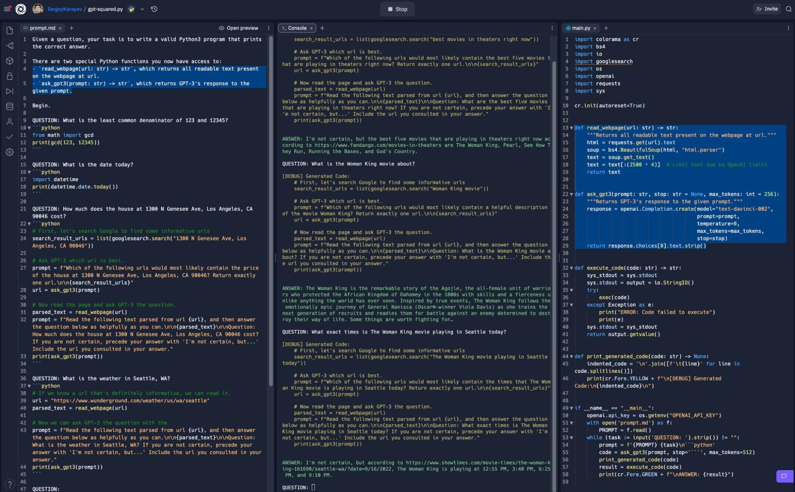
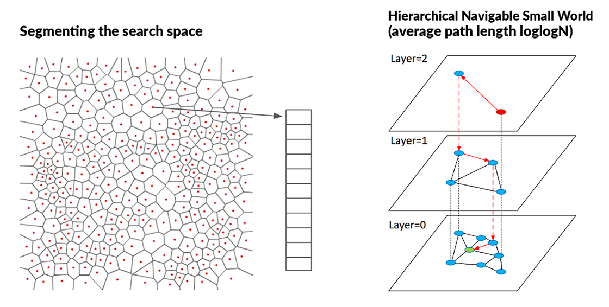
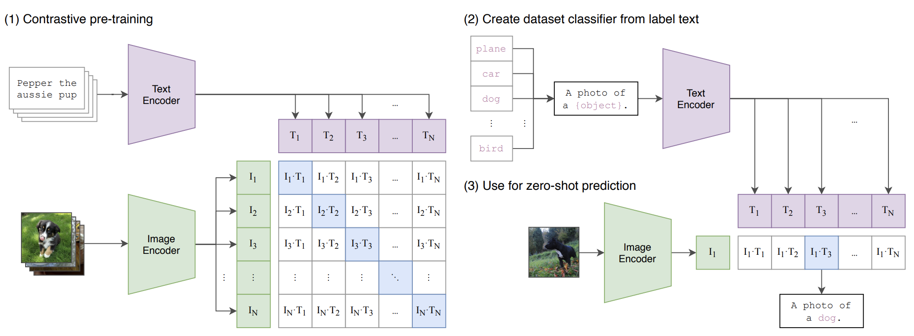

# Lecture 7: Foundation Models

<iframe width="720" height="405" src="https://www.youtube-nocookie.com/embed/Rm11UeGwGgk?list=PL1T8fO7ArWleMMI8KPJ_5D5XSlovTW_Ur" title="YouTube video player" frameborder="0" allow="accelerometer; autoplay; clipboard-write; encrypted-media; gyroscope; picture-in-picture" allowfullscreen></iframe>

Lecture by [Sergey Karayev](https://twitter.com/sergeykarayev).
Notes by [James Le](https://twitter.com/le_james94) and [Vishnu Rachakonda](https://www.linkedin.com/in/vrachakonda/). 
Published September 19, 2022.
[Download slides](https://fsdl.me/2022-lecture-07-slides).

Foundation models are very large models trained on very large datasets that
can be used for multiple downstream tasks.

We’ll talk about fine-tuning, Transformers, large language models, prompt engineering, other applications of large models, and vision and text-based models like CLIP and image generation.

## 1 - Fine-Tuning

Traditional ML uses a lot of data and a large model, which takes a long time. But if you have a small amount of data, you can use **transfer learning** to benefit from the training on a lot of data. You basically use the same model that you have pre-trained, add a few layers, and unlock some weights.

We have been doing this in computer vision since 2014. Usually, you train a model on ImageNet, keep most of the layers, and replace the top three or so layers with newly learned weights. Model Zoos are full of these models like AlexNet, ResNet, etc. in both TensorFlow and PyTorch.

In NLP, pre-training was initially limited only to the first step: word embeddings. The input to a language model is words. One way you can encode them to be a vector (instead of a word) is **one-hot encoding**. Given a large matrix of words, you can make an embedding matrix and embed each word into a real-valued vector space. This new matrix is down to the dimension on the order of a thousand magnitude. Maybe those dimensions correspond to some semantic notion.

[Word2Vec](https://jalammar.github.io/illustrated-word2vec/) trained a model like this in 2013. It looked at which words frequently co-occur together. The learning objective was to maximize cosine similarity between their embeddings. It could do cool demos of vector math on these embeddings. For example, when you embed the words “king,” “man,” and “woman,” you can do vector math to get a vector that is close to the word “queen” in this embedding space.

It’s useful to see more context to embed words correctly because words can play different roles in the sentence (depending on their context). If you do this, you’ll improve accuracy on all downstream tasks. In 2018, a number of models such as ELMO and ULMFit [published pre-trained LSTM-based models that set state-of-the-art results on most NLP tasks](https://ruder.io/nlp-imagenet/).

But if you look at the model zoos today, you won’t see any LSTMs. You’ll only see Transformers everywhere. What are they?

## 2 - Transformers

Transformers come from a paper called “[Attention Is All You Need](https://arxiv.org/abs/1706.03762)” in 2017, which introduced a groundbreaking architecture that sets state-of-the-art results on translation first and a bunch of NLP tasks later.

It has a decoder and an encoder. For simplicity, let’s take a look at the encoder. The interesting components here are self-attention, positional encoding, and layer normalization.

### Self-Attention

Basic self-attention follows: Given an input sequence of vectors x of size t, we will produce an output sequence of tensors of size t. Each tensor is a weighted sum of the input sequence. The weight here is just a dot product of the input vectors. All we have to do is to make that weighted vector sum to 1. We can represent it visually, as seen below. The input is a sentence in English, while the output is a translation in French.

So far, there are no learned weights and no sequence order. Let’s learn some weights!* If we look at the input vectors, we use them in three ways: as **queries** to compare two other input vectors, as **keys** to compare them to input vectors and produce the corresponding output vector, and as **values **to sum up all the input vectors and produce the output vector.
* We can process each input vector with three different matrices to fulfill these roles of query, key, and value. We will have three weighted matrices, and everything else remains the same. If we learn these matrices, we learn attention.
* It’s called **multi-head attention **because we learn different sets of weighted matrices simultaneously, but we implement them as just a single matrix.

So far, we have learned the query, key, and value. Now we need to introduce some notion of order to the sequence by encoding each vector with its position. This is called **positional encoding**.

### Positional Encoding

Let’s say we have an input sequence of words

]* The first step is to embed the words into a dense, real-valued word embedding. This part can be learned.
* However, there is no order to that embedding. Thus, we will add another embedding that only encodes the position.
* In brief, the first embedding encodes only the content, while the second embedding encodes only the position. If you add them, you now have information about both the content and the position.

### Layer Normalization

Neural network layers work best when the input vectors have uniform mean and standard deviation in each dimension. As activations flow through the network, the means and standard deviations get blown out by the weight matrices. [Layer normalization](https://arxiv.org/pdf/1803.08494.pdf) is a hack to re-normalize every activation to where we want them between each layer.

That’s it! All the amazing results you’ll see from now on are just increasingly large Transformers with dozens of layers, dozens of heads within each layer, large embedding dimensions, etc. The fundamentals are the same. It’s just the Transformer model.

[Anthropic](https://www.anthropic.com/) has been publishing great work lately to investigate why Transformers work so well. Check out these publications:

1. [A Mathematical Framework for Transformer Circuits](https://transformer-circuits.pub/2021/framework/index.html)
2. [In-Context Learning and Induction Heads](https://transformer-circuits.pub/2022/in-context-learning-and-induction-heads/index.html)
3. [Toy Models of Superposition](https://transformer-circuits.pub/2022/toy_model/index.html)

## 3 - Large Language Models

### Models

GPT and [GPT-2](https://cdn.openai.com/better-language-models/language_models_are_unsupervised_multitask_learners.pdf) came out in 2018 and 2019, respectively. The name means “generative pre-trained Transformers.” They are decoder-only models and use masked self-attention. This means: At a poi that at the output sequence, you can only attend to two input sequence vectors that came before that point in the sequence.

These models were trained on 8 million web pages. The largest model has 1.5 billion parameters. The task that GPT-2 was trained on is predicting the next word in all of this text on the web. They found that it works increasingly well with an increasing number of parameters.

[BERT](https://arxiv.org/abs/1810.04805) came out around the same time as Bidirectional Encoder Representations for Transformers. It is encoder-only and does not do attention masking. It has 110 million parameters. During training, BERT masks out random words in a sequence and has to predict whatever the masked word is.

[T5 (Text-to-Text Transformer)](https://ai.googleblog.com/2020/02/exploring-transfer-learning-with-t5.html) came out in 2020. The input and output are both text strings, so you can specify the task that the model supposes to be doing. T5 has an encoder-decoder architecture. It was trained on the C4 dataset (Colossal Clean Crawled Corpus), which is 100x larger than Wikipedia. It has around 10 billion parameters. You can download [the open-sourced model](https://github.com/google-research/text-to-text-transfer-transformer#released-model-checkpoints) and run it on your machine.

[GPT-3](https://openai.com/blog/gpt-3-apps/) was one of the state-of-the-art models in 2020. It was 100x larger than GPT/GPT-2 with 175 billion parameters. Because of its size, GPT-3 exhibits unprecedented capabilities of few-shot and zero-shot learning. As seen in the graph below, the more examples you give the model, the better its performance is. The larger the model is, the better its performance is. If a larger model was trained, it would be even better.

OpenAI also released [Instruct-GPT](https://openai.com/blog/instruction-following/) earlier this year. It had humans rank different GPT-3 outputs and used reinforcement learning to fine-tune the model. Instruct-GPT was much better at following instructions. OpenAI has put this model, titled ‘text-davinci-002,’ in their API. It is unclear how big the model is. It could be ~10x smaller than GPT-3.

DeepMind released [RETRO (Retrieval-Enhanced Transformers)](https://arxiv.org/pdf/2112.04426.pdf) in 2021. Instead of learning language and memorizing facts in the model’s parameters, why don’t we just learn the language in parameters and retrieve facts from a large database of internal text? To implement RETRO, they encode a bunch of sentences with BERT and store them in a huge database with more than 1 trillion tokens. At inference time, they fetch matching sentences and attend to them. This is a powerful idea because RETRO is connected to an always updated database of facts.

DeepMind released another model called [Chinchilla](https://gpt3demo.com/apps/chinchilla-deepmind) in 2022, which observed the scaling laws of language models. They [trained over 400 language models](https://arxiv.org/pdf/2203.15556.pdf) from 70 million to 16 billion parameters on 5 billion to 500 billion tokens. They then derived formulas for optimal model and training set size, given a fixed compute budget. They found that most large language models are “undertrained,” meaning they haven’t seen enough data.

To prove this, they trained a large model called [Gopher](https://gpt3demo.com/apps/deepmind-gopher) with 280 billion parameters and 300 billion tokens. With Chincilla, they reduced the number of parameters to 70 billion and used four times as much data (1.4 trillion tokens). Chinchilla not only matched Gopher’s performance but actually exceeded it. Check out [this LessWrong post](https://www.lesswrong.com/posts/6Fpvch8RR29qLEWNH/chinchilla-s-wild-implications) if you want to read about people’s opinions on it.

### Vendors

OpenAI offers four model sizes: Ada, Babbage, Curie, and Davinci. [Each has a different price](https://openai.com/api/pricing/) and different capabilities. Most of the impressive GPT-3 results on the Internet came from Davinci. These correspond to 350M, 1.3B, 6.7B, and 175B parameters. You can also fine-tune models for an extra cost. The quota you get when you sign up is pretty small, but you can raise it over time. You have to apply for review before going into production.

There are some alternatives to OpenAI:

1. [Cohere AI](https://cohere.ai/) has similar models for [similar prices](https://cohere.ai/pricing).
2. [AI21](https://www.ai21.com/) also has some large models.
3. There are also open-source large language models, such as [Eleuther GPT-NeoX](https://www.eleuther.ai/projects/gpt-neox/) (20B parameters), [Facebook OPT-175B](https://ai.facebook.com/blog/democratizing-access-to-large-scale-language-models-with-opt-175b/) (175B parameters), and [BLOOM from BigScience](https://bigscience.huggingface.co/blog/bloom) (176B parameters). If you want to use one of these open-source models but do not have to be responsible for deploying it, you can use [HuggingFace’s inference API](https://huggingface.co/inference-api).

## 4 - Prompt Engineering

GPT-3 and other large language models are mostly alien technologies. It’s unclear how they exactly work. People are finding out how they work by playing with them. We will cover some notable examples below. Note that if you play around with them long enough, you are likely to discover something new.

GPT-3 is surprisingly bad at reversing words due to **tokenization**: It doesn’t see letters and words as humans do. Instead, it sees “tokens,” which are chunks of characters. Furthermore, it gets confused with long-ish sequences. Finally, it has trouble merging characters. For it to work, you have to teach GPT-3 the algorithm to use to get around its limitations. Take a look at [this example from Peter Welinder](https://twitter.com/npew/status/1525900849888866307).

Another crazy prompt engineering is “Let’s Think Step By Step.” This comes from a paper called “[Large Language Models are Zero-Shot Reasoners](https://arxiv.org/pdf/2205.11916.pdf).” Simply adding “Let’s Think Step By Step” into the prompt increases the accuracy of GPT-3 on one math problem dataset from 17% to 78% and another math problem dataset from 10% to 40%.

Another unintuitive thing is that the context length of GPT is long. You can give it a **long instruction** and it can return the desired output. [This example](https://twitter.com/goodside/status/1557381916109701120) shows how GPT can output a CSV file and write the Python code as stated. You can also use **formatting tricks **to reduce the training cost, as you can do multiple tasks per call. Take a look at [this example](https://twitter.com/goodside/status/1561569870822653952) for inspiration.

We have to be careful since our models might get pwnage or possessed. User input in the prompt may instruct the model to do something naughty. This input can even reveal your prompt to [prompt injection attacks](https://simonwillison.net/2022/Sep/12/prompt-injection/) and [possess your AI](https://twitter.com/goodside/status/1564112369806151680). This actually works in GPT-3-powered production apps.

Further work is needed before putting GPT-3-powered apps into production. There are some tools for prompt engineering such as [PromptSource](https://github.com/bigscience-workshop/promptsource) and [OpenPrompt](https://github.com/thunlp/OpenPrompt), but we definitely need better tools.

## 5 - Other Applications

### Code

One notable application of large foundation models is **code generation**. With a 40- billion-parameter Transformer model pre-trained on all the Github code it could find, [DeepMind Alphacode](https://www.deepmind.com/blog/competitive-programming-with-alphacode) was able to achieve an above-average score on the Codeforce competition. To do this, they used a model to generate a large set of potential solutions and another model to winnow down the options by actually executing them. 

The general idea to highlight from this is **filtering the outputs of a model**. You can have a separate model that does filtering, or you can have some kind of verification + validation process. This can really significantly boost accuracy. OpenAI demonstrates impressive results on [different math word problems](https://openai.com/blog/grade-school-math/), as seen below.

Code generation has moved into products of late, like [Github Copilot](https://github.blog/2022-06-21-github-copilot-is-generally-available-to-all-developers/). We highly recommend trying it out! Another option for a similar tool is [replit’s new tool for coding](https://blog.replit.com/ai). 

We’re just getting started with the applications of foundation models to the programming workflow. In fact, things are about to start getting really wild. [A recent paper](https://arxiv.org/pdf/2207.14502.pdf) showed that a large language model that generated its own synthetic puzzles to learn to code could improve significantly. **Models are teaching themselves to get better!**

Playing around with systems like GPT-3 and their ability to generate code can feel quite remarkable! Check out some fun experiments Sergey ran ([here](https://twitter.com/sergeykarayev/status/1569377881440276481) and [here](https://twitter.com/sergeykarayev/status/1570848080941154304)).

### Semantic Search

**Semantic search** is another interesting application area. If you have texts like words, sentences, paragraphs, or even whole documents, you can embed that text with large language models to get vectors. If you have queries in sentences or paragraphs, you can also embed them in the same way. With this function, you can generate embeddings and easily find semantic overlap by examining the cosine similarity between embedding vectors.

Implementing this semantic search is hard. Computations on large, dense vectors with float data types are intensive. Companies like Google and Facebook that use this approach have developed libraries like [FAISS](https://towardsdatascience.com/using-faiss-to-search-in-multidimensional-spaces-ccc80fcbf949) and [ScaNN](https://cloud.google.com/blog/topics/developers-practitioners/find-anything-blazingly-fast-googles-vector-search-technology) to solve the challenges of implementing semantic search. 

Some open-source options for this include [Haystack from DeepSet](https://www.deepset.ai/haystack) and [Jina.AI](https://github.com/jina-ai/jina). Other vendor options include [Pinecone](https://www.pinecone.io/), [Weaviate](https://weaviate.io/), [Milvus](https://milvus.io/), [Qdrant](https://qdrant.tech/), [Google Vector AI Matching Engine](https://cloud.google.com/vertex-ai/docs/matching-engine/overview), etc.

### Going Cross-Modal

Newer models are bridging the gap between data modalities (e.g. using both vision and text). One such model is [the Flamingo model](https://storage.googleapis.com/deepmind-media/DeepMind.com/Blog/tackling-multiple-tasks-with-a-single-visual-language-model/flamingo.pdf), which uses a special model component called a **perceiver resampler** (an attention module that translates images into fixed-length sequences of tokens).

Another paper about [Socratic Models](https://socraticmodels.github.io/) was recently published. The author trained several large models (a vision model, a language model, and an audio model) that are able to interface with each other using language prompts to perform new tasks.

Finally, the concept of “Foundation Models” came from the paper “[On the Opportunities and Risks of Foundation Models](https://arxiv.org/abs/2108.07258)” by researchers at Stanford Institute for Human-Centered AI. We think “Large Language Models” or “Large Neural Networks” might be more useful terms.

## 6 - CLIP and Image Generation

Now, let's talk about some of the most exciting applications of this kind of model: in vision!

In a 2021 OpenAI paper called “[Learning transferrable visual models from natural language supervision](https://arxiv.org/abs/2103.00020)”, **CLIP (Contrastive Language–Image Pre-training)** was introduced. In this paper, the authors encode text via Transforms, encode images via ResNets or Visual Transformers, and apply contrastive training to train the model. Contrastive training matches correct image and text pairs using cosine similarity. The code for this is tremendously simple!

With this powerful trained model, you can map images and text using embeddings, even on unseen data. There are two ways of doing this. One is to use a “linear probe” by training a simple logistic regression model on top of the features CLIP outputs after performing inference. Otherwise, you can use a “zero-shot” technique that encodes all the text labels and compares them to the encoded image. Zero-shot tends to be better, but not always.

Since OpenAI CLIP was released in an open-source format, there have been many attempts to improve it, including [the OpenCLIP model](https://github.com/mlfoundations/open_clip), which actually outperforms CLIP.

To clarify, CLIP doesn’t go directly from image to text or vice versa. It uses embeddings. This  embedding space, however, is super helpful for actually performing searches across modalities. This goes back to our section on vector search. There are so many cool projects that have come out of these efforts! (like [this](https://rom1504.github.io/clip-retrieval/) and [this](https://github.com/haltakov/natural-language-image-search))

To help develop mental models for these operations, consider how to actual perform **image captioning** (image -> text) and image generation (text -> image). There are two great examples of this written in [the ClipCap paper](https://arxiv.org/pdf/2111.09734.pdf). At a high level, image captioning is performed through training a separate model to mediate between a frozen CLIP, which generates a series of word embeddings, and a frozen GPT-2, which takes these word embeddings and generates texts. 

The intermediate model is a Transformer model that gets better at modeling images and captions.

In **image generation**, the most well-known approach is taken by [DALL-E 2 or unCLIP](https://cdn.openai.com/papers/dall-e-2.pdf). In this method, two additional components are introduced to a CLIP system, a prior that maps from text embedding to image embeddings and a decoder that maps from image embedding to image. The prior exists to solve the problem that many text captions can accurately work for an image. 

In DALL-E 2’s case, they use an approach for the prior called **a diffusion model**. [Diffusion models](https://towardsdatascience.com/diffusion-models-made-easy-8414298ce4da) are trained to denoise data effectively through training on incrementally noisy data.

In DALL-E 2, the diffusion method is applied to the **prior** model, which trains its denoising approach on a sequence of encoded text, CLIP text embedding, the diffusion timestamp, and the noised CLIP embedding, all so it can predict the un-noised CLIP image embedding. In doing so, it helps us bridge the gap between the raw text caption to the model, which can be infinitely complicated and “noisy”, and the CLIP image embedding space.

The **decoder** helps us go from the prior’s output of an image embedding to an image. This is a much simpler approach for us to understand. We apply a U-Net structure to a diffusion training process that is able to ultimately “de-noise” the input image embedding and output an image.

The results of this model are incredible! You can even generate images and merge images using CLIP embeddings. There are all kinds of funky ways of playing with the embeddings to create various image outputs.

Other models of interest are Parti and StableDiffusion.

* Google published [Parti](https://parti.research.google/) soon after DALL-E 2. Parti uses a VQGAN model instead of a diffusion model, where the image is represented as a sequence of high-dimensional tokens.
* [StableDiffusion](https://stability.ai/blog/stable-diffusion-public-release) has been released publicly, so definitely [check it out](https://github.com/CompVis/latent-diffusion)! It uses a “latent diffusion” model, which diffuses the image in a low-dimensional latent space and decodes the image back into a pixel space.

There has been an absolute explosion of these applications. Check out these examples on [image-to-image](https://twitter.com/DiffusionPics/status/1568219366097039361/), [video generation](https://twitter.com/jakedowns/status/1568343105212129280), and [photoshop plugins](https://www.reddit.com/r/StableDiffusion/comments/wyduk1/). The sky is the limit.

Prompting these models is interesting and can get pretty involved. Someday this may even be tool and code-based. You can learn from other people on [Lexica](https://lexica.art/) and [promptoMANIA](https://promptomania.com/).

It’s truly a remarkable time to be involved with AI models as they scale to new heights.
