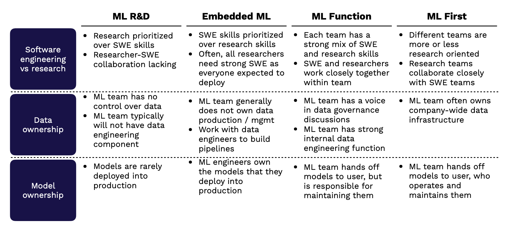

# Lecture 8: ML Teams and Project Management

<iframe width="720" height="405" src="https://www.youtube-nocookie.com/embed/a54xH6nT4Sw?list=PL1T8fO7ArWleMMI8KPJ_5D5XSlovTW_Ur" title="YouTube video player" frameborder="0" allow="accelerometer; autoplay; clipboard-write; encrypted-media; gyroscope; picture-in-picture" allowfullscreen></iframe>

Lecture by [Josh Tobin](https://twitter.com/josh_tobin_).
Notes by [James Le](https://twitter.com/le_james94) and [Vishnu Rachakonda](https://www.linkedin.com/in/vrachakonda/). 
Published September 26, 2022.
[Download slides](https://fsdl.me/2022-lecture-08-slides).

## 0 - Why is this hard?

Building any product is hard:

-   You have to hire great people.

-   You have to manage and develop those people.

-   You have to manage your team's output and make sure your vectors are
aligned.

-   You have to make good long-term technical choices and manage
technical debt.

-   You have to manage expectations from leadership.

-   You have to define and communicate requirements with stakeholders.

Machine Learning (ML) adds complexity to that process:

-   ML talent is expensive and scarce.

-   ML teams have a diverse set of roles.

-   Projects have unclear timelines and high uncertainty.

-   The field is moving fast, and ML is the "[high-interest credit card
of technical
debt](https://papers.nips.cc/paper/5656-hidden-technical-debt-in-machine-learning-systems.pdf)."

-   Leadership often doesn't understand ML.

-   ML products fail in ways that are hard for laypeople to understand.

In this lecture, we'll talk about:

1.  ML-related **roles** and their required skills.

2.  How to **hire** ML engineers (and how to get hired).

3.  How ML teams are **organized** and fit into the broader
organization.

4.  How to **manage** an ML team and ML products.

5.  **Design** considerations for ML products.

## 1 - Roles

### Common Roles

Let's look at the most common ML roles and the skills they require:

-   The **ML Product Manager** works with the ML team, other business
functions, the end-users, and the data owners. This person designs
docs, creates wireframes, and develops a plan to prioritize and
execute ML projects.

-   The **MLOps/ML Platform Engineer** builds the infrastructure to make
models easier and more scalable to deploy. This person handles the
ML infrastructure that runs the deployed ML product using
platforms like AWS, GCP, Kafka, and other ML tooling vendors.

-   The **ML Engineer** trains and deploys prediction models. This
person uses tools like TensorFlow and Docker to work with
prediction systems running on real data in production.

-   The **ML Researcher** trains prediction models, often those that are
forward-looking or not production-critical. This person uses
libraries like TensorFlow and PyTorch on notebook environments to
build models and reports describing their experiments.

-   The **Data Scientist** is a blanket term used to describe all of the
roles above. In some organizations, this role entails answering
business questions via analytics. This person can work with
wide-ranging tools from SQL and Excel to Pandas and Scikit-Learn.

### Skills Required

What skills are needed for these roles? The chart below displays a nice
visual - where the horizontal axis is the level of ML expertise and the
size of the bubble is the level of communication and technical writing
(the bigger, the better).

-   The **MLOps** is primarily a software engineering role, which often
comes from a standard software engineering pipeline.

-   The **ML Engineer** requires a rare mix of ML and Software
Engineering skills. This person is either an engineer with
significant self-teaching OR a science/engineering Ph.D. who works
as a traditional software engineer after graduate school.

-   The **ML Researcher** is an ML expert who usually has an MS or Ph.D.
degree in Computer Science or Statistics or finishes an industrial
fellowship program.

-   The **ML Product Manager** is just like a traditional Product
Manager but with a deep knowledge of the ML development process
and mindset.

-   The **Data Scientist** role constitutes a wide range of backgrounds,
from undergraduate to Ph.D. students.

There is an important distinction between a task ML engineer and a
platform ML engineer, coined by Shreya Shankar in [this blog
post](https://www.shreya-shankar.com/phd-year-one/):

1.  **Task ML engineers** are responsible for maintaining specific ML
pipelines. They only focus on ensuring that these ML models are
healthy and updated frequently. They are often overburdened.

2.  **Platform ML engineers** help task ML engineers automate tedious
parts of their jobs. They are called MLOps/ML Platform engineers
in our parlance.

## 2 - Hiring

### The AI Talent Gap

In 2018 (when we started FSDL), the AI talent gap was the main story.
There were so few people who understood this technology, so the biggest
block for organizations was that they couldn't find people who were good
at ML.

In 2022, the AI talent gap persists. But it tends to be less of a
blocker than it used to be because we have had four years of folks
switching careers into ML and software engineers emerging from
undergraduate with at least a couple of ML classes under their belts.

The gap tends to be in folks that understand more than just the
underlying technology but also have experience in seeing how ML fails
and how to make ML successful when it's deployed. That's the reality of
how difficult it is to hire ML folks today, especially those with
**production experience**.

### Sourcing

Because of this shallow talent pool and the skyrocketing demand, hiring
for ML positions is pretty hard. Typical ML roles come in the following
structure:

-   ML Adjacent roles: ML product manager, DevOps, Data Engineer

-   Core ML Roles: ML Engineer, ML Research/ML Scientist

-   Business analytics roles: Data Scientist

For ML-adjacent roles, traditional ML knowledge is less important, as
demonstrated interest, conversational understanding, and experience can
help these professionals play an impactful role on ML teams. Let's focus
on how to hire for **the core ML roles**.

While there's no perfect way to **hire ML engineers**, there's
definitely a wrong way to hire them, with extensive job descriptions
that demand only the best qualifications (seen above). Certainly, there
are many good examples of this bad practice floating around.

-   Rather than this unrealistic process, consider hiring for software
engineering skills, an interest in ML, and a desire to learn. You
can always train people in the art and science of ML, especially
when they come with strong software engineering fundamentals.

-   Another option is to consider adding junior talent, as many recent
grads come out with good ML knowledge nowadays.

-   Finally, and most importantly, be more specific about what you need
the position and professional to do. It's impossible to find one
person that can do everything from full-fledged DevOps to
algorithm development.

To **hire ML researchers**, here are our tips:

-   Evaluate the quality of publications, over the quantity, with an eye
toward the originality of the ideas, the execution, etc.

-   Prioritize researchers that focus on important problems instead of
trendy problems.

-   Experience outside academia is also a positive, as these researchers
may be able to transition to industry more effectively.

-   Finally, keep an open mind about research talent and consider
talented people without PhDs or from adjacent fields like physics,
statistics, etc.

To find quality candidates for these roles, here are some ideas for
sourcing:

-   Use standard sources like LinkedIn, recruiters, on-campus
recruiting, etc.

-   Monitor arXiv and top conferences and flag the first authors of
papers you like.

-   Look for good implementations of papers you like.

-   Attend ML research conferences (NeurIPS, ICML, ICLR).

As you seek to recruit, stay on top of what professionals want and make
an effort to position your company accordingly. ML practitioners want to
be empowered to do great work with interesting data. Building a culture
of learning and impact can help recruit the best talent to your team.
Additionally, sell sell sell! Talent needs to know how good your team is
and how meaningful the mission can be.

### Interviewing

As you interview candidates for ML roles, try to **validate your
hypotheses of their strengths while testing a minimum bar on weaker
aspects**. For example, ensure ML researchers can think creatively about
new ML problems while ensuring they meet a baseline for code quality.
It's essential to test ML knowledge and software engineering skills for
all industry professionals, though the relative strengths can vary.

The actual ML interview process is much less well-defined than software
engineering interviews, though it is modeled off of it. Some helpful
inclusions are projects or exercises that test the ability to work with
ML-specific code, like take-home ML projects. Chip Huyen's
"[Introduction to ML Interviews
Book](https://huyenchip.com/ml-interviews-book/)" is a
great resource.

### Finding A Job

To find an ML job, you can take a look at the following sources:

-   Standard sources such as LinkedIn, recruiters, on-campus recruiting,
etc.

-   ML research conferences (NeurIPS, ICLR, ICML).

-   Apply directly (remember, there's a talent gap!).

Standing out for competitive roles can be tricky! Here are some tips (in
increasing order of impressiveness) that you can apply to differentiate
yourself:

1.  Exhibit ML interest (e.g., conference attendance, online course
certificates, etc.).

2.  Build software engineering skills (e.g., at a well-known software
company).

3.  Show you have a broad knowledge of ML (e.g., write blog posts
synthesizing a research area).

4.  Demonstrate ability to get ML projects done (e.g., create side
projects, re-implement papers).

5.  Prove you can think creatively in ML (e.g., win Kaggle competitions,
publish papers).

## 3 - Organizations

### Organization Archetypes

There exists not yet a consensus on the right way to structure an ML
team. Still, a few best practices are contingent upon different
organization archetypes and their ML maturity level. First, let's see
what the different ML organization archetypes are.

**Archetype 1 - Nascent and Ad-Hoc ML**

-   These are organizations where no one is doing ML, or ML is done on
an ad-hoc basis. Obviously, there is little ML expertise in-house.

-   They are either small-to-medium businesses or less
technology-forward large companies in industries like education or
logistics.

-   There is often low-hanging fruit for ML.

-   But there is little support for ML projects, and it's challenging to
hire and retain good talent.

**Archetype 2 - ML R&D**

-   These are organizations in which ML efforts are centered in the R&D
arm of the organization. They often hire ML researchers and
doctorate students with experience publishing papers.

-   They are larger companies in sectors such as oil and gas,
manufacturing, or telecommunications.

-   They can hire experienced researchers and work on long-term business
priorities to get big wins.

-   However, it is very difficult to get quality data. Most often, this
type of research work rarely translates into actual business
value, so usually, the amount of investment remains small.

**Archetype 3 - ML Embedded Into Business and Product Teams**

-   These are organizations where certain product teams or business
units have ML expertise alongside their software or analytics
talent. These ML individuals report up to the team's
engineering/tech lead.

-   They are either software companies or financial services companies.

-   ML improvements are likely to lead to business value. Furthermore,
there is a tight feedback cycle between idea iteration and product
improvement.

-   Unfortunately, it is still very hard to hire and develop top talent,
and access to data and compute resources can lag. There are also
potential conflicts between ML project cycles and engineering
management, so long-term ML projects can be hard to justify.

**Archetype 4 - Independent ML Function**

-   These are organizations in which the ML division reports directly to
senior leadership. The ML Product Managers work with Researchers
and Engineers to build ML into client-facing products. They can
sometimes publish long-term research.

-   They are often large financial services companies.

-   Talent density allows them to hire and train top practitioners.
Senior leaders can marshal data and compute resources. This gives
the organizations to invest in tooling, practices, and culture
around ML development.

-   A disadvantage is that model handoffs to different business lines
can be challenging since users need the buy-in to ML benefits and
get educated on the model use. Also, feedback cycles can be slow.

**Archetype 5 - ML-First Organizations**

-   These are organizations in which the CEO invests in ML, and there
are experts across the business focusing on quick wins. The ML
division works on challenging and long-term projects.

-   They are large tech companies and ML-focused startups.

-   They have the best data access (data thinking permeates the
organization), the most attractive recruiting funnel (challenging
ML problems tends to attract top talent), and the easiest
deployment procedure (product teams understand ML well enough).

-   This type of organization archetype is hard to implement in practice
since it is culturally difficult to embed ML thinking everywhere.

### Team Structure Design Choices

Depending on the above archetype that your organization resembles, you
can make the appropriate design choices, which broadly speaking follow
these three categories:

1.  **Software Engineer vs. Research**: To what extent is the ML team
responsible for building or integrating with software? How
important are Software Engineering skills on the team?

2.  **Data Ownership**: How much control does the ML team have over data
collection, warehousing, labeling, and pipelining?

3.  **Model Ownership**: Is the ML team responsible for deploying models
into production? Who maintains the deployed models?

Below are our design suggestions:

If your organization focuses on **ML R&D**:

-   Research is most definitely prioritized over Software Engineering
skills. Because of this, there would potentially be a lack of
collaboration between these two groups.

-   ML team has no control over the data and typically will not have
data engineers to support them.

-   ML models are rarely deployed into production.

If your organization has **ML embedded into the product**:

-   Software Engineering skills will be prioritized over Research
skills. Often, the researchers would need strong engineering
skills since everyone would be expected to product-ionize his/her
models.

-   ML teams generally do not own data production and data management.
They will need to work with data engineers to build data
pipelines.

-   ML engineers totally own the models that they deploy into
production.

If your organization has **an independent ML division**:

-   Each team has a potent mix of engineering and research skills;
therefore, they work closely together within teams.

-   ML team has a voice in data governance discussions, as well as a
robust data engineering function.

-   ML team hands-off models to users but is still responsible for
maintaining them.

If your organization is **ML-First**:

-   Different teams are more or less research-oriented, but in general,
research teams collaborate closely with engineering teams.

-   ML team often owns the company-wide data infrastructure.

-   ML team hands the models to users, who are responsible for operating
and maintaining them.

The picture below neatly sums up these suggestions:

## 4 - Managing

### Managing ML Teams Is Challenging

The process of actually managing an ML team is quite challenging for
four reasons:

1.  **Engineering Estimation:** It's hard to know how easy or hard an ML
project is in advance. As you explore the data and experiment with
different models, there is enormous scope for new learnings about
the problem that materially impact the timeline. Furthermore,
knowing what methods will work is often impossible. This makes it
hard to say upfront how long or how much work may go into an ML
project.

2.  **Nonlinear Progress:** As the chart below from a [blog
post](https://medium.com/@l2k/why-are-machine-learning-projects-so-hard-to-manage-8e9b9cf49641)
by Lukas Biewald (CEO of [Weights and
Biases](https://wandb.ai/site)) shows, progress on ML
projects is unpredictable over time, even when the effort expended
grows considerably. It's very common for projects to stall for
extended periods of time.

3.  **Cultural gaps:** The relative culture of engineering and research
professionals is very different. Research tends to favor novel,
creative ideas, while engineering prefers tried and true methods
that work. As a result, ML teams often experience a clash of
cultures, which can turn toxic if not appropriately managed. A
core challenge of running ML teams is addressing the cultural
barriers between ML and software engineering so that teams can
harmoniously experiment and deliver ML products.

4.  **Leadership Deficits**: It's common to see a lack of detailed
understanding of ML at senior levels of management in many
companies. As a result, expressing feasibility and setting the
right expectations for ML projects, especially high-priority ones,
can be hard.

### How To Manage ML Teams Better

Managing ML teams is hardly a solved problem, but you can take steps to
improve the process.

**Plan probabilistically**

Many engineering projects are managed in a waterfall fashion, with the
sequential tasks defined up front clearly. Instead of forcing this
method of engineering management on difficult ML projects, try assigning
a likelihood of success to different tasks to better capture the
experimental process inherent to ML engineering. As these tasks progress
or stall, rapidly re-evaluate your task ordering to better match what is
working. Having this sense of both (1) **how likely a task is to
succeed** and (2) **how important it is** makes project planning
considerably more realistic.

**Have a portfolio of approaches**

Embrace multiple ideas and approaches to solve crucial research
challenges that gate production ML. Don't make your plan dependent on
one approach working!

**Measure inputs, not results**

As you work through several approaches in your portfolio, do not overly
emphasize whose ideas ultimately work as a reflection of contribution
quality. This can negatively impact team members' creativity, as they
focus more on trying to find only what they currently think could work,
rather than experimenting in a high-quality fashion (which is ultimately
what leads to ML success).

**Have researchers and engineers work together**

The collaboration between engineering and research is essential for
quality ML products to get into production. Emphasize collaboration
across the groups and professionals!

**Get quick wins**

Taking this approach makes it more likely that your ML project will
succeed in the long term. It allows you to demonstrate progress to your
leadership more effectively and clearly.

**Educate leadership on uncertainty**

This can be hard, as leadership is ultimately accountable for addressing
blind spots and understanding timeline risk. There are things you can
do, however, to help improve leadership's knowledge about ML timelines.

-   Avoid building hype around narrow progress metrics material only to
the ML team (e.g., "*We improved F1 score by 0.2 and have achieved
awesome performance!*").

-   Instead, be realistic, communicate risk, and emphasize real product
impact (e.g., "Our model improvements should increase the number
of conversions by 10%, though we must continue to validate its
performance on additional demographic factors.)

-   Sharing resources like [this a16z primer](https://a16z.com/2016/06/10/ai-deep-learning-machines/),
[this class from Prof. Pieter
Abbeel](https://executive.berkeley.edu/programs/artificial-intelligence),
and [this Google's People + AI
guidebook](https://pair.withgoogle.com/guidebook) can
increase awareness of your company's leadership.

### ML PMs are well-positioned to educate the organization

There are two types of ML product managers.

1.  **Task PMs**: These are the more common form of ML PM. They are
generally specialized into a specific product area (e.g. trust and
safety) and have a strong understanding of the particular use
case.

2.  **Platform PMs**: These are a newer form of PMs. They have a broader
mandate to ensure that the ML team (generally centralized in this
context) is highest leverage. They manage workflow and priorities
for this centralized team. To support this, they tend to have a
broad understanding of ML themselves. These PMs are critical for
educating the rest of the company about ML and ensuring that teams
trust the output of models.

Both types of PMs are crucial for ML success. Platform PMs tend to have
a particularly powerful role to play in pushing an organization's
adoption of machine learning and making it successful.

### What is "Agile" for ML?

There are two options similar to what Agile is for software development
in the ML context. They are shown below:

They are both structured, data-science native approaches to project
management. You can use them to provide standardization for project
stages, roles, and artifacts.

**TDSP** tends to be more structured and is a strong alternative to the
Agile methodology. **CRISP-DM** is somewhat higher level and does not
provide as structured a project management workflow. If you genuinely
have a large-scale coordination problem, you can try these frameworks,
but don't otherwise. They can slow you down since they are more oriented
around "traditional" data science and not machine learning.

## 5 - Design

Let's talk about how to actually design machine learning products now.
The biggest challenge with designing such products often isn't
implementing them; it's **bridging the gap between users' inflated
expectations and the reality**.

Users often expect extremely sophisticated systems capable of solving
many more problems than they actually can.

In reality, machine learning systems are more like dogs that are trained
to do a special task; weird little guys with a penchant for distraction
and an inability to do much more than they are explicitly told.

All this leads to a big gap between what can be done and what users
expect!

### The Keys to Good ML Product Design

In practice, **good ML product design bridges users expectations and
reality**. If you can help users understand the benefits and limitations
of the model, they tend to be more satisfied. Furthermore, always have
backup plans for model failures! Over-automating systems tends to be a
recipe for unhappy users. Finally, building in feedback loops can really
increase satisfaction over time.

There are a couple ways to **explain the benefits and limitations** of
an ML system to users.

-   Focus on the problems it solves, not the fact that the system is
"AI-powered".

-   If you make the system feel "human-like" (unconstrained input,
human-like responses), expect users to treat it as human-like.

-   Furthermore, seek to include guardrails or prescriptive interfaces
over open-ended, human-like experiences. A good example of the
former approach is [Amazon
Alexa](https://alexa.amazon.com/), which has specific
prompts that its ML system responds to.

**Handling failures** is a key part of keeping ML systems users happy.
There's nothing worse than a "smart" system that conks out when you do
something slightly unexpected. Having built-in solutions to solve for
automation issues is extremely important. One approach is letting users
be involved to correct improper responses. Another is to focus on the
notion of "model confidence" and only offer responses when the threshold
is met. A good example of a handling failure approach is how Facebook
recommends photo tags for users, but doesn't go so far as to autoassign.

### Types of User Feedback

How can you collect feedback from users in a way that avoids these
issues? There are different types of user feedback and how they help
with model improvement.

Let's go across this chart.

1.  The simplest form of feedback is **indirect implicit feedback**. For
example, did the user churn from the product? That tells you
immediately how the user felt about the system without them giving
a clear signal themselves.

2.  Another form is **direct implicit feedback**, which involves the
user "taking the next step". For example, in an automated user
onboarding flow, did the user click through into ensuing steps?
This is trickier to implement, but can be useful for future
training iterations.

3.  The next type of feedback is **binary explicit feedback**, wherein
users are specifically asked (e.g. via thumbs up/down buttons) how
they feel about the model performance.

4.  You can make this more sophisticated and add **categorical explicit
feedback**, which allows users to sort their feedback into various
types.

5.  To really get a sense of how users feel, consider offering **free
text feedback**. This is tricky to use for model training and can
be involved for users, but it's very useful to highlight the
highest friction predictions.

6.  The gold standard, of course, are **model corrections**; they are
free labels!

Whenever building explicit feedback into ML systems, avoid relying on
users' altruism and be clear about why they should engage in the
feedback. Instead, build positive feedback loops by allowing users to
experience the benefits of their feedback quickly.

**Great ML product experiences are designed from scratch**. ML is a very
specific technology with clear advantages and drawbacks. Design needs to
be thoughtfully executed around these products. It's especially
important to allow users to interact safely with ML products that may
fail in unexpected ways. Always try to find ways to build in feedback
loops to make the ML product better over time.

There are tons of resources that can help you get started with this
emerging field.

-   [Google's People + AI
Guidebook](https://pair.withgoogle.com/guidebook)

-   [Guidelines for Human-AI
Interaction](https://dl.acm.org/doi/abs/10.1145/3290605.3300233)

-   [Agency Plus Automation: Designing AI into Interactive
Systems](http://idl.cs.washington.edu/files/2019-AgencyPlusAutomation-PNAS.pdf)

-   [Designing Collaborative
AI](https://medium.com/@Ben_Reinhardt/designing-collaborative-ai-5c1e8dbc8810)

In conclusion, we talked through a number of adjacent considerations to
building ML systems and products. In short, you ship the team as much
you do the code; be thoughtful about how you hire, manage, and structure
ML teams as much as ML products!

