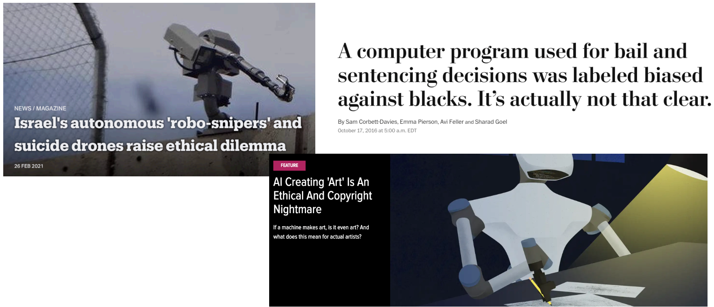
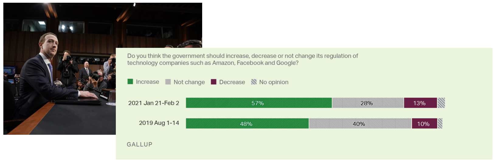
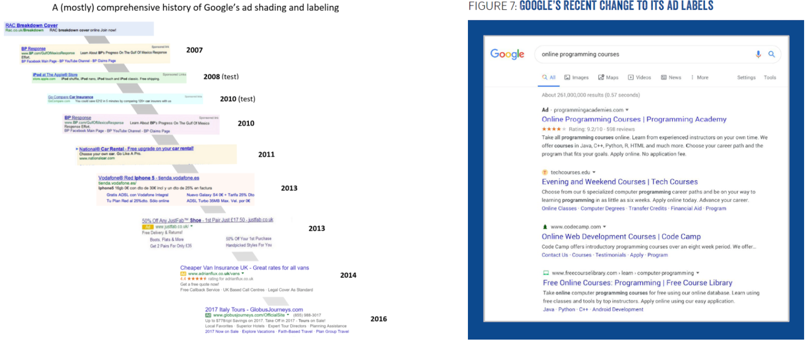
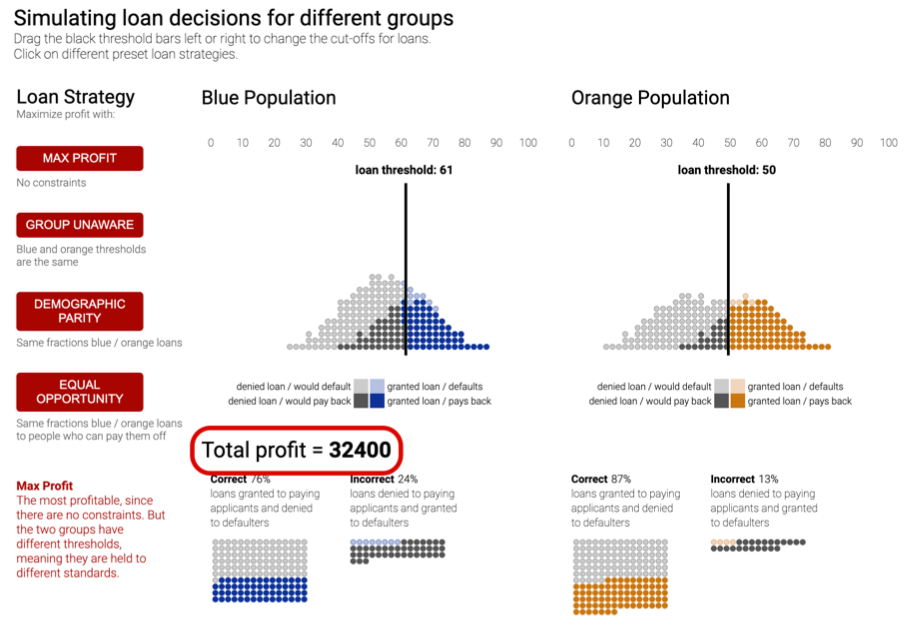
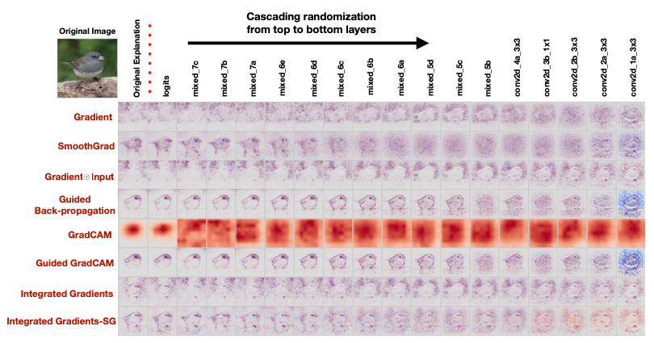
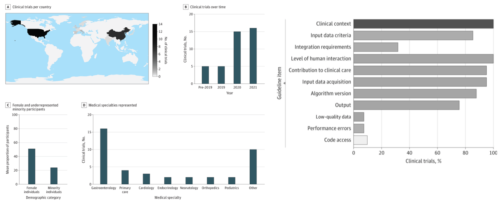

# Lecture 9: Ethics

<iframe width="720" height="405" src="https://www.youtube-nocookie.com/embed/7FQpbYTqjAA?list=PL1T8fO7ArWleMMI8KPJ_5D5XSlovTW_Ur" title="YouTube video player" frameborder="0" allow="accelerometer; autoplay; clipboard-write; encrypted-media; gyroscope; picture-in-picture" allowfullscreen></iframe>

Lecture by [Charles Frye](https://twitter.com/charles_irl).
Notes by [James Le](https://twitter.com/le_james94) and [Vishnu Rachakonda](https://www.linkedin.com/in/vrachakonda/). 
Published October 03, 2022.
[Download slides](https://fsdl.me/2022-lecture-09-slides).

In this final lecture of FSDL 2022, we'll talk about ethics. After going
through the context of what we mean by ethics, we'll go through three
different areas where ethics come up:

1.  **Tech Ethics**: ethics that anybody who works in the tech industry
broadly needs to think about.

2.  **ML Ethics**: what ethics has specifically meant for the ML
industry.

3.  **AI Ethics**: what ethics might mean in the future where true AGI
exists.

## 1 - Overview and Context

All ethics lectures are wrong, but some are useful. They are more useful
if we admit and state what our assumptions or biases are. We'll also
talk about three general themes that come up often when ethical concerns
are raised in tech/ML: alignment, trade-offs, and humility.

In this lecture, we'll approach ethics on the basis of **concrete
cases** - specific instances where people have raised concerns. We'll
talk about **cases where people have taken actions that have led to
claims and counter-claims of ethical or unethical behavior** - such as
the use of automated weapons, the use of ML systems to make decisions
like sentencing and bail, and the use of ML algorithms to generate art.
In each case when criticism has been raised, part of that criticism has
been that the technology is unethical.

Approaching ethics in this way allows us to answer the question of "What
is ethics?" by way of Ludwig Wittgenstein's quote: "*The meaning of a
word is its use in the language*." We'll focus on times when people have
used the word "ethics" to describe what they like or dislike about a
specific technology.

If you want to try it out for yourself, you should check out the game
"[Something Something Soup
Something](https://soup.gua-le-ni.com/)." In this browser
game, you are presented with a bunch of dishes and have to decide
whether they are soup or not soup, as well as whether they can be served
to somebody who ordered soup. By playing a game like this, you'll
discover (1) how difficult it is to come up with a concrete definition
of soup and (2) how poorly your working definition of soup fits with any
given soup theory.

Because of this case-based approach, we won't be talking about ethical
schools or "trolley" problems. Rather than considering [these
hypothetical
scenarios](https://www.currentaffairs.org/2017/11/the-trolley-problem-will-tell-you-nothing-useful-about-morality),
we'll talk about concrete and specific examples from the past decade of
work in our field and adjacent fields.

If you want another point of view that emphasizes the trolley problems,
you should check out [Sergey's lecture from the last edition of the
course from
2021](https://fullstackdeeplearning.com/spring2021/lecture-9/).
It presented similar ideas from a different perspective and came to the
same conclusion and some different conclusions.

A useful theme from that lecture that we should all have in mind when we
ponder ethical dilemmas is "What Is Water?" - which came up from [a
famous commencement speech by David Foster
Wallace](https://www.youtube.com/watch?v=PhhC_N6Bm_s). If
we aren't thoughtful and paying attention, things that are very
important can become background, assumptions, and invisible to us.

The approach of **relying on prominent cases risks replicating social
biases**. Some ethical claims are amplified and travel more because
people (who are involved) have more resources and are better connected.
Using these forms of case-based reasoning (where you explain your
beliefs in concrete detail) can **hide the principles that are actually
in operation**, making them disappear like water.

But in the end, **so much of ethics is deeply personal** that we can't
expect to have a perfect approach. We can just do the best we can and
hopefully become better every day.

## 2 - Themes

We'll see three themes repeatedly coming up throughout this lecture:

1.  **Alignment**: a conflict between what we want and what we get.

2.  **Trade-Offs**: a conflict between what we want and what others
want.

3.  **Humility**: a response when we don't know what we want or how to
get it.

### Alignment

The problem of **alignment** (where what we want and what we get differ)
come up over and over again. A primary driver of this is called the
**proxy problem** - in which we often optimize or maximize some proxies
for the thing that we really care about. If the alignment (or loosely
the correlation between that proxy and the thing we care about) is poor
enough, then by trying to maximize that proxy, we can end up hurting the
thing we originally cared about.

There was [a recent
paper](https://arxiv.org/abs/2102.03896) that did a
mathematical analysis of this idea. You can see these kinds of proxy
problems everywhere once you look for them.

-   On the top right, we have a train and validation loss chart from one
of the training runs for the FSDL text recognizer. The thing we
can optimize is the training loss. That's what we can use to
calculate gradients and improve the parameters of our network. But
the thing we really care about is the performance of the network
on data points that it has not seen (like the validation set, the
test set, or data in production). If we optimize our training loss
too much, we can actually cause our validation loss to go up.

-   Similarly, there was [an interesting
paper](https://openreview.net/forum?id=qrGKGZZvH0)
suggesting that increasing your accuracy on classification tasks
can actually result in a decrease in the utility of your
embeddings in downstream tasks.

-   You can find these proxy problems outside of ML as well. [This
thread](https://skeptics.stackexchange.com/questions/22375/did-a-soviet-nail-factory-produce-useless-nails-to-improve-metrics)
reveals an example where a factory that was making chemical
machines (rather than creating a machine that was cheaper and
better) chose not to adopt producing that machine because their
output was measured in weight. So the thing that the planners
actually cared about, economic efficiency and output, was not
optimized because it was too difficult to measure.

One reason why these kinds of proxy problems arise so frequently is due
to issues of information. **The information that we are able to measure
is not the information that we want**. At a higher level, we often don't
know what it is that we truly needed. We may want the validation loss,
but what we need is the loss in production or really the value our users
will derive from this model.

### Trade-Offs

Even when we know what we want or what we need, we are likely to run
into the second problem - **the tradeoff between stakeholders**. It is
sometimes said that the need to negotiate tradeoffs is one of the
reasons why engineers do not like thinking about some of these problems
around ethics. That's not quite right because we do accept tradeoffs as
a key component of engineering.

-   In [this O'Reilly book on the fundamentals of software
architecture](https://www.oreilly.com/library/view/fundamentals-of-software/9781492043447/),
the first thing they state at the beginning is that **everything
in software architecture is a tradeoff.**

-   [This satirical O'Reilly
book](https://www.reddit.com/r/orlybooks/comments/50meb5/it_depends/)
says that every programming question has the answer: "It depends."

The famous chart above compares the different convolutional networks on
the basis of their accuracy and the number of operations to run them.
Thinking about these tradeoffs between speed and correctness is exactly
the thing we have to do all the time in our job as engineers.

We can select the **Pareto Front** for the metrics we care about. A way
to remember what a Pareto front is [this definition of a data scientist
from Josh
Wills](https://twitter.com/josh_wills/status/198093512149958656?lang=en):
"Person who is better at statistics than any software engineer and
better at software engineering than any statistician." The Pareto Front
in the chart above includes the models that are more accurate than those
with fewer FLOPs and use fewer FLOPs than those that are more accurate.

A reason why engineers may dislike thinking about these problems is that
**it's hard to identify and quantify these tradeoffs**. These are indeed
proxy problems. Even further, once measured, where on that front do we
fall? As engineers, we may develop expertise in knowing whether we want
high accuracy or low latency, but we are not as comfortable deciding how
many current orphans we want to trade for what amount of future health.
This raises questions both in terms of measurement and decision-making
that are outside of our expertise.

### Humility

The appropriate response is **humility** because most engineers do not
explicitly train in these skills. Many engineers and managers in tech,
in fact, constitutionally prefer optimizing single metrics that are not
proxies. Therefore, when encountering a different kind of problem, it's
important to bring a humble mindset, ask for help from experts, and
recognize that the help you get might not be immediately obvious to what
you are used to.

Additionally, when intervening due to an ethical concern, it's important
to remember this humility. It's easy to think that when you are on the
good side, this humility is not necessary. But even trying to be helpful
is a delicate and dangerous undertaking. We want to make sure that as we
resolve ethical concerns, we come up with solutions that are not just
parts of the problem.

### User Orientation Undergirds Each Theme

We can resolve all of these via **user orientation**.

1.  By getting feedback from users, we maintain **alignment** between
our system and our users.

2.  When making **tradeoffs**, we should resolve them in consultation
with users.

3.  **Humility** means we actually listen to our users because we
recognize we don't have the answers to all the questions.

## 3 - Tech Ethics

The tech industry can't afford to ignore ethics as public trust in tech
declines. We need to learn from other nearby industries that have done a
better job on professional ethics. We'll also touch on some contemporary
topics.

### Tech Industry's Ethical Crisis

Throughout the past decade, the tech industry has been plagued by
scandal - whether that's how tech companies interface with national
governments at the largest scale or how tech systems are being used or
manipulated by people who create disinformation or fake social media
accounts that hack the YouTube recommendation system.

As a result, distrust in tech companies has risen markedly in the last
ten years. [This Public Affairs Pulse
survey](https://pac.org/public-affairs-pulse-survey-2021)
shows that in 2013, the tech industry was one of the industries with
less trustworthiness on average. In 2021, it has rubbed elbows with
famously more distrusted industries such as energy and pharmaceuticals.

Politicians care quite a bit about public opinion polls. In the last few
years, the fraction of people who believe that large tech companies
should be more regulated has gone up a substantial amount. [Comparing
it to 10 years ago, it's astronomically
higher](https://news.gallup.com/poll/329666/views-big-tech-worsen-public-wants-regulation.aspx).
So there will be a substantial impact on the tech industry due to this
loss of public trust.

We can learn from nearby fields: from the culture of professional ethics
in engineering in Canada (by wearing [the Iron
Ring](https://en.wikipedia.org/wiki/Iron_Ring)) to ethical
standards for human subjects research ([Nuremberg
Code](https://en.wikipedia.org/wiki/Nuremberg_Code), [1973
National Research
Act](https://en.wikipedia.org/wiki/National_Research_Act)).
We are at the point where we need a professional code of ethics for
software. Hopefully, many codes of ethics developed in different
communities can compete with each other and merge into something that
most of us can agree on. That can be incorporated into our education for
new members of our field.

Let's talk about two particular ethical concerns that arise in tech in
general: carbon emissions and dark/user-hostile design patterns.

### Tracking Carbon Emissions

Because carbon emissions scale with cost, you only need to worry about
them when the costs of what you are working on are very large. Then you
won't be alone in making these decisions and can move a bit more
deliberately to make these choices more thoughtfully.

Anthropogenic climate change from carbon emissions raises ethical
concerns - tradeoffs between the present and future generations. The
other view is that this is an issue that arises from a classic alignment
problem: many organizations are trying to maximize their profit, which
is based on prices for goods that don't include externalities (such as
environmental damage caused by carbon emissions, leading to increased
temperatures and lactic change).

The primary dimension along which we have to worry about carbon
emissions is in **compute jobs that require power**. That power can
result in carbon emissions. [This
paper](https://aclanthology.org/P19-1355/) walks through
how much carbon dioxide was emitted using typical US-based cloud
infrastructure.

-   The top headline shows that training a large Transformer model with
neural architecture search produces as much carbon dioxide as five
cars create during their lifetimes.

-   It's important to remember that power is not free. On US-based cloud
infrastructure, \$10 of cloud spent is roughly equal to \$1 of air
travel costs. That's on the basis of something like the numbers
and the chart indicating air travel across the US from New York to
San Francisco.

-   Just changing cloud regions can actually reduce your emissions quite
a bit. There's [a factor of
50x](https://www.youtube.com/watch?v=ftWlj4FBHTg)
from regions with the most to least carbon-intensive power
generation.

The interest in this problem has led to new tools.
[Codecarbon.io](https://codecarbon.io/) allows you to
track power consumption and reduce carbon emissions from your computing.
[ML CO2 Impact](https://mlco2.github.io/impact/) is
oriented directly towards machine learning.

### Deceptive Design and Dark Patterns

The other ethical concern in tech is **deceptive design**. An
unfortunate amount of deception is tolerated in some areas of software.
As seen below, on the left is a nearly complete history of the way
Google displays ads in its search engine results. It started off very
clearly colored and separated out with bright colors from the rest of
the results. Then about ten years ago, that colored background was
removed and replaced with a tiny little colored snippet that said "Ad."
Now, as of 2020, that small bit is no longer even colored. It is just
bolded. This makes it difficult for users to know which content is being
served to them because somebody paid for it (versus content served up
organically).

A number of **dark patterns** of deceptive design have emerged over the
last ten years. You can read about them on the website called
[deceptive.design](https://www.deceptive.design/). There's
also a Twitter account called
[\@darkpatterns](https://twitter.com/darkpatterns) that
shares examples found in the wild.

A practice in the tech industry that's on a very shaky ethical /legal
ground is **growth hacking**. This entails a set of techniques for
achieving rapid growth in user base or revenue for a product and has all
the connotations you might expect from the name - with examples
including LinkedIn and Hotmail.

**ML can actually make this problem worse if we optimize short-term
metrics**. These growth hacks and deceptive designs can often drive user
and revenue growth in the short term but worsen user experience and draw
down on goodwill towards the brand in a way that can erode the long-term
value of customers. When we incorporate ML into the design of our
products with A/B testing, we have to watch out to make sure that the
metrics that we are optimizing do not encourage this kind of deception.

These arise inside another alignment problem. One broadly-accepted
justification for the private ownership of the means of production is
that private enterprise delivers broad social value aligned by price
signals and market focus. But these private enterprises optimize metrics
that are, at best, a proxy for social value. There's the possibility of
an alignment problem where **companies pursuing and maximizing their
market capitalization can lead to net negative production of value**. If
you spend time at the intersection of funding, leadership, and
technology, you will encounter it.

In the short term, you can **push for longer-term thinking within your
organization** to allow for better alignment between metrics and goals
and between goals and utility. You can also learn to recognize
user-hostile designs and **advocate for user-centered design instead**.

To wrap up this section on tech ethics:

1.  The tech industry should learn from other disciplines if it wants to
avoid a trust crisis.

2.  We can start by educating ourselves about common deceptive or
user-hostile practices in our industry.

## 4 - ML Ethics

The ethical concerns raised about ML have gone beyond just the ethical
questions about other kinds of technology. We'll talk about common
ethical questions in ML and lessons learned from Medical ML.

### Why Not Just Tech Ethics?

ML touches human lives more intimately than other technologies. Many ML
methods, especially deep neural networks, make human-legible data into
computer-legible data. Humans are more sensitive to errors and have more
opinions about visual and text data than they do about the type of data
manipulated by computers. As a result, there are more stakeholders with
more concerns that need to be traded off in ML applications.

Broadly speaking, ML involves being wrong pretty much all the time. Our
models are statistical and include "randomness." Randomness is almost
always an admission of ignorance. As we admit a certain degree of
ignorance in our models, our models will be wrong and misunderstand
situations that they are put into. It can be upsetting and even harmful
to be misunderstood by our models.

Against this backlash of greater interest or higher stakes, a number of
common types of ethical concerns have coalesced in the last couple of
years. There are somewhat established camps of answers to these
questions, so you should at least know where you stand on the four core
questions:

1.  Is the model "fair"?

2.  Is the system accountable?

3.  Who owns the data?

4.  Should the system be built at all?

### Common Ethical Questions in ML

#### Is The Model "Fair"?

The classic case on this comes from criminal justice with [the COMPAS
system](https://en.wikipedia.org/wiki/COMPAS_(software))
for predicting whether a defendant will be arrested again before trial.
If they are arrested again, that suggests they committed a crime during
that time. This assesses a certain degree of risk for additional harm
while the justice system decides what to do about a previous arrest and
potential crime.

The operationalization here was a 10-point re-arrest probability based
on past data about this person, and they set a goal from the very
beginning to be less biased than human judges. They operationalize that
by calibrating these arrest probabilities across subgroups. Racial bias
is a primary concern in the US criminal justice system, so they took
care to make sure that these probabilities of re-arrest were calibrated
for all racial groups.

The system was deployed and used all around the US. It's proprietary and
difficult to analyze. But using the Freedom of Information Act and
coalescing together a bunch of records, [people at ProPublica were able
to run their own analysis of this
algorithm](https://www.propublica.org/article/machine-bias-risk-assessments-in-criminal-sentencing).
They determined that the model was not more or less wrong for one racial
group or another. It tended to have more false positives for Black
defendants and more false negatives for White defendants. So despite the
creators of COMPAS taking into account bias from the beginning, they
still ended up with an algorithm with this undesirable property of being
more likely to falsely accuse Black defendants than White defendants.

It turned out that some quick algebra revealed that some form of
race-based bias is inevitable in this setting, as indicated [in this
paper](https://arxiv.org/abs/1610.07524). There are a large
number of fairness definitions that are mutually incompatible. [This
tutorial by Arvind
Narayanan](https://www.youtube.com/watch?v=jIXIuYdnyyk&ab_channel=ArvindNarayanan)
is an excellent one to display them.

It is noteworthy that **the impact of "unfairness" is not fixed**. The
story is often presented as "no matter what, the journalists would have
found something to complain about." But note that equalizing false
positive rates and positive predictive value across groups would lead to
a higher false negative rate for Black defendants relative to White
defendants. In the context of American politics, that's not going to
lead to complaints from the same people.

This is the story about the necessity of confronting the tradeoffs that
will inevitably come up. Researchers at Google made [a nice little
tool](https://research.google.com/bigpicture/attacking-discrimination-in-ml/)
where you can think through and make these tradeoffs for yourself. It's
helpful for building intuition on these fairness metrics and what it
means to pick one over the other.

Events in this controversy kicked off a flurry of research on fairness.
[The Fairness, Accountability, and Transparency
conference](https://facctconference.org/) has been held for
several years. There has been a ton of work on both **algorithmic-level
approaches** on measuring and incorporating fairness metrics into
training and **qualitative work** on designing systems that are more
transparent and accountable.

In the case of COMPAS, **re-arrest is not the same as recidivism**.
Being rearrested requires that a police officer believes you committed a
crime. Police officers are subject to their own biases and patterns of
policing, which result in a far higher fraction of crimes being caught
for some groups than for others. Our real goal, in terms of fairness and
criminal justice, might be around reducing those kinds of unfair impacts
and using past rearrest data that have these issues.

#### Representation Matters for Model Fairness

Unfortunately, it is easy to make ML-powered tech that fails for
minoritized groups. For example, off-the-shelf computer vision tools
often fail on darker sins (as illustrated in [this talk by Joy
Buolamwini](https://www.ted.com/talks/joy_buolamwini_how_i_m_fighting_bias_in_algorithms)).
This is not a new issue in technology, just a more salient one with ML.

There has been a good amount of progress on this in the last five years.
An example is [Google's Model
Cards](https://modelcards.withgoogle.com/about) which show
how well a model will perform on human subgroups of interest.
HuggingFace has good integrations for creating these kinds of model
cards.

When you invite people for talks or hire people to join your
organizations, you should work to reduce the bias of that discovery
process by diversifying your network. Some good resources include
[Black in AI](https://blackinai.github.io/#/), [Diversify
Tech Job Board](https://www.diversifytech.co/job-board/),
[Women in Data Science](https://www.widsconference.org/),
and the [You Belong in AI
podcast](https://anchor.fm/ucla-acm-ai). You can make
professional connections via them to improve the representation of
minoritized groups in the engineering, design, and product management
process.

#### Is The System Accountable?

At a broader level than fairness, we should expect "accountability" from
ML systems. Some societies and states, including the EU, consider "[the
right to an explanation](https://arxiv.org/abs/1606.08813)"
in the face of important judgments to be a part of human rights.

In the GDPR act, there is [a section that enshrines
accountability](https://www.consumerfinance.gov/rules-policy/regulations/1002/interp-9/#9-b-1-Interp-1).
This isn't quite a totally new requirement; credit denials in the US
have been required to be explained since 1974. People have a right to
know what and why into making decisions for them!

If you want to impose this "accountability" on a deep neural network and
understand its selections, there are a number of methods that use the
input-output gradient to explain the model. You can see a list of
several methods in order of increasing performance below (from [this
paper](https://arxiv.org/abs/1810.03292)). These approaches
don't quite have strong theoretical underpinnings or a holistic
explanation, and are not that robust as a result. A lot of these methods
act primarily as edge detectors. The paper shows how even randomizing
layers in a model does not materially change the interpretability output
of GradCAM methods.

As a result, introspecting DNNs effectively requires reverse engineering
the system to really understand what is going on, largely thanks to
efforts like [Distil](https://distil.pub/) and
[Transfomer Circuits](https://transformer-circuits.pub/).

Due to these technical challenges, machine learning systems are prone to
unaccountability that impacts most those least able to understand and
influence their outputs. Books such as [Automating
Inequality](https://www.amazon.com/Automating-Inequality-High-Tech-Profile-Police/dp/1250074312)
describe the impacts of these systems. In such a context, you should
seek to question the purpose of model, involve those impacted by the
decisions (either through direct human inputs or through other means),
and ensure that equal attention is paid to benefits and harms of
automation.

#### Who Owns The Data?

**Humans justifiably feel ownership of the data they creat**e, which is
subsequently used to train machine learning models. Large datasets used
to train models like GPT-3 are created by mining this data without the
explicit involvement of those who create the data. Many people are not
aware that this is both possible and legal. As technology has changed,
what can be done with data has changed.

[You can even verify if your data has been used to train models
on](https://haveibeentrained.com/). Some of these images
are potentially [obtained
illegally](https://arstechnica.com/information-technology/2022/09/artist-finds-private-medical-record-photos-in-popular-ai-training-data-set/),
as a result of sensitive data being posted openly without the recorded
consent of the originator.

Each of these controversies around image generation and illegal data has
opened up a new frontier in **data governance**. Focus will be placed on
ensuring new ML systems are sensitive to personal and professional
concerns of those who generate the data ML systems are trained on.
[Emad Mostaque](https://uk.linkedin.com/in/emostaque), CEO
of [Stability AI](https://stability.ai/), has gone so far
as to offer future opt out systems from systems similar to Stable
Diffusion.

Here are some practical tips: [Dataset
cards](https://huggingface.co/docs/datasets/dataset_card)
can be helpful in providing documentation in a similar fashion to model
cards. There are also ethics lists, like [the deon ethic
checklist](https://deon.drivendata.org/examples/) that
helps design proper systems. Deon also has a helpful list of failure
cases.

#### Should This Be Built At All?

The undercurrent behind this conversation is the justifiable question of
whether some of these systems should be built at all, let alone in an
ethical way.

**ML-powered weaponry** is the canonical example here, which is already
in use. The definition of these systems are blurry, as both systems old
and new have had various autonomous capacities. This is difficult to get
a sense of due to the secrecy associated with weapon systems.

Some have argued that "autonomous weapons" have existed for hundreds of
years, but even this does not mean that they are ethical. Mines are good
examples of these systems. Movements like t[he Campaign Against Killer
Robots](https://www.stopkillerrobots.org/about-us/) are
trying to prevent the cycle we entered with mines - where we invented
them, when we realized the incredible harm, and why we are trying to ban
them. Why invent these at all?

Let's wrap up this entire section with some closing questions that you
should always have a thoughtful answer to as you build a machine
learning system.

1.  **Is the model "fair"?** Fairness is possible, but requires
trade-offs.

2.  **Is the system accountable?** Accountability is easier than
interpretability.

3.  **Who owns the data?** Answer this upfront. Changes are on the way.

4.  **Should the system be built at all?** Repeatedly ask this and use
it to narrow scope.

### What Can We Learn from Medical ML

*Note: The FSDL team would like to thank [Dr. Amir Ashraf
Ganjouei](https://scholar.google.com/citations?user=pwLadpcAAAAJ)
for his feedback on this section.*

Interestingly, medicine can teach us a lot about how to apply machine
learning in a responsible way. Fundamentally, this has led to a mismatch
between how medicine works and how machine learning systems are built
today.

Let's start with a startling fact: **the machine learning response to
COVID-19 was an abject failure**. In contrast, the biomedical response
was a major triumph. For example, the vaccines were developed with
tremendous speed and precision.

Machine learning did not acquit itself well with the COVID-19 problem.
Two reviews ([Roberts et al.,
2021](https://www.nature.com/articles/s42256-021-00307-0)
and [Wynants et al.,
2020-2022](https://www.bmj.com/content/369/bmj.m1328))
found that nearly all machine learning models were insufficiently
documented, had little to no external validation, and did not follow
model development best practices. A full 25% of the papers used a
dataset incorrect for the task, which simply highlighted the difference
between children and adults, not pneumonia and COVID.

Medicine has a strong culture of ethics that professionals are
integrated into from the point they start training. Medical
professionals take the Hippocratic oath of practicing two things: either
help or do not harm the patient. In contrast, the foremost belief
associated with software development tends to be the infamous "Move fast
and break things." While this approach works for harmless software like
web apps, **it has serious implications for medicine and other more
critical sectors**. Consider the example of a retinal implant that was
simply deprecated by developers and left hundreds without sight [in
this Statnews
article](https://www.statnews.com/2022/08/10/implant-recipients-shouldnt-be-left-in-the-dark-when-device-company-moves-on/).

**Researchers are drawing inspiration from medicine to develop similar
standards for ML**.

-   For example, clinical trial standards have been extended to ML.
These standards were developed through extensive surveys,
conferences, and consensus building (detailed in
[these](https://www.nature.com/articles/s41591-020-1037-7)
[papers](https://www.nature.com/articles/s41591-020-1034-x)).

-   Progress is being made in understanding how this problem presents.
[A recent
study](https://jamanetwork.com/journals/jamanetworkopen/fullarticle/2796833)
found that while clinical activities are generally performed at a
high compliance level, statistical and data issues tend to suffer
low compliance.

-   New approaches are developing [entire "auditing"
procedures](https://www.thelancet.com/journals/landig/article/PIIS2589-7500(22)00003-6/fulltext)
that exquisitely identify the activities required to effectively
develop models.

Like medicine, machine learning is intimately intertwined with people's
lives. The most important question to ask is "Should this system be
built at all?". Always ask yourselves this and understand the
implications!

## 5 - AI Ethics

AI ethics are a frontier in both the technology and the ethics worlds.
False claims and hype are the most pressing concerns, but other risks
could present themselves soon.

### AI Snake Oils

**False claims outpace the performance of AI**. This poses a serious
threat to adoption and satisfaction with AI systems long term.

-   For example, if you call something "AutoPilot", people might truly
assume it is fully autonomous, as happened in the below case of a
Tesla user. This goes back to our discussion about how AI systems
are more like funky dogs than truly human intelligent systems.

-   Another example of this is [IBM's Watson
system](https://www.ibm.com/ibm/history/ibm100/us/en/icons/watson/),
which went from tackling the future of healthcare to being sold
off for parts.

These false claims tend to be amplified in the media. But this isn't
confined to traditional media. Even Geoff Hinton, a godfather of modern
machine learning, has been [a little too aggressive in his forecasts
for AI
performance](https://www.youtube.com/watch?v=2HMPRXstSvQ)!

You can call this **"AI Snake Oil"** as Arvind Narayanan does in [his
Substack](https://aisnakeoil.substack.com/) and
[talk](https://www.cs.princeton.edu/~arvindn/talks/MIT-STS-AI-snakeoil.pdf).

Let's separate out where true progress has been made versus where
progress is likely to be overstated. On some level, AI perception has
seen tremendous progress, AI judgment has seen moderate progress, and AI
prediction of social outcomes has seen not nearly as much progress.

### Frontiers: AI Rights and X-Risk

There's obvious rationale that should artificial sentient beings exist,
tremendous ethical implications would be raised. Few people believe that
we are truly on the precipice of sentient beings, but there is
disagreement on how close we are.

There's a different set of concerns around how to regard self-improving
intelligent beings, for which there is already evidence. Large Language
Models have been show to be able to improve themselves in a range of
studies
([here](https://openreview.net/forum?id=92gvk82DE-) and
[here](https://arxiv.org/abs/2207.14502v1)).

Failing to pursue this technology would lead to [a huge opportunity
cost](https://nickbostrom.com/astronomical/waste) (as
argued by Nick Bostrom)! There truly is a great opportunity in having
such systems help us sold major problems and lead better lives. The key
though, is that such technology should be developed in the **safest way
possible,** not the fastest way.

[The paperclip
problem](https://www.lesswrong.com/tag/paperclip-maximizer)
shows how the potential for misalignment between AI systems and humans
could dramatically reduce human utility and even compromise our
interests. Imagine a system designed to manufacture paperclips... could
actually develop the intelligence to alter elements of society to favor
paper clips?! This thought experiments illustrates how self-learning
systems could truly change our world for the worse in a misaligned way.

These ideas around existential risk are most associated with [the
Effective Altruism community](https://www.eaglobal.org/).
Check out resources like [Giving What We
Can](https://www.givingwhatwecan.org/donate/organizations)
and [80,000 Hours](https://80000hours.org/) if you're
interested!

## 6 - What Is To Be Done?

This course can't end on a dour a note as existential risk. What can be
done to mitigate these consequences and participate in developing truly
ethical AI?

1.  The first step is **to educate yourself on the topic**. There are
many great books that give lengthy, useful treatment to this
topic. We recommend [Automating
Inequality](https://www.amazon.com/Automating-Inequality-High-Tech-Profile-Police/dp/1250074312),
[Weapons of Math
Destruction](https://www.amazon.com/Weapons-Math-Destruction-Increases-Inequality/dp/0553418815),
and [The Alignment
Problem](https://www.amazon.com/Alignment-Problem-Machine-Learning-Values/dp/0393635821).

2.  After reading this, **consider how to prioritize your actions**.
What do you want to impact? When do you want to do that? Place
them in this two-by-two to get a sense of where their importance
is.

**Ethics cannot be purely negative**. We do good, and we want to
*prevent* bad! Focus on the good you can do and be mindful of the harm
you can prevent.

Leading organizations like
[DeepMind](https://www.deepmind.com/about/operating-principles)
and [OpenAI](https://openai.com/charter/) are leading from
the front. Fundamentally, building ML well aligns with building ML for
good. All the leading organizations emphasize effective *and*
responsible best practices for building ML powered practices. Keep all
this in mind as you make the world a better place with your AI-powered
products!
