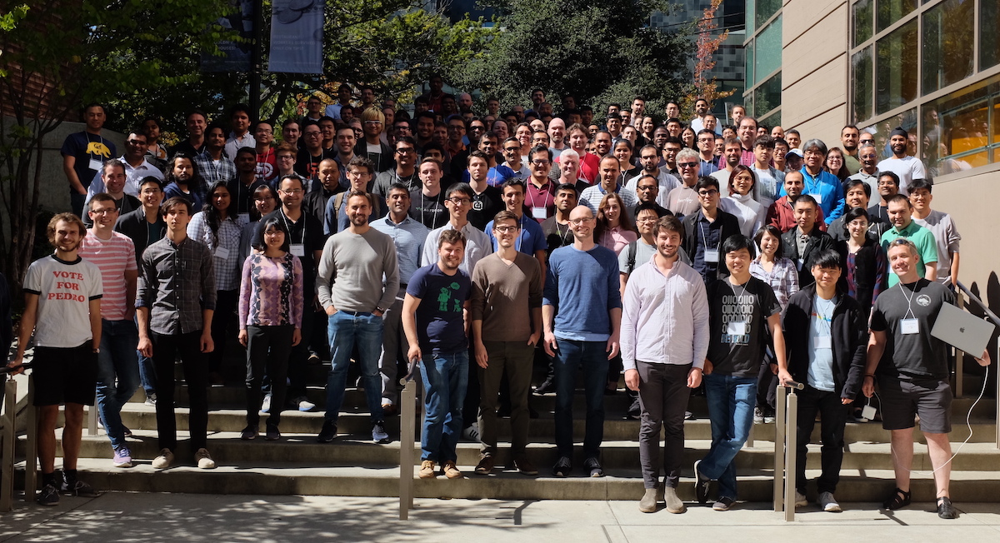

---
hide:
  - navigation
  - toc
---

# Foundation Models Bootcamp

🚀 Announcing April 2023 Bootcamp 🚀

**Build AI-powered Products Faster with Foundation Models**

- April 22-23 in San Francisco
- End-to-end project showing best practices and tools
- ~6 hours of lectures
- ~4 hours of guest talks
- Credits from OpenAI, Modal, Lambda Labs, Replicate
- Networking with ~250 builders

[Register now](#register){ .md-button .md-button--primary }

## Why

We are in the middle of a **tech tree unlock** as momentous as the early days of the Internet.

The way that AI systems are developed has changed from “train a model from scratch” to “fine-tune an existing model” to “prompt a large foundation model.”

An entirely new ecosystem of vendors and tools has formed, and even ML veterans are scrambling to orient themselves and figure out the most productive new sets of techniques and tools.

They are asking themselves:

- “Should I be able to code a Transformer from scratch?”
- “What will my moat be if I’m relying on OpenAI APIs?”
- "Are there open-source alternatives to LLM vendors?"
- "Can I use human feedback to improve performance?”
- “Do I need to buy a cluster of A100’s?”

## What

We have put together a state-of-the-art program to help you answer these questions and make the transition.

- **AskFullStackAI Sample Project**
    - Well-documented project using LangChain, GPT-3, (Vector DB)
    - Use as starter code to save ~20 hours on your own project

- **Foundations of Foundation Models**
    - Training vs Evaluation, Loss Functions, PR Curves, Common Benchmarks
    - Self-supervised Learning
    - The Transformer, BERT/T5/GPT/RETRO models, Chinchilla Scaling Laws

- **Mastering LLM APIs**
    - The basics (temperature, log probs, byte pair encoding)
    - Vendor comparison (OpenAI, Cohere, AI21, open source models)
    - Prompt Engineering (few-shot examples, dynamic context, chain-of-thought, formatting tricks)
    - Software tools (LangChain, GPTIndex, Everyprompt, dust.tt)

- **Search 2.0**
    - Embeddings and Semantic Search
    - Vector Databases (e.g. FAISS, Milvus, Pinecone, Weaviate, Vespa)
    - Multi-modal search

- **Learning from human feedback**
    - Monitoring predictions and recording feedback
    - RLHF

- **Deploying AI-powered apps**

- **UX Design of AI-powered apps**

## Who

We are Full Stack AI (formerly Full Stack Deep Learning).

Since 2018, we have taught in-person bootcamps, online multi-week cohorts, and official semester-long courses at UW and UC Berkeley.

  

    
    
<strong>Charles Frye</strong> educates people in AI. He has worked at companies such as Weights & Biases after getting a PhD in Neuroscience at UC Berkeley.

  

  

    
    

    <strong>Sergey Karayev</strong> builds AI-powered products as Co-founder of Volition. He co-founded Gradescope after getting a PhD in AI at UC Berkeley.
    

  

  

    
    

    <strong>Josh Tobin</strong> builds tooling for AI products as CEO of Gantry. He worked as a Research Scientist at OpenAI and received a PhD in AI at UC Berkeley.
    

  

### Guest Talks

  

    
    
<strong>Peter Welinder</strong> is VP of Product and Partnerships at OpenAI

  

  

    
    
<strong>Peter Welinder</strong> is VP of Product and Partnerships at OpenAI

  

  

    
    
<strong>Peter Welinder</strong> is VP of Product and Partnerships at OpenAI

  

  

    
    
<strong>Peter Welinder</strong> is VP of Product and Partnerships at OpenAI

  

## When and Where

The event will be **in-person** and run **all day** on **Saturday, April 22, 2023** and **Sunday, April 23, 2023** at the [South San Francisco Conference Center](https://ssfconf.com/).

<iframe src="https://www.google.com/maps/embed?pb=!1m18!1m12!1m3!1d74597.27001002253!2d-122.39849142057383!3d37.69637486488224!2m3!1f0!2f0!3f0!3m2!1i1024!2i768!4f13.1!3m3!1m2!1s0x808f79b47d5d81ad%3A0xfd9c1f0af6155a3d!2sSouth%20San%20Francisco%20Conference%20Center!5e0!3m2!1sen!2sus!4v1674094089226!5m2!1sen!2sus" width="600" height="450" style="border:0;" allowfullscreen="" loading="lazy" referrerpolicy="no-referrer-when-downgrade"></iframe>

## Sponsors

We are also fortunate to be sponsored by some excellent companies (who are also providing credits to attendees)

- OpenAI
- Lambda Labs
- Scale.ai
- Modal
- Vercel
- Replicate

Contact [`sponsorships@fullstackdeeplearning.com`](mailto:sponsorships@fullstackdeeplearning.com) if you'd like to sponsor.

## Register

  

    
In-Person

    

      $?
    

    <ul class="tier--features">
      <li> 🗣 &nbsp; Watch the talks live in real life
      <li> 🤝 &nbsp; Network with builders and vendors in ML
      <li> 👕 &nbsp; Get some conference swag
      <li> 🥞 &nbsp; Eat food
      <li> 🔜 &nbsp; Register by April 15th!
    </ul>

    

      <a href="https://fsdl.me/2023-conf-irl-reg" style="width: 100%" class="md-button md-button--primary">Register here</a>
    

  

## Schedule

|       | Saturday (April 22)                                   | Sunday (April 23)                            |
| ----- | ----------------------------------------------------- | -------------------------------------------- |
| 9 am  | Registration & Breakfast                              | Breakfast                                    |
| 10 am | **AskFSDL in 1 hour** (Charles)                       | **Deploying** (Charles)                      |
| 11 am | **Foundations of Foundation Models** (Charles)        | **CLIP and Vision Models** (Sergey)          |
| 12 pm | Lunch and networking                                  | Lunch and networking                         |
| 1 pm  | **Mastering LLMs** (Sergey)                           | **Learning from human feedback** (Josh)      |
| 2 pm  | **Search 2.0** (Josh)                                 | **UX Design for AI apps** (Charles)          |
| 3 pm  | Coffee and networking                                 | Coffee and networking                        |
| 4 pm  | **Riley Goodside**: Staff Prompt Engineer at Scale.ai | **Harrison Chase**: Creator of LangChain     |
| 5 pm  | **Peter Welinder**: VP of Product at OpenAI           | **Alex Graveley**: Creator of Github Copilot |
| 6 pm  | Reception                                             | Depart for after-parties                     |
