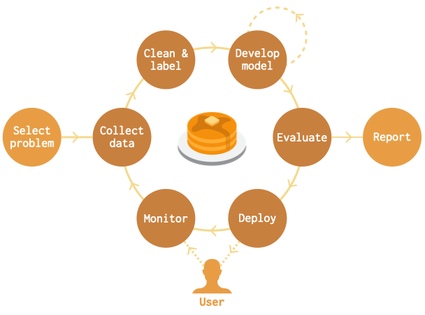
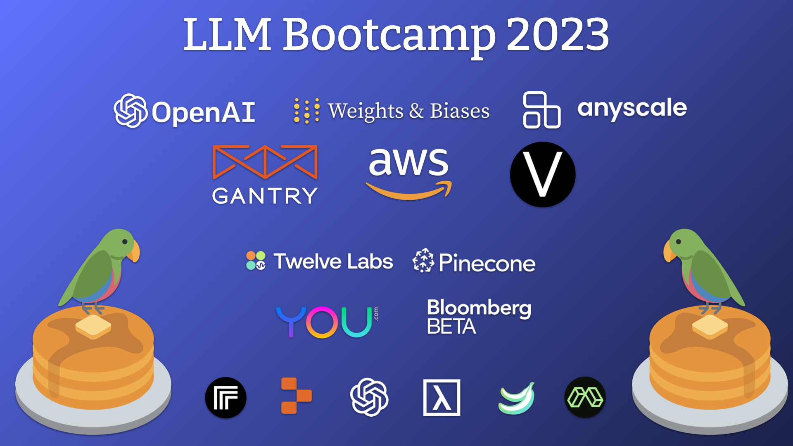

---
hide:
  - navigation
  - toc
---

  

    
    

      <h2><strong>{{ config.site_description }}</strong></h2>
      
 

      <a href="/llm-bootcamp" class="md-button md-button--primary">
        Free LLM Bootcamp Available Now!
      </a>
    

  

  

    

        <h2>Building an AI-powered product is much more than just training a model or writing a prompt.</h2>
        
The Full Stack brings people together to learn and share best practices across the entire lifecycle of an AI-powered product:
            from defining the problem and picking a GPU or foundation model to production deployment and continual learning
            to user experience design.
        

    

    
  

  

    
    

        <h2>Get up to speed on the latest in AI-powered apps with the new <a href="llm-bootcamp">Large Language Models Bootcamp</a>.</h2>
         
        

          Learn best practices and tools for building applications powered by LLMs. 
 
 Cover the full stack from <a href="llm-bootcamp/prompt-engineering">prompt engineering</a> and <a href="llm-bootcamp/llmops">LLMops</a> to <a href="llm-bootcamp/ux-for-luis">user experience design</a>.
        

    

  

  

    
    

        <h2>Build an AI-powered application from the ground up in our <a href="course">Deep Learning Course</a>.</h2>
        

          You've trained your first (or 100th) model, and you're ready to take your skills to the next level.
        

        

            Join thousands from <a href="https://bit.ly/berkeleyfsdl">UC Berkeley</a>,
            <a href="https://bit.ly/uwfsdl">University of Washington</a>, and <a
                href="https://youtube.com/c/FullStackDeepLearning">all over the world</a>
            and learn best practices for building AI-powered products from scratch with deep neural networks.
        

    

  

  

      

          <a class="md-button md-button--primary" href="https://fsdl.me/join-discord">🚀 Join us on Discord 🚀</a>
      

  

  

