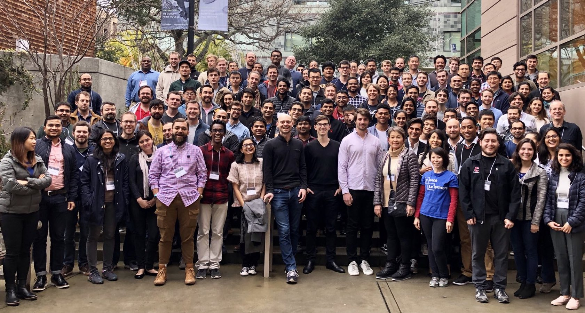

---
hide:
  - navigation
---

<h1 class="title">Full Stack Deep Learning</h1>

Our mission is to help you go from a promising ML experiment to a shipped product, with real-world impact.

## Current Course

We are teaching a major update of the course Spring 2021 as an official UC Berkeley course and as an online course, with all lectures and labs available for free.

  <a class="md-button md-button--primary" href="/spring2021">🚀Spring 2021 Online Course🚀</a>

## About this course

There are many great courses to learn how to train deep neural networks.
However, training the model is just one part of shipping a deep learning project.
This course teaches full-stack production deep learning:

- Formulating the problem and estimating project cost
- Finding, cleaning, labeling, and augmenting data
- Picking the right framework and compute infrastructure
- Troubleshooting training and ensuring reproducibility
- Deploying the model at scale

## Who is this for

The course is aimed at people who already know the basics of deep learning and want to understand the rest of the process of creating production deep learning systems.
You will get the most out of this course if you have:

- At least one-year experience programming in Python.
- At least one deep learning course (at a university or online).
- Experience with code versioning, Unix environments, and software engineering.

While we cover the basics of deep learning (backpropagation, convolutional neural networks, recurrent neural networks, transformers, etc), we expect these lectures to be mostly review.

## Instructors

**[Sergey Karayev](https://twitter.com/sergeykarayev)** is Head of STEM AI at Turnitin. He co-founded Gradescope after getting a PhD in Computer Vision at UC Berkeley.

**[Josh Tobin](https://twitter.com/josh_tobin_)** is Founder and CEO of a stealth startup. He worked as a Research Scientist at OpenAI after getting a PhD in Robotics at UC Berkeley.

**[Pieter Abbeel](https://twitter.com/pabbeel)** is Professor at UC Berkeley. He co-founded Covariant.ai, Berkeley Open Arms, and Gradescope.

<figure>
  
  <figcaption>Our March 2019 Bootcamp</figcaption>
</figure>

## Course Offerings

- [🚀Spring 2021🚀](/spring2021) Online Course
- [Spring 2021](https://bit.ly/berkeleyfsdl) CSE 194-080 - UC Berkeley Undergraduate course
- [Spring 2020](https://bit.ly/uwfsdl) CSEP 590C - University of Washington Professional Master's Program course
- [✨Fall 2019✨](https://fall2019.fullstackdeeplearning.com) nicely formatted videos and notes from our weekend bootcamp
- [March 2019](/march2019) raw videos from our bootcamp
- [August 2018](/august2018) bootcamp
