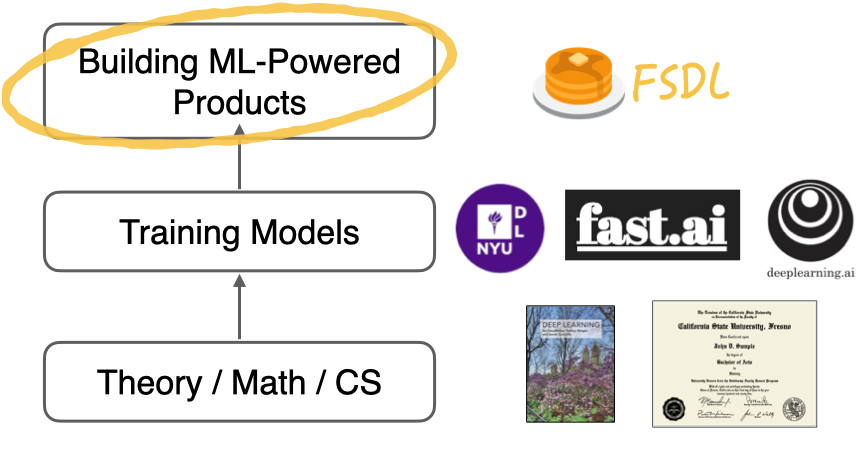

---
hide:
  - navigation
---

<h1 class="title">{{ config.site_name }}</h1>

<h2 class="subtitle">{{ config.site_description }}</h2>

Building ML-powered products is much more than just training a model.

!!! info "FSDL brings people together to learn and shape best practices for the full stack"
    - Formulating the problem and estimating project cost
    - Finding, cleaning, labeling, synthesizing, and augmenting data
    - Reproducibly training the model on the right infrastructure
    - Deploying and monitoring the model and its application at scale
    - Using best practices in software engineering throughout so that development is fast and robust

  <a class="md-button md-button--primary" href="/course/">🚀 Check out the 2022 course 🚀</a>

## Course

  

  Every year, we put together a [course](/course/).
  Several hundred people take it synchronously, participating in lectures, coding in interactive labs, and creating their own demo ML-powered application as a final project.
  Thousands more watch the videos that we post on <a href="https://youtube.com/c/FullStackDeepLearning">YouTube</a>.

  We have taught the course online in [2021](/spring2021), as official [Berkeley](https://bit.ly/berkeleyfsdl) (2021) and [UW](https://bit.ly/uwfsdl) (2020) courses, and as weekend bootcamps in [2019](/march2019) and [2018](/august2018).
  

  

## Conference

There's nothing better than people coming together in-person to learn, share, and form lasting connections.

Test paragraph

**✨ We have something exciting planned for Fall 2022. [Follow us on Twitter](https://twitter.com/full_stack_dl) to be the first to hear! ✨**

## Online Community

Everyone who participates in our course is forever a member of our online community.
We share best practices, job opportunities, and cool projects.

  <a class="md-button md-button--primary" href="/course/">🚀 Check out the 2022 course 🚀</a>

