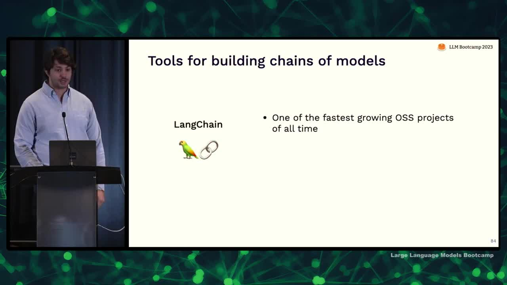
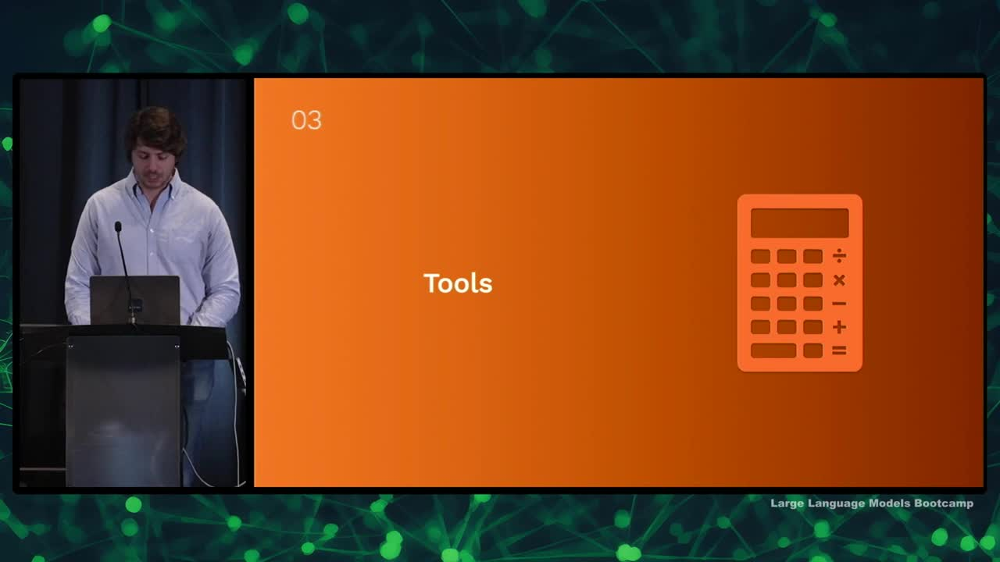

## Chapter Summaries

### Why augmented LMs?

- Language models are good at understanding language, following instructions, basic reasoning, and understanding code, but they lack up-to-date knowledge, specifics about your data, and more complex reasoning abilities.
- Think of language models as the "brain" that needs tools and data to complete tasks.
- Context windows are limited but growing rapidly and putting more context in the model costs money.
- There are three ways to augment language models: retrieval, chains, and tools.
- Retrieval involves providing an external corpus of data for the model to search, chains use the output of one language model as input for another, and tools allow models to interact with external data sources.
- This lecture serves as an introduction to these topics with depth available for further exploration.

### Why retrieval augmentation?

- Discussing retrieval augmentation to give models access to user-specific data
- Initial approach: put data into the context (e.g., organizers of an event)
- Challenge: thousands of users and complex relationships between queries and users make it difficult to use simple rules/coding
- Consider building the context as a form of information retrieval (like search)
- Treat putting the right data in the context for the model as a search problem

### Traditional information retrieval

- Traditional information retrieval uses a query to find and rank relevant objects in a collection
- Objects can be documents, images, or other types of content
- Inverted indexes, which record word frequencies in documents, are often used for search
- Relevance is typically determined through Boolean search, while ranking is commonly done using the BM25 algorithm
- Factors affecting ranking include search term frequency in the document, number of documents containing the search term, and context within a sentence
- Traditional search is limited as it cannot capture semantic information or complex relationships between terms

### Embeddings for retrieval

- Discussing AI-centric approach for information retrieval via embeddings.
- AI helps improve search and retrieve better data from contexts using large language models and embeddings.
- Embeddings are abstract, dense, compact, usually fixed-size, and learned representations of data, which could be documents, images, audio, etc.
- Good embeddings have utility for the downstream task, and similar objects should be close together in the embedding space, while different objects should be far apart.
- Important embeddings to know: Word2Vec, Sentence Transformers, CLIP, OpenAI embeddings (Text Embedding ada002), and Instructor.
- Off-the-shelf embeddings are a good start, but fine-tuning and training an embedding model on specific tasks can achieve better results.

### Embedding relevance and indexes

- Discussing using embeddings for information retrieval
- Can use cosine similarity or dot product similarity as similarity metrics
- For nearest neighbor search, can simply use numpy if dealing with less than 100,000 vectors
- Approximate nearest neighbor algorithms are useful for faster search at larger scales, with tools like Facebook AI's FAISS, HNSW, and Annoy
- Choosing an information retrieval system is more important than the specific embedding index
- Limitations of approximate nearest neighbor indices include lack of hosting, data and metadata storage, and scalability
- Consider an information retrieval system that addresses these limitations for production use, analogous to having a complete library rather than just a card catalog

### Embedding databases

- Searching over vectors may not be great for production, so consider databases for a more reliable and production-oriented approach.
- Consider whether you need an embedding database or just a database, as many popular databases already have embedding index built in, such as PG Vector for Postgres, Elasticsearch, and Redis.
- Building a system for information retrieval with embeddings involves challenges like scale, reliability, managing the embedding function, specifying queries, and choosing search algorithms.
- Don't try to handle all the complexity yourself; use existing embedding databases like Chroma, Milvus, Pinecone, Vespa, and Weaviate.
- When choosing an embedding database, consider features like scalability, embedding management, filtering, and integration with traditional full-text search.
- General recommendations: use your existing database for prototyping, choose Pinecone for speed of setup, consider Vespa and Weaviate for flexible queries, and Vespa and Milvus for scale and reliability.

### Beyond naive embeddings

- Address issues when queries and documents have different forms and embeddings aren't comparable
- Consider training a model that jointly represents both queries and documents for a more "apples to apples" comparison
- Explore hypothetical document embeddings: have the model imagine a document containing the query's answer and find similar documents
- Look into re-ranking techniques: search a large number of documents and train a model to reorder them based on specific criteria
- Use new libraries like Lama Index to search more efficiently, respecting the structure of the data and subsets (e.g., Notion database, Twitter, or recent data)
- Lama Index combines document retrieval and building embeddings designed for hierarchical searching

### Patterns & case studies

- Retrieval augmentation case study: Copilot
- Two secrets to Copilot: speed and relevant context
- Builds context by looking at most recently accessed 20 documents in the same programming language
- Post-processing includes looking at code before and after cursor, relevant snippets from candidate docs, and heuristically accessing data
- Output generated is a result of sorting by heuristics
- Copilot is powerful but uses simple retrieval methods, highlighting the effectiveness of heuristics
- Another common pattern: question answering using retrieval augmentation
- This involves finding most similar documents/messages to a question and using retrieved information to answer the question
- Limitation: search process might not return the documents containing the answer
- Solution: use more models and iterate over documents, calling an LLM on each subset and feeding the output to the next model
- This approach can be generalized as "chains" where models build context for other models

### What are chains and why do we need them?

- Discussing ways to add information to the context for language models besides retrieval
- Retrieval-based models follow a common question-answering pattern: embedding queries, comparing embeddings to find similar documents, and using context to answer questions
- Key limitation: reliance on the retrieval system; if the right information isn't among the retrieved documents, the model can't answer the question
- Possible solutions:
  - Improve the quality of the information retrieval system with advanced search features
  - Add additional processing, like using another LLM for post-processing retrieved documents, to refine the context (although it might be slower and more expensive)
- Introducing the concept of "chains": sequencing language model calls where the output of one call is the input to another
- Example patterns for building chains:
  - Question-answering pattern
  - Hypothetical document embeddings
  - Summarizing a large corpus through a mapreduce-like process by independently summarizing each document, then summarizing the summaries

### LangChain

- Lang chain is an extremely popular tool for building chains of models and one of the fastest growing open source projects
- Supports both Python and JavaScript
- Fastest way to get started building applications and can be used in production
- Many people end up creating their own chaining, possibly inspired by Lang chain
- Lang chain provides a repository of different chains for various tasks and offers nice code and abstractions
- Ideal for prototyping, but also easy to build your own system if needed for production
- Contains many examples of types of chains in their repository, which is useful for generating ideas and learning about chaining patterns

### Tool use

- Building context for language models to answer questions can involve creating a search engine or giving them access to APIs and outside tools
- A "feeling lucky" chain involves searching Google for an answer, getting the top result, and summarizing the content for the user
- Tool_Former paper demonstrates using tools such as calculators, question-answering systems, and translation systems in the training process for language models
- Tools can be used deterministically or in a way similar to OpenAI plugins
- Examples of tools for language models include archive search, Python interpreters, and SQL query execution
- An example chain involves translating a user's natural language question into an SQL query, executing the query, and providing the response back to the user

### Plugins

- There is a more automated approach called plugins to allow language models to interact with external tools.
- In a chain-based approach, developers manually design the interaction pattern between language model and tool by passing queries through a series of steps.
- In a plugin-based approach, the language model gets to decide whether to use a tool or not. A simpler method is used in Tool Former and OpenAI plugins.
- To create an OpenAI plugin, provide an API spec and a description of the API meant for the language model to decide when to use it.
- OpenAI passes the description as part of the context to the model, enabling it to make decisions based on user inputs and the API's usefulness.
- The model can invoke the API, and results are fed into the context allowing the language model to continue answering user questions.

### Recommendations for tool use

- Tools are a flexible way to augment language models with external data.
- Retrieval systems are one example of a tool that can be based on various databases.
- Two ways to build tool use into language models: manually describe the logic (chains) or use plugins and let the model figure it out.
- Chains are better for reliability and consistent problem-solving.
- Plugins are more suitable for interactivity, flexibility, and general-purpose use, allowing users to solve various unanticipated problems.

### Recap & conclusions

- LMS are more powerful when connected to external data
- Rules and heuristics can help identify useful data
- As knowledge base scales, consider it as information retrieval
- Chains can encode complex reasoning and help with token limits
- Tools can provide access to external knowledge beyond internal database

