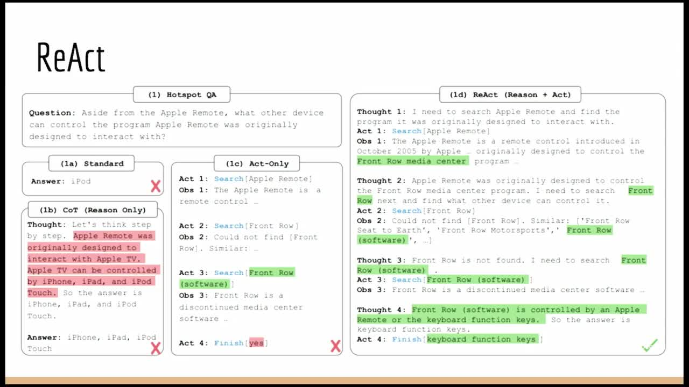

## Chapter Summaries

### What are "agents"?

- The lecture covers agents and their significance in the context of LangChain.
- The core idea of agents is using a language model as a reasoning engine to determine how to interact with the outside world based on user input
- First it defines what agents are, explains why they are used, and shows how they are typically implemented.
- It also considers the challenges associated with getting agents to work reliably in production.
- It touches on memory and recent projects that involve agentic behavior

### Why use agents?

- Agents are useful for connecting language models to external sources of data and computation, such as search APIs and databases.
- Agents are more flexible and powerful than simply connecting language models to tools, and can handle edge cases and multi-hop tasks better.
- The typical implementation of agents involves using the language model to choose a tool, taking action with that tool, observing the output, and feeding it back into the language model until a stopping condition is met.
- Stopping conditions can be set by the language model or through hard-coded rules.

### ReAct: Reasoning to Act

- ReAct is a prompting strategy for natural language processing
- It stands for "Reasoning and Acting"
- It combines Chain-of-Thought reasoning and action-taking to improve the language model's ability to reason and access real data sources
- It yields higher quality, more reliable results than other prompting techniques

### Challenge: controlling tool use

- React is a popular implementation of agency, but there are many challenges
- One challenge is getting agents to use tools appropriately, which can be addressed by providing tool descriptions or using tool retrieval
- Few-shot examples can guide the language model in what to do
- Another challenge is getting agents not to use tools when they don't need to, which can be addressed with reminders or adding a tool that explicitly returns to the user

### Challenge: parsing tool invocations

- Language models return raw strings, and we often want to pass those strings into other programs
- More structured responses, like those in JSON format, are easier to parse
- Output parsers are used to encapsulate the logic needed to parse responses, can be modular, and can retry mistakes
- There are subtle differences in fixing errors in response outputs, and output parsers can help with this task

### Challenge: long-term memory and coherence

- Fourth challenge is getting agents to remember previous steps
- ReAct paper keeps a list of these steps in memory
- Long-running tasks present context window issues
- Retrieval methods can fetch previous steps and put them into context
- Combining some `N` most recent and some `K` most relevant actions and observations is common
- Incorporating big and hard-to-parse API responses is a challenge
- Custom logic can be used to select relevant keys and put them in context
- Tool usage requires thinking about output size
- Agents can go off track, and reiterating the objective can help
- Separating planning and execution steps can help break down objectives

### Challenge: evaluation

- Evaluating language models and applications built on top is difficult
- Evaluating agents is also difficult
- One way to evaluate agents is to measure if the correct result was produced
- Another way to evaluate agents is to assess if the agent trajectory or intermediate steps were correct and efficient. Examples include evaluating correct input to action, correct number of steps, and the most efficient sequence of steps.
- Evaluating the intermediate steps can be just as useful as evaluating the final result.

### Agent memory and adaptability

- Memory is an interesting aspect of AI, especially in the context of user-AI interactions and personalization.
- Personalization can be achieved by encoding an agent's objectives and persona in the prompt, but there is also work being done on evolving that over time to give agents a sense of long-term memory.
- Memory is becoming increasingly important in the concept of agents as encapsulated programs that adapt over time.
- Four recent projects build upon and improve the "react-style" agent, discussed next

### Example: AutoGPT

points:

- ReAct-style agents are designed to solve a specific objective, with short-lived, immediately quantifiable goals
- AutoGPT was created for long-running, open-ended goals such as increasing Twitter following
- AutoGPT introduced the concept of long-term memory using a vector store due to the long-running nature of its projects

### Example: BabyAGI

- BabyAGI is another popular project for agents for long-running objectives
- Introduces separate planning and execution steps to improve long-running objectives
- BabyAGI initially didn't have tools, but now has them
- Separating planning and execution steps can improve reliability and focus of longer-term agents

### Example: CAMEL

- CAMEL paper involves two agents working together, novel idea
- The main point of the paper is the use of a simulation environment
- Simulation environments can be used for practical evaluation of agents or for entertainment
- The paper's results are for a simple "simulation environment" -- two agents interacting in a chat room
- The agents were language models without tools

### Example: "Generative Agents" paper

- Recent simulation environment that had 25 agents in a Sims-like world
- Memory refers to remembering previous events to inform future actions
- Three components of memory retrieval: time weighting, importance weighting, relevancy weighting
- Reflection step introduced to update different states of the world after observing recent events
- Reflection step could be applied to other memory types in LangChain, such as entity memory and summary conversation memory
- Other papers recently incorporated the idea of reflection, which is interesting and worth keeping an eye on for the future
