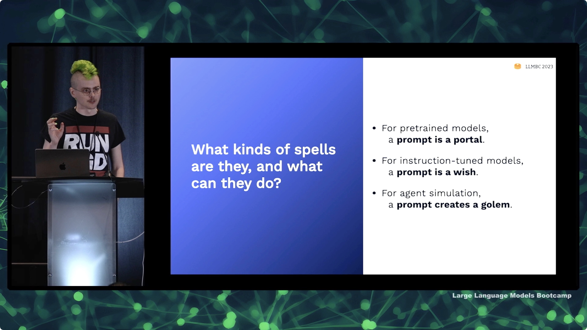
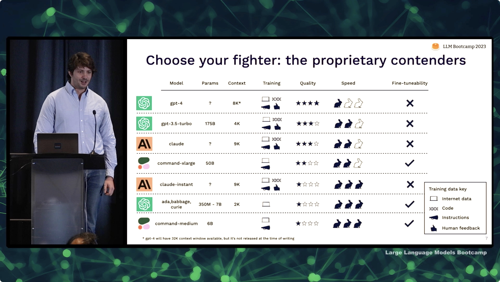
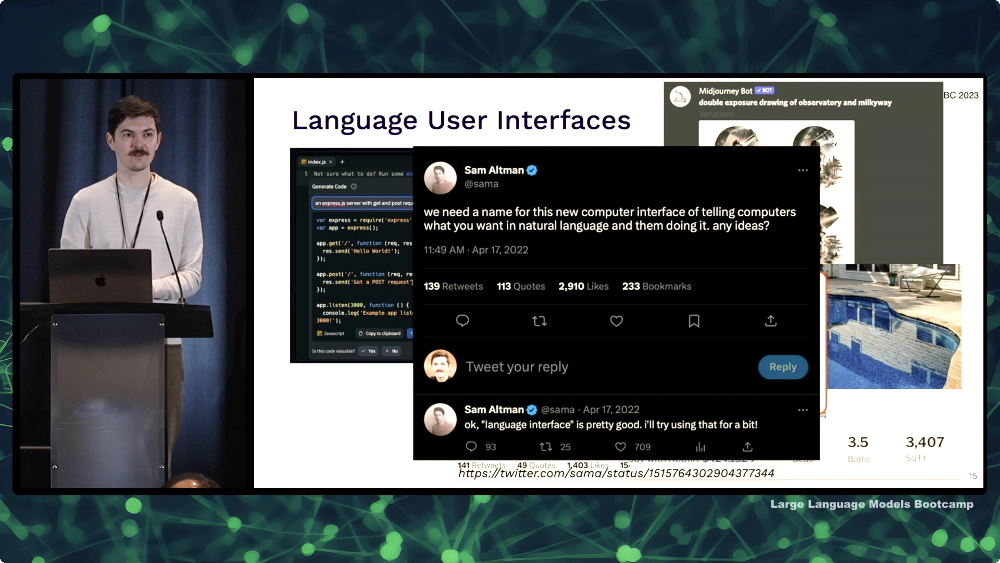
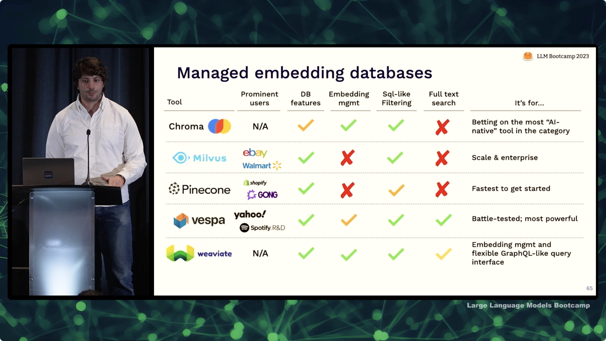
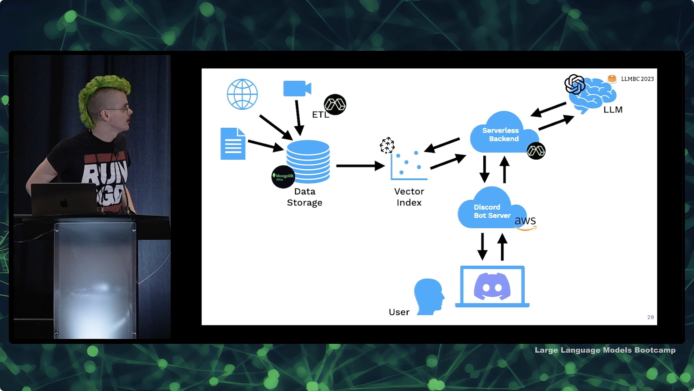
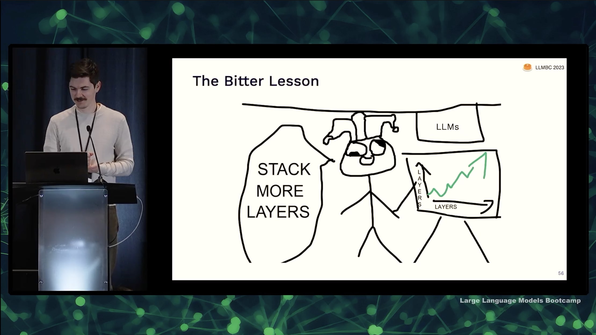
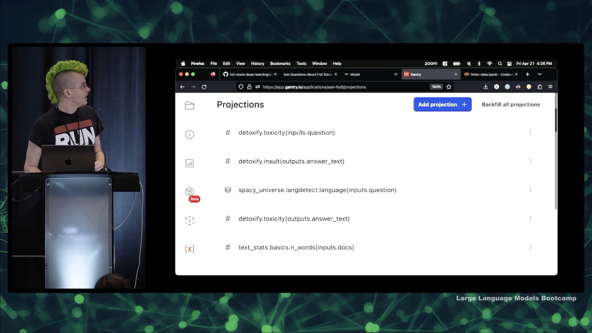
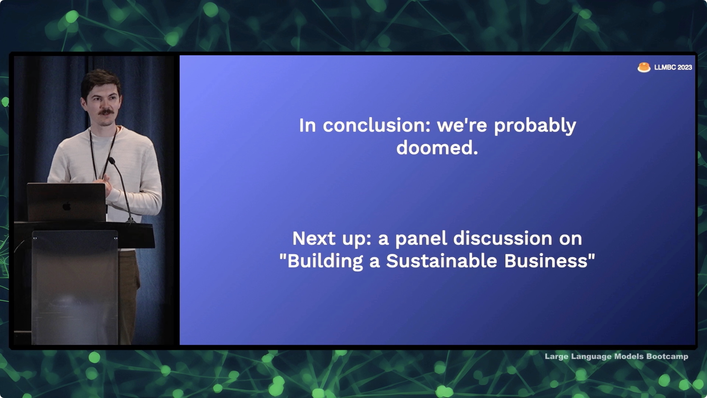

---
hide:
  - navigation
description: Learn best practices and tools for building LLM-powered apps
embed_image: https://fullstackdeeplearning.com/llm-bootcamp/opengraph.png
title: LLM Bootcamp - Spring 2023
---

# LLM Bootcamp - Spring 2023

!!! question "What are the pre-requisites for this bootcamp?"
    Our goal is to get you 100% caught up to state-of-the-art and ready to build and deploy LLM apps, no matter what your level of experience with machine learning is.

    Please enjoy, and [email](mailto:team@fullstackdeeplearning.com) us, [tweet](https://twitter.com/full_stack_dl) us, or post in [our Discord](https://fsdl.me/join-discord) if you have any questions or feedback!

## Lectures

### <a href="prompt-engineering/">**Learn to Spell: Prompt Engineering**</a>

<ul>
  <li> High-level intuitions for prompting
  <li> Tips and tricks for effective prompting: decomposition/chain-of-thought, self-criticism, ensembling
  <li> Gotchas: "few-shot learning" and tokenization
</ul>

### <a href="llmops/">**LLMOps**</a>

<ul>
  <li> Comparing and evaluating open source and proprietary models
  <li> Iteration and prompt management
  <li> Applying test-driven-development and continuous integration to LLMs
</ul>

### [**UX for Language User Interfaces**](ux-for-luis/)

  <ul>
    <li>General principles for user-centered design
    <li>Emerging patterns in UX design for LUIs
    <li>UX case studies: GitHub Copilot and Bing Chat
  </ul>

### [**Augmented Language Models**](augmented-language-models/)

  <ul>
    <li> Augmenting language model inputs with external knowledge
    <li> Vector indices and embedding management systems
    <li> Augmenting language model outputs with external tools
  </ul>

### [**Launch an LLM App in One Hour**](launch-an-llm-app-in-one-hour/)

  <ul>
    <li> Why is now the right time to build?
    <li> Techniques and tools for the tinkering and discovery phase: ChatGPT, LangChain, Colab
    <li> A simple stack for quickly launching augmented LLM applications
  </ul>

### [**LLM Foundations**](llm-foundations/)

  <ul>
    <li> Speed-run of ML fundamentals
    <li> The Transformer architecture
    <li> Notable LLMs and their datasets
  </ul>

### [**Project Walkthrough: askFSDL**](askfsdl-walkthrough/)

  <ul markdown>
  - Walkthrough of a [GitHub repo](https://fsdl.me/askfsdl-github) for sourced Q&A with LLMs
  - Try it out via a [bot in our Discord](https://fsdl.me/join-discord-askfsdl)
  - Python project tooling, ETL/data processing, deployment on Modal, and monitoring with Gantry
  </ul>

### [**What's Next?**](whats-next/)

  <ul>
    <li> Can we build general purpose robots using multimodal models?
    <li> Will models get bigger or smaller? Are we running out of data?
    <li> How close are we to AGI? Can we make it safe?
  </ul>

## Invited Talks

### <a href="shabani-train-your-own/">**Reza Shabani: How To Train Your Own LLM**</a>

<ul>
  <li> The "Modern LLM Stack": Databricks, Hugging Face, MosaicML, and more
  <li> The importance of knowing your data and designing preprocessing carefully
  <li> The features of a good LLM engineer
  <li> By <a href="https://twitter.com/npew">Reza Shabani</a>, who trained <a href="https://repl.it">Replit</a>'s code completion model, Ghostwriter.
</ul>

### <a href="chase-agents/">**Harrison Chase: Agents**</a>

<ul>
  <li> The "agent" design pattern: tool use, memory, reflection, and goals
  <li> Challenges facing agents in production: controlling tool use, parsing outputs, handling large contexts, and more
  <li> Exciting research projects with agents: AutoGPT, BabyAGI, CAMEL, and Generative Agents
  <li> By <a href="https://twitter.com/hwchase17">Harrison Chase</a>, co-creator of <a href="https://twitter.com/langchainai">LangChain</a>
</ul>

### <a href="welinder-fireside-chat/">**Fireside Chat with Peter Welinder**</a>

<ul>
  <li> With <a href="https://twitter.com/npew">Peter Welinder</a>, VP of Product & Partnerships at OpenAI
  <li> How OpenAI converged on LLMs
  <li> Learnings and surprises from releasing ChatGPT
</ul>

## Sponsors

We are deeply grateful to all of the sponsors who helped make this event happen.

### Direct Sponsors

  

    
  

  

    
  

  

    
  

  

    
  

  

    
  

  

    
  

  

    
  

  

    
  

  

    
  

  

    
  

  

    
  

  

    
  

### Compute Credit Sponsors

  

    
  

  

    
    

  

    
    

  

    
    

  

    
    

  

    
    

