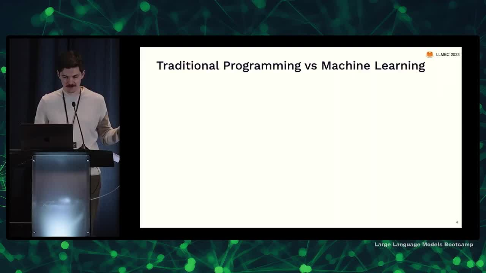
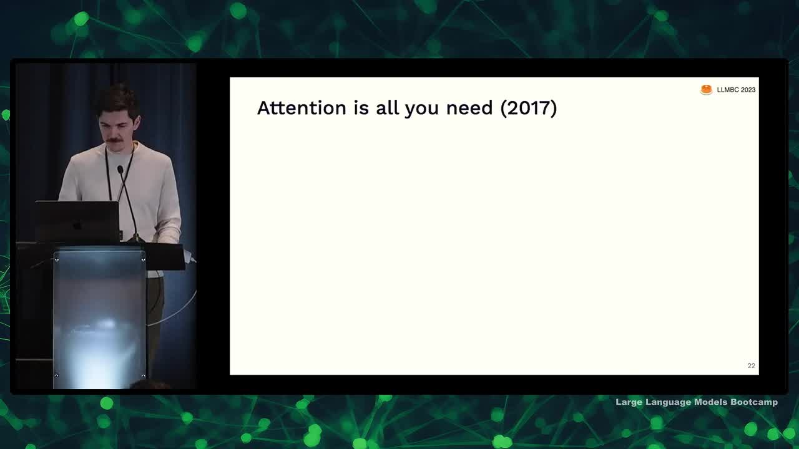
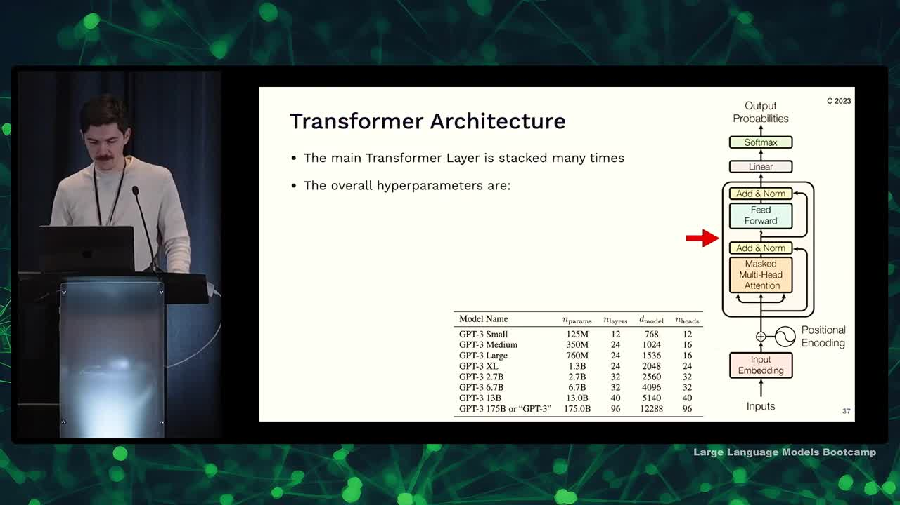
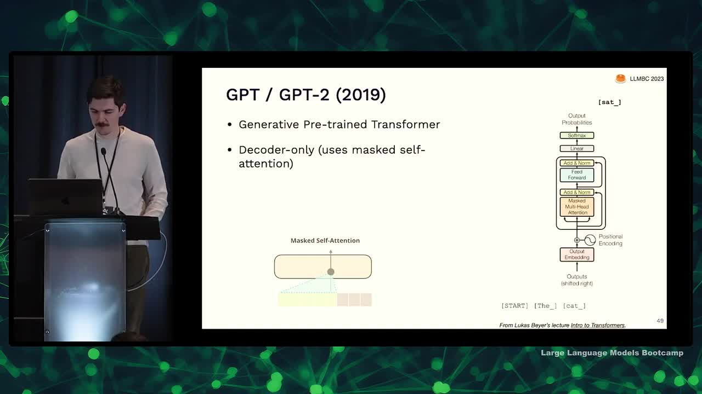
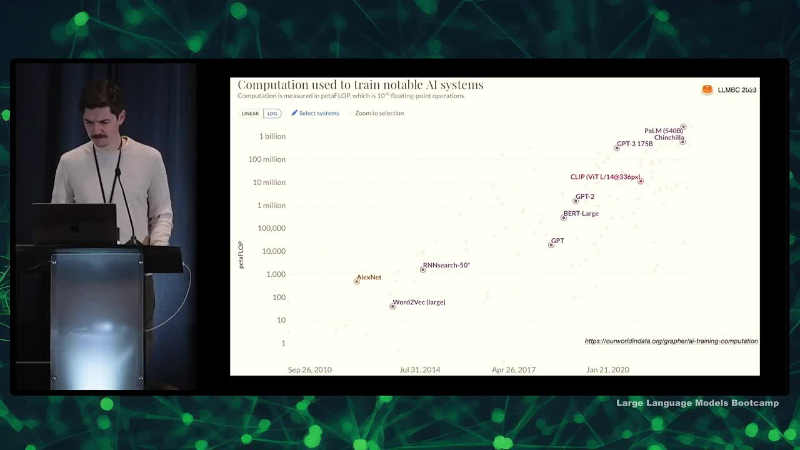

## Chapter Summaries

### Intro

- Discuss four key ideas in machine learning
- Address diverse audience, including experts, executives, and investors
- Cover Transformer architecture
- Mention notable LLMs (e.g., GPT, T5, BERT, etc.)
- Share details on running a Transformer

### Foundations of Machine Learning

- Machine learning has shifted from traditional programming (Software 1.0) to a Software 2.0 mindset, where algorithms are generated from training data and more emphasis is placed on the training system. 
- Three types of machine learning include unsupervised learning, supervised learning, and reinforcement learning, which have mostly converged to a supervised learning approach.
- For machines, input and output are always just numbers, represented as vectors or matrices.
- One dominant approach to machine learning today is neural networks, also known as deep learning, which was inspired by the human brain's structure and function.
- Neural networks consist of perceptrons connected in layers, and all operations are matrix multiplications.
- GPUs, originally developed for graphics and video games, have played a significant role in advancing deep learning due to their compatibility with matrix multiplications.
- To train a neural network, data is typically split into training, validation, and test sets to avoid overfitting and improve model performance.
- Pre-training involves training a large model on extensive data, which can then be fine-tuned using smaller sets of specialized data for better performance.
- Model hubs, such as Hugging Face, offer numerous pre-trained models for various machine learning tasks and have seen significant growth in recent years.
- The Transformer model has become the dominant architecture for a wide range of machine learning tasks.

### The Transformer Architecture

- Transformer architecture introduced in 2017 paper "Attention is All You Need"
- Set state-of-the-art results in translation tasks
- Applied to other NLP tasks and fields like vision
- Appears complicated but consists of two similar halves
- Focusing on one half called the decoder

### Transformer Decoder Overview

- The task of the Transformer decoder is to complete text, much like GPT models.
- The input consists of a sequence of tokens (e.g., "it's a blue"), and the goal is to predict the next word (e.g., "sundress").
- The output is a probability distribution over potential next tokens.
- Inference involves sampling a token from the distribution, appending it to the input, and running the model again with the updated input.
- ChatGPT operates by seeing user input, sampling the next word, appending it, and repeating this process.

### Inputs

- Inputs need to be vectors of numbers
- Text is turned into vectors through tokenization
- Tokens are assigned an ID in a vocabulary, rather than being words
- Numbers are represented as vectors using one-hot encoding (e.g., number 3 represented by a vector with 1 in third position, zeros everywhere else)

### Input Embedding

- One-hot vectors are not good representations of words or tokens as they don't capture the notion of similarity between words
- To address the issue, we use embedding
- Embedding involves learning an embedding matrix which converts a one-hot vocabulary encoding into a dense vector of chosen dimensionalities
- This process turns words into dense embeddings, making it the simplest neural network layer type

### Masked Multi-Head Attention

- Attention was introduced in 2015 for translation tasks, and the idea is to predict the most likely next token based on the importance of previous tokens.
- Attention mechanism involves an output as a weighted sum of input vectors, and these weights are calculated using dot products (similarities) between the input vectors.
- Each input vector plays three roles in the attention mechanism: as a query, key, and value.
- To learn and improve attention, input vectors can be projected into different roles (query, key, and value) by multiplying them with learnable matrices.
- Multi-head attention refers to learning several different ways of transforming inputs into queries, keys, and values simultaneously.
- Masking is used to prevent the model from "cheating" by considering future tokens; it ensures that the model only predicts the next token based on the already seen input.

### Positional Encoding

- No notion of position in the current model, only whether something has been seen or not.
- Positional encoding is introduced to provide ordering among the seen elements.
- Current equations resemble a bag of unordered items.
- Positional encoding vectors are added to embedding vectors to provide order.
- Seems counterintuitive, but it works; attention mechanism figures out relevant positions.

### Skip Connections and Layer Norm

- Add up and norm attention outputs using skip connections and layer normalization
- Skip connections help propagate loss from end to beginning of model during backpropagation
- Layer normalization resets mean and standard deviation to uniform after every operation
- Input embedding determines the dimension of the entire Transformer model
- Normalization seems inelegant but is very effective in improving neural net learning

### Feed-forward Layer

- Feed forward layer is similar to the standard multi-layer perceptron.
- It receives tokens augmented with relevant information.
- The layer upgrades the token representation.
- The process goes from word-level to thought-level, with more semantic meaning.

### Transformer hyperparameters and Why they work so well

- GPT-3 model ranges from 12 to 96 layers of Transformer layers with adjustable embedding dimensions and attention heads, totaling 175 billion parameters.
- Most of GPT-3's parameters are in the feed forward layer, but for smaller models, a significant portion is in embedding and attention.
- Transformers are effective general-purpose differentiable computers that are expressive, optimizable via backpropagation, and efficient due to parallel processing.
- Understanding exact expressiveness of the Transformer is ongoing, with interesting results like RASP (a programming language designed to be implemented within a Transformer).
- Decompiling Transformer weights back to a program is still an unsolved problem.
- Multiple attention heads allow the model to figure out how to use a second head, showcased in work like Induction Heads.
- Learning to code Transformers isn't necessary for AI-powered products, but can be fun and educational. Resources like YouTube tutorials and code examples are available to assist in learning.

### Notable LLM: BERT

- Bert, T5, and GPT cover the gamut of large Transformer models
- Bert stands for bi-directional encoder representation from Transformers
- Bert uses the encoder part of the Transformer, with unmasked attention
- Bert contains 100 million parameters, considered large at its time
- Bert was trained by masking 15% of words in a text corpus and predicting the masked words
- Bert became a building block for other NLP applications

### Notable LLM: T5

- T5 applies Transformer architecture to text-to-text transfer, meaning both input and output are text strings
- The task is encoded in the input string and can involve translation, summarization, etc.
- Encoder-decoder architecture was found to be best, with 11 billion parameters
- Trained on Colossal Queen Crawl Corpus (C4) derived from Common Crawl dataset
- C4 was created by filtering out short pages, offensive content, pages with code, and de-duplicating data
- Fine-tuned using academic supervised tasks for various NLP applications

### Notable LLM: GPT

- GPT is a generative pre-trained Transformer, with GPT-2 being decoder only
- GPT-2 was trained on a dataset called WebText created by scraping links from Reddit
- GPT tokenizes text using byte pair encoding, a middle ground between old-school tokenization and using UTF-8 bytes
- GPT-3 came out in 2020 and is 100 times larger than GPT-2, enabling few-shot and zero-shot learning
- GPT-3 was trained on webtext, raw common crawl data, a selection of books, and all of Wikipedia
- The dataset for GPT-3 contained 500 billion tokens, but it was only trained on 300 billion tokens
- GPT-4 details are unknown, but it is assumed to be much larger than previous versions due to the trend in increasing size

### Notable LLM: Chinchilla and Scaling Laws

- Using more computation to train AI systems improves their performance
- Rich Sutton's "bitter lesson": advantage goes to those stacking more layers
- DeepMind's paper, Training Compute Optimal LLMs: studied relationship between model size, compute and data set size
- Most LLMs in literature had too many parameters for their data amount
- Chinchilla model (70 billion) outperformed Gopher model (four times larger) by training on 1.4 trillion tokens instead of 300 billion
- Open question: can models continue to improve by training repeatedly on existing data?

### Notable LLM: LLaMA

- Llama is an open-source chinchilla optimal LLM from Meta Research
- Several sizes available, ranging from 7 billion to 65 billion, with at least 1 trillion tokens
- Competitively benchmarks against GPT-3 and other state-of-the-art LLMs
- Open source but non-commercial license for pre-trained weights
- Trained on custom common crawl filtering, C4, GitHub, Wikipedia, books, and scientific papers
- Data set replicated by Red Pajama, which is also training models to replicate Llama
- Interesting inclusion of GitHub as a training resource

### Why include code in LLM training data?

- Including code in training data can improve performance on non-code tasks
- OpenAI found this with their Codex model, which was fine-tuned on code and outperformed GPT-3 on reasoning tasks
- Since then, people have been adding code to training data
- Open source dataset called 'the stack' collects code from GitHub while respecting licenses

### Instruction Tuning

- Discusses instruction tuning in GPT models and its impact on performance
- Mentions the shift from text completion mindset to instruction following mindset
- Supervised fine-tuning helps models become better at zero-shot tasks by using data sets of zero-shot inputs and desired outputs
- OpenAI hired thousands of contractors to gather zero-shot data and used reinforcement learning for training
- GPT model lineage includes DaVinci, Codex, and various iterations, fine-tuning for specific applications
- Fine-tuning imposes an "alignment tax," decreasing few-shot learning ability and model's confidence calibration
- Llama model by Stanford team used GPT-3 generated instructions, costing less but with reduced performance compared to GPT-3
- A specific data set for instruction tuning in chat-based paradigms is called "Open Assistant"

### Notable LLM: RETRO

- Discussing a model called "retrieval enhancing" from DeepMind
- Goal: train a smaller model good at reasoning and writing code, but looks up facts from a database
- Used "burden-coded" sentences in a trillion-token database for fact retrieval
- Not as effective as large language models yet, but shows potential for the future

