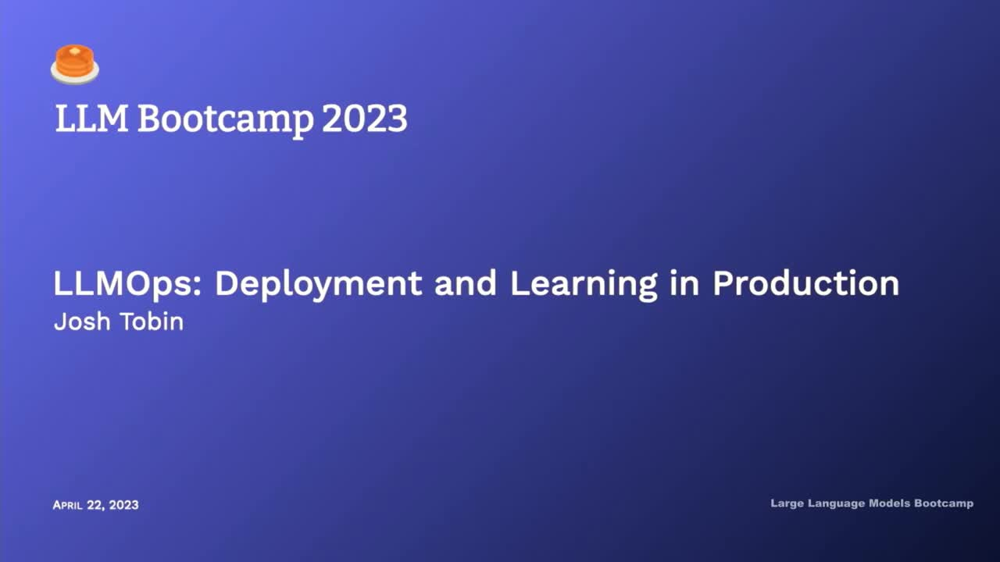
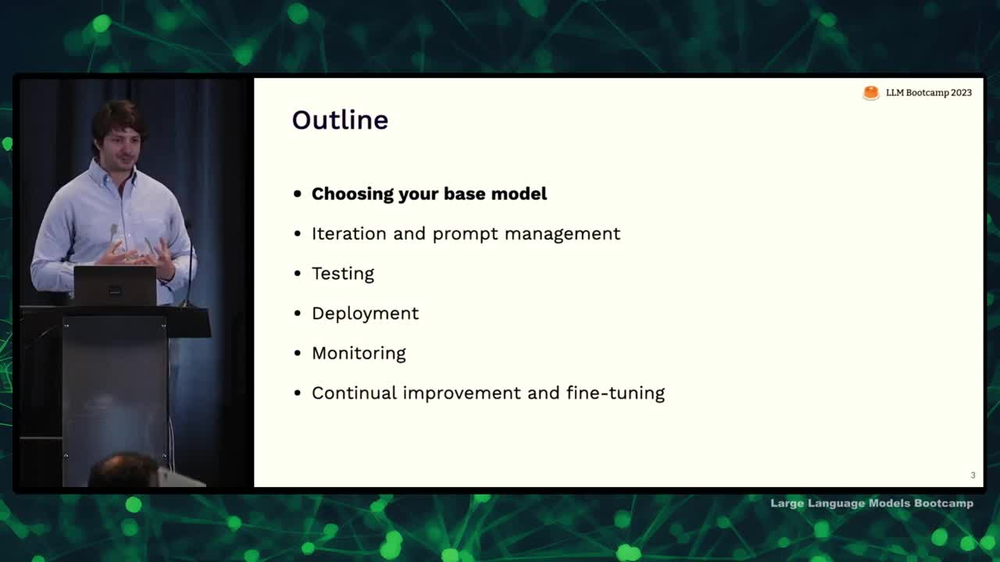
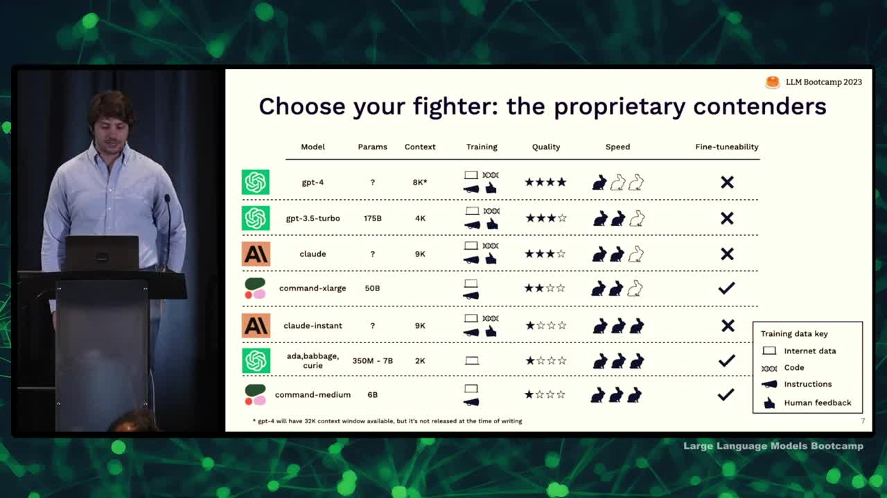
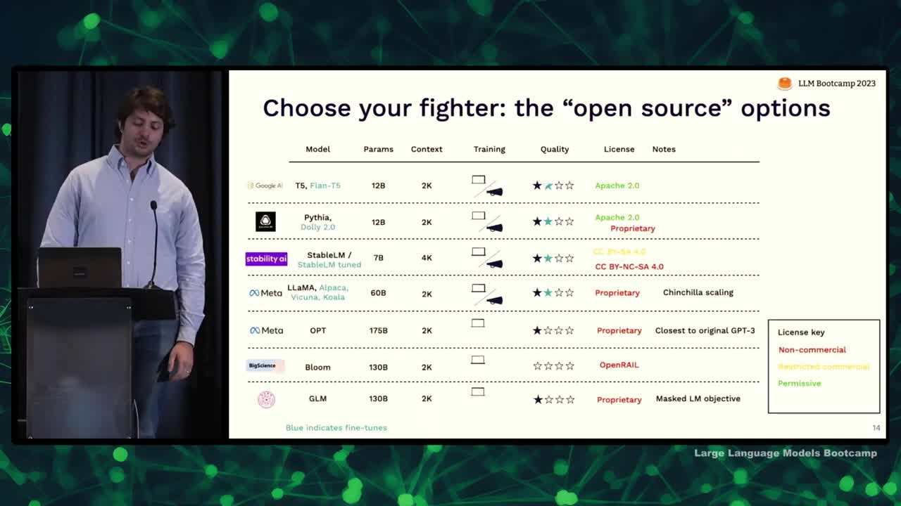
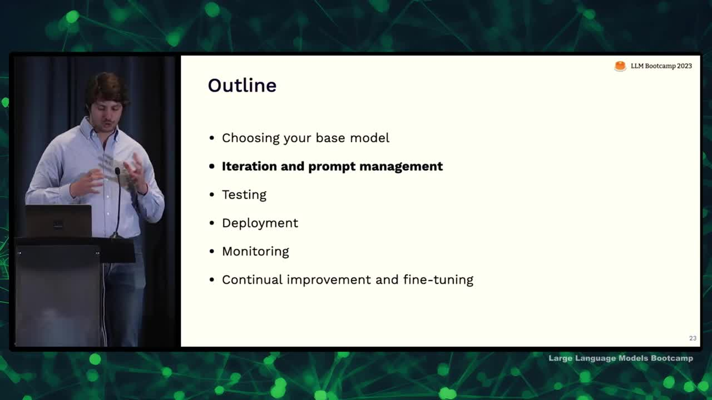
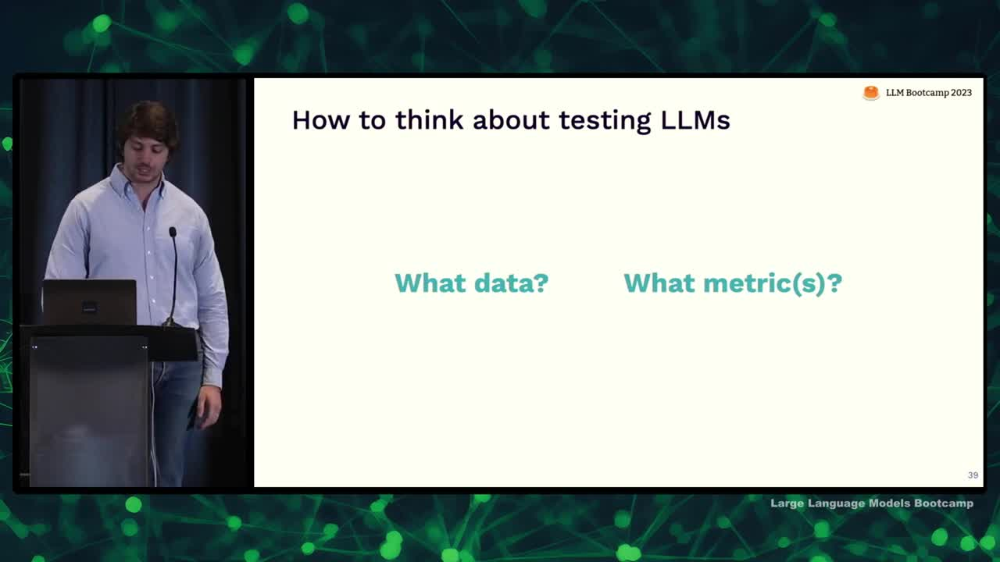
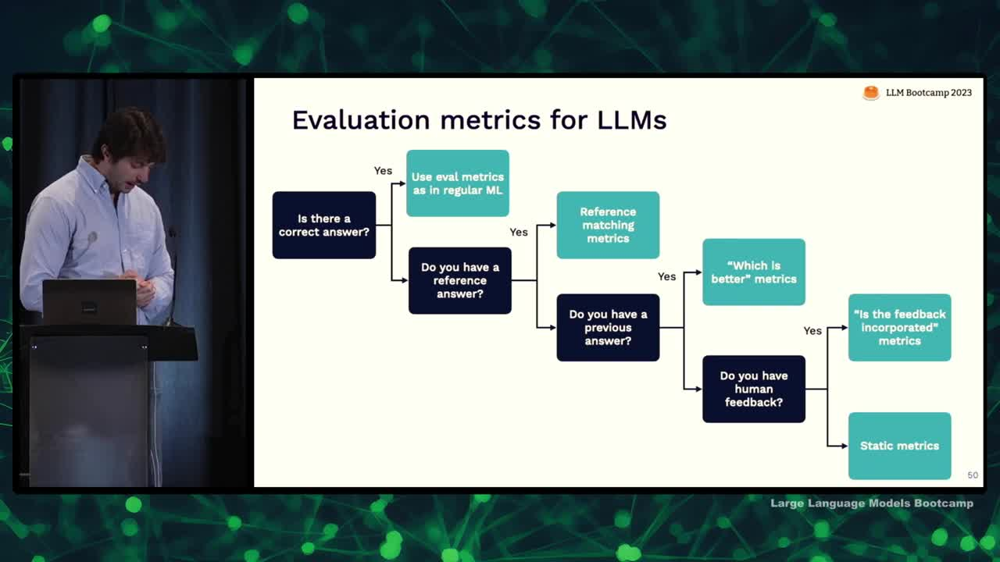
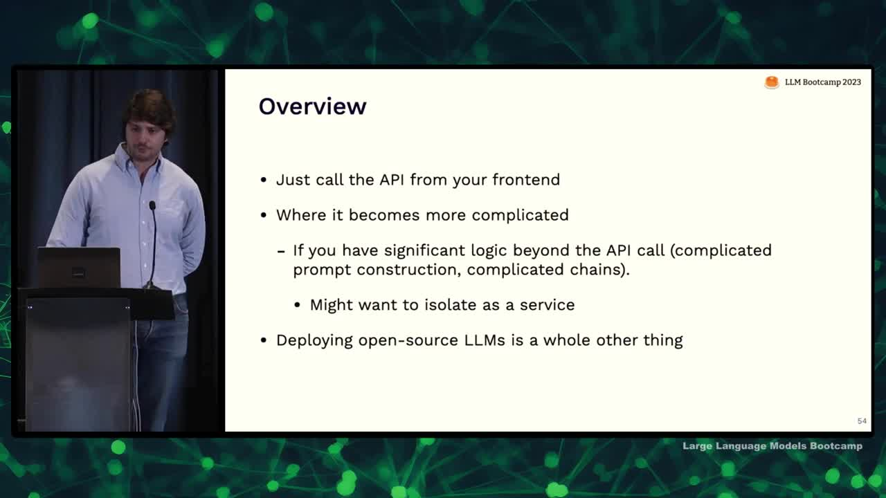
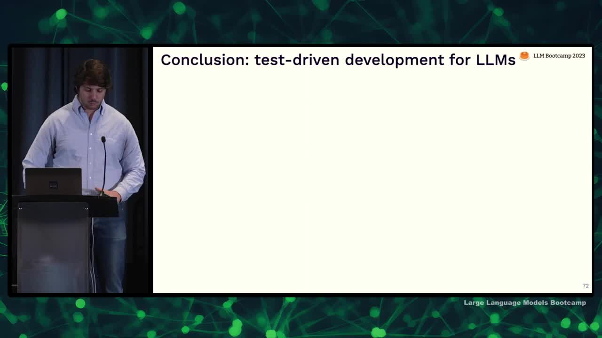

## Chapter Summaries

### Why LLMOps?

- Topic of lecture core to whole ethos of full stack deep learning
- Started five years ago in AI hype cycle focusing on deep learning
- Classes teach about building with neural networks, but not getting into production
- Philosophy carried throughout the development of courses
- Focus on building applications with language models and considerations for production systems
- Space for real production systems with language models is underdeveloped
- Lecture will cover assorted topics related to building these applications
- Provide high-level pointers, initial choices, and resources for learning more
- Aim to tie topics together into a first-pass theory for "LLMops"

### Choosing your base LLM

- Building an application on top of LLMs requires choosing which model to use; the best model depends on trade-offs, such as quality, speed, cost, tunability, and data security.
- For most use cases, GPT4 is a good starting point.
- Proprietary models, like GPT4 and Anthropic, are usually higher quality, but open source models offer more customization and better data security.
- Consider licensing when choosing an open source model: permissive licenses (e.g., Apache 2.0) offer more freedom, whereas restricted licenses limit commercial use.
- Be cautious with "open source" models released under non-commercial licenses, as they restrict commercial use and may not truly be open source.

### Proprietary LLMs

- Discussed proprietary models and ranked them using criteria: number of parameters, size of context window, type of training data, subjective quality score, speed of inference, and fine-tunability.
- Number of parameters and training data are proxies for model quality; context window crucial for model usefulness in downstream applications.
- Four types of training data: diverse, code, instructions, and human feedback; few models use all four types.
- Quality best determined using benchmarks and hands-on evaluations.
- GPT-4 recognized as the highest quality model, followed by GPT-3.5 for a faster and cheaper option.
- Claude from Anthropic and Cohere's largest model compete for quality and fine-tunability.
- For a trade-off of quality in favor of speed and cost, consider Anthropic's offering or alternatives from OpenAI and Cohere.

### Open-source LLMs

- Large language models have both proprietary and open-source options
- Open-source options include T5, Flan T5, Pythia, Dolly, Stable-LM, Llama, Alpaca, Vicuna, Koala, and Opt
- T5 and Flan-T5 have permissive licenses while other options may have license restrictions
- Llama ecosystem is well-supported by the community, but not ideal for production
- Benchmarks can mislead, assess language model performance on specific tasks
- Start projects with GPT-4 to prototype, downsize to GPT-3.5 or Claude if cost/latency is a concern
- Cohere is the best for fine-tuning among commercial providers
- Open-source may catch up with GPT-3.5 level performance by the end of the year

### Iteration and prompt management

- I believe prompt engineering is currently missing tools to make it more like engineering and less like ad hoc experimentation.
- Experiment management was impactful in the deep learning world because experiments took a long time to run and there were many parallel experiments, which prompt engineering typically doesn't have.
- I suggest three levels of tracking experiments with prompts and chains: 1) Doing nothing and using OpenAI Playground, 2) Tracking prompts in Git, and 3) Using specialized tracking tools for prompts (if necessary).
- Most teams should use Git for tracking as it's easy and fits into their current workflows.
- Specialized prompt tracking tools should be decoupled from Git and provide a UI for non-technical stakeholders.
- Keep an eye out for new tools in this space, as it's rapidly evolving with recent announcements from major providers like Weights & Biases, Comet, and MLflow.

### Testing LLMs: Why and why is it hard?

- To ensure changes to a model or prompt are effective, measure performance on a wide range of data representing end-user inputs.
- User retention for AI-powered applications depends on trust and reliable output.
- Traditional machine learning model testing involves training sets, held-out data, and measuring accuracy, but language models present unique challenges:
  - You don't know the training data used by API providers like OpenAI.
  - Production distribution is always different than training distribution.
  - Metrics are less straightforward and might not capture the diverse behaviors of the model.
- Language models require a more diverse understanding of behaviors and qualitative output measurement.

### Testing LLMs: What works?

- Two key questions for testing language models: what data to test them on and what metrics to compute on that data
- Build evaluation sets incrementally, starting from the beginning while prototyping the model
- Add interesting examples to the dataset, focusing on hard examples where the model struggles and different examples that aren't common in the dataset
- Utilize the language model to help generate diverse test cases by creating prompts for the tasks you're trying to solve
- As the model rolls out to more users, keep adding data to the dataset, considering user dislikes and underrepresented topics for inclusion
- Consider the concept of test coverage, aiming for an evaluation set that covers the types of tasks users will actually perform in the system
- Test coverage and distribution shift are analogous, but measure different aspects of data relationships
- To be effective, test reliability should measure the difference between online and offline performance, ensuring that metrics are relevant to real-world user experiences.

### Evaluation metrics for LLMs

- Evaluation metrics for language models depend on the availability of a correct answer, reference answer, previous answer, or human feedback.
- If there's a correct answer, use metrics like accuracy.
- With a reference answer, employ reference matching metrics like semantic similarity or factual consistency.
- If there's a previous answer, ask another language model which answer is better.
- When human feedback is available, check if the answer incorporates the feedback.
- If none of these options apply, verify output structure or ask the model to grade the answer.
- Although automatic evaluation is desirable for faster experimentation, manual checks still play an essential role.

### Deployment and monitoring

- Deploying LLM (Language Model) APIs can be simple, but becomes more complex if there's a lot of logic behind API calls.
- Techniques to improve LLM output quality include self-critique, sampling multiple outputs, and ensemble techniques.
- Monitoring LLMs involves looking at user satisfaction and defining performance metrics, like response length or common issues in production.
- Gather user feedback via low friction methods, such as thumbs up/down or short messages.
- Common issues with LLMs in production include UI problems, latency, incorrect answers, long-winded responses, and prompt injection attacks.
- Use user feedback to improve prompts by finding and addressing themes or problems.
- Fine-tuning LLMs can be done through supervised fine-tuning or human feedback, though the latter is more challenging.

### Test-driven development for LLMs

- Rapidly evolving field with no established best practices yet
- Aim to provide main questions and resources for building applications with LLMS
- Introduce a potential structured process: test-driven or behavior-driven development
- Main components of process are prompt/chain development, deployment, user feedback, and logging/monitoring
- Use interaction data from user feedback to improve model, extract test data, and iterate on prompts
- As complexity increases, consider fine-tuning workflow with additional training data
- Virtuous cycle of improvement as interaction data from users increases and informs subsequent iterations
- Process repeats with individual developer, team, and end-users involved in feedback and improvements

