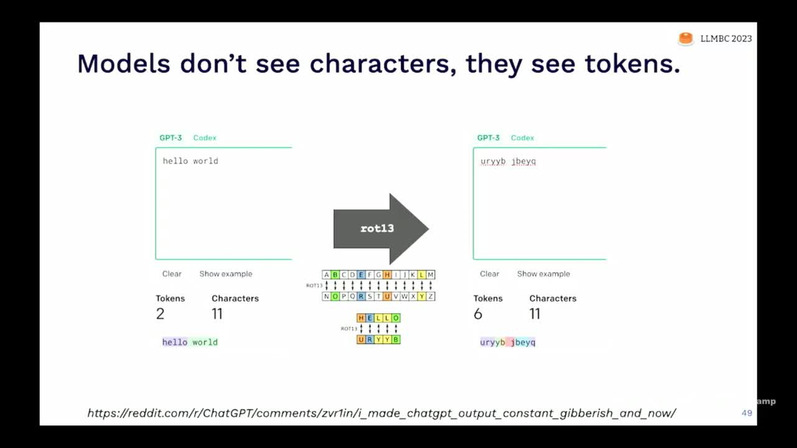
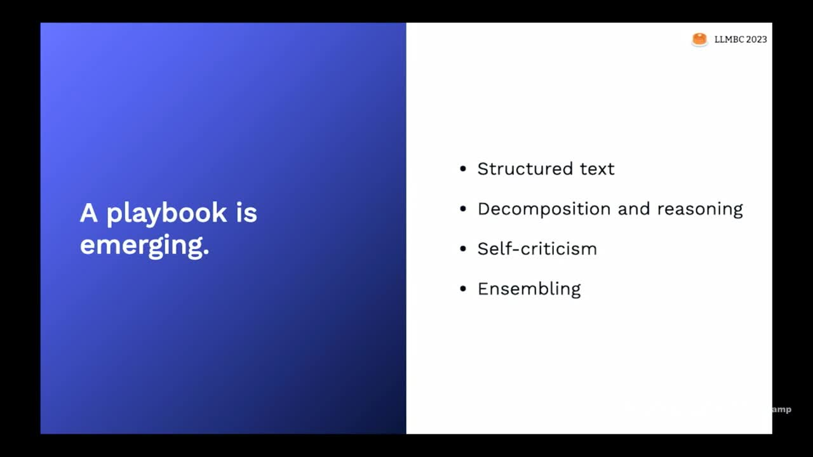

## Chapter Summaries

### Intro

- Dive into technical skills for using language models
- Focus on prompt engineering: designing text input to get desired behavior from language models
- Language models replace traditional training and fine-tuning techniques in machine learning
- Programming language models is like programming in English instead of coding languages
- High-level intuitions for prompt engineering: prompts as magic spells
- Discuss emerging playbook for effective prompting, including techniques to get desired output from language models

### Language models are statistical models of text

- Prompts are not literal magic spells; they are based on linear algebra.
- Language models are statistical models of text, similar to how a bell curve is a statistical model of data.
- Language models are trained by going through text and predicting the probability of the next word, which is called an auto-regressive model.
- These models start with random weights, eventually learning to assign high probabilities to text that resembles real-world samples.

### But "statistical model" gives bad intuition

- Language models can be thought of as statistical pattern matchers, but this can also give bad intuitions.
- Traditional simple statistical models, like linear regression, are not the best way to think about language models.
- A better intuition comes from probabilistic programs, which allow manipulation of random variables and can represent complex statistics.
- Probabilistic programs can be represented by graphical models, providing insight into complex text models.
- The Language Model Cascades paper by Dohan et al. dives into detail on probabilistic programs and their applications to language models.

### Prompts are magic spells

- Drawing inspiration from Arthur C Clarke's laws of technology, which suggests that advanced technology is similar to magic
- Prompts are like magic spells, using words to achieve impossible effects but requiring complex rules
- Spending too much time learning these complex rules can negatively impact mental health
- Three magical intuitions for using prompts: 
  1. Pre-trained models (e.g. GPT-3, Llama) - prompts are portals to alternate universes
  2. Instruction-tuned models (e.g. ChatGPT, Alpaca) - prompts are used to make wishes
  3. Agent simulation (latest language models) - prompts create a Golem

### Prompts are portals to alternate universes

- The language model creates a portal to an alternate universe where desired documents exist by weighting all possible documents based on their probability.
- The primary goal of prompting is subtractive; it focuses the mass of predictions to hone in on a specific world by conditioning the probabilistic model.
- The language model can generate text from nearby universes for similarities, but cannot provide specific or novel information from another universe (e.g., a cure for cancer).
- The model can help find ideas and documents similar to existing ones or combine ideas that haven't been combined yet.

### A prompt can make a wish come true

- Core intuition: Language models shape and sculpt from the set of all possible documents and universes; Instruction-tuned models (like ChatGPT) can respond to wishes and commands.
- An example of overcoming bias: Asking the model to ensure answers are unbiased and do not rely on stereotypes greatly improves performance.
- Be precise when prompting language models and learn the rules the "genie" operates by.
- Suggestions to improve instructional prompts:
  - Simplify and focus on low-level patterns of text rather than conversational complexity.
  - Turn descriptions into bulleted lists; language models tend to only focus on the beginning of descriptions.
  - Replace negation statements with assertions (e.g., instead of "don't be stereotyped," say, "please ensure your answer does not rely on stereotypes").
- Instruction fine-tuned models are essentially like annotators with no context; treat them as such for better performance.

### A prompt can create a golem

- Large language models can create "golems" or artificial agents with specific personas, similar to the golem creature from Jewish folklore
- Personas in language models can help improve performance on tasks like translations by putting the model into a situational context
- People have created models with detailed personas in various settings, including video game worlds
- Language models become better by internally modeling processes that produce text, such as understanding the context and environment in which utterances are made
- Natural language processing faces challenges with large language models as they may lack communicative intentions, which humans naturally have
- By designing prompts carefully, one can get a language model to simulate agents, improving its predictions and understanding of context.

### Limitations of LLMs as simulators

- Our universal simulators are trained on text humans have written, not on all data or states of the universe.
- Simulations will be related to human-written data, like fictional super intelligences (e.g. HAL 9000), not actual super intelligent AIs.
- Language models can simulate human thinking well for short timeframes (e.g. reactions to social media posts), but struggle for longer periods and personal contexts.
- Models can perform well in simulating fictional personas and can approximate calculators or interpreters, but cannot replace them or access live data.
- Wherever possible, replace weak simulators with the real deal (e.g. run Python code in an actual kernel).
- Pre-trained models are mostly alternate universe document generators, and can be agent simulators with varying quality depending on the model and agent.

### Prompting techniques are mostly tricks

- This section focuses on prompt engineering tricks and techniques.
- Many prompt engineering papers can actually be summarized in a few sentences, but they include pages of benchmark marketing.
- There isn't much depth to these tricks, unlike the core language modeling aspect which has mathematical depth.
- Two things to be cautious of: few-shot learning as an approach and potential issues with tokenization.
- I will discuss some misconceptions and provide tips for handling these issues.

### Few-shot learning isn't the right model for prompting

- Language models like GPT-3 can learn tasks from prompts, but it was unclear if they would actually be useful.
- The GPT-3 paper called these models "few-shot learners" and showed they can learn tasks like math and translation.
- However, the model often struggles to move away from pre-training knowledge.
- For example, GPT-3 tends to ignore permuted labels for sentiment analysis and sticks to its original understanding.
- Latest language models can handle permuted labels, but not perfectly, and require many examples to accomplish this.
- Treating the prompt as a way to do few-shot learning might not be an ideal approach.

### Character-level operations are hard

- Models see tokens, not characters; they struggle with tasks like rotating and reversing words
- Adding spaces between letters can change tokenization and improve performance
- GPT-4 can handle some challenges (e.g. summary with words starting with G) but still has limitations
- For tasks like string manipulation, it's better to use traditional programming instead of language models

### The prompting playbook: reasoning, reflection, & ensembling

- Language models perform well with formatted text; using structured text like pseudocode can improve results
- Decompose tasks into smaller pieces in your prompt to make the language model generate each piece; automate decomposition for better performance
- Elicit reasoning capabilities from the model by carefully tuning the prompt, such as using "Let's think step-by-step"
- Ensemble results of multiple models for more accurate answers and use randomness for greater heterogeneity in responses
- Combine prompting techniques (e.g., few-shot, Chain of Thought, ensembling) to increase performance, but be mindful of the impact on latency and compute costs

