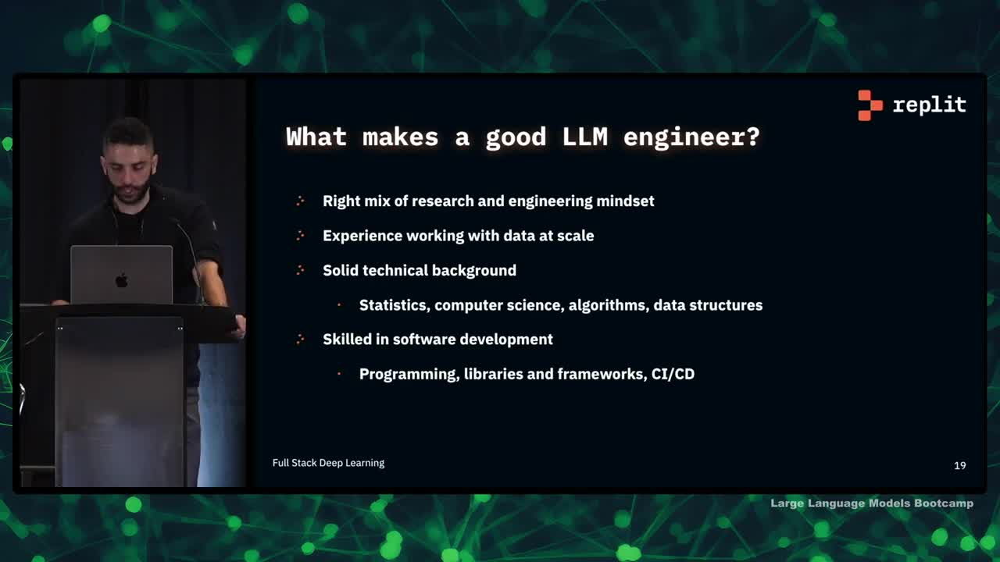

## Chapter Summaries

### Why train your own LLMs?

- Topic of the lecture: how to train large language models
- Reasons for training your own models are customization, reduce dependency, cost efficiency, data privacy and control over updates
- Lecture covers the process of training Ghostwriter code completion model
- Ghostwriter is a competitor to Co-pilot, used for code generation

### The Modern LLM Stack

- Replit uses Databricks for all of their data pipelines, including pre-processing, summary statistics, analytics transformations, and more.
- Replit also makes use of Hugging Face for data sets, pre-trained models, tokenizers, and inference tools.
- Mosaic ML is used for GPU nodes and model training, with pre-configured LLM configurations available.
- The process is divided into three stages: data processing, model training, and deployment/production.

### Data Pipelines: Databricks & Hugging Face

- The data pipeline starts with a large corpus of permissively licensed code data from The Stack.
- The data set comes from the GitHub archive and undergoes license filtering and near-deduplication.
- The data set contains programming languages in the hundreds.
- Databricks is used for processing and transformations, rather than Hugging Face tooling.
- Databricks allows for more control over the data and enables processing at scale.
- Proprietary data sources and data sets not on Hugging Face can be included in the training set.
- The process is tractable and extensible.
- Pre-processing steps are important in understanding the data set.

### Preprocessing

- Anonymizing the data is an important pre-processing step, which involves removing emails, IP addresses, and secret keys.
- Auto-generated code and minified code are also removed using regexes and other heuristics.
- Code that doesn't compile or is not parsable is removed to remove bugs and improve model training.
- The team uses filters based on average line length, maximum line length, and percentage of alphanumeric characters.
- Metrics such as the number of GitHub stars or issues do not necessarily improve model quality.
- The team also trains its own tokenizer.

### Tokenizer Training

- Tokenizers are made up of a tokenization algorithm and a vocabulary.
- Standard tokenizers are available on Hugging Face, but custom tokenizers can be trained on domain-specific data.
- A custom tokenizer can result in a smaller vocabulary, which speeds up model training and inference while capturing more relevant information.
- The tokenizer feeds back into the data pipeline and the training process, making it an integral part of the model.

### Running Training: MosaicML, Weights & Biases

- Mosaic ML provides GPUs from multiple Cloud providers at reduced prices
- They have well-tuned LLM training configurations for specific models
- The manager infrastructure is fault-tolerant and has an easy-to-use CLI for training runs
- The speaker found using Mosaic ML worth it due to these benefits
- They use Weights & Biases for logging during training runs

### Testing & Evaluation: HumanEval, Hugging Face

- Testing language models is difficult and time-consuming
- HumanEval is a common dataset for testing code generation models
- Hugging Face's code inference tool is useful for running tests quickly
- Running tests for multiple languages and certain tasks, like web completion, is more difficult
- Models need to be tested on unseen data to prevent bias
- Models can score well on tests but still not be practical or effective

### Deployment: FasterTransformer, Triton Server, k8s

- Deployment into production is a complex topic with many factors to consider
- Replit uses FasterTransformer and NVIDIA's Triton server for optimized performance
- Trton server allows for multiple model instances per GPU or multiple GPUs per model, with useful features like batching and request cancellation for reducing latency
- Auto-scaling infrastructure is used for running the models, but there are unique challenges for deployed models such as larger model sizes and specific GPU requirements
- Dealing with GPU shortages in individual zones is necessary

### Lessons learned: data-centrism, eval, and collaboration

- Data is the most difficult part of the process
- Good pipelines are important for scalability and quick iteration
- Data is a critical factor in model quality and output
- Human evaluation and user testing are important for model vibes and usefulness
- Collaboration across the team is key to ensure all moving parts are working together

### What makes a good LLM engineer?

- A good engineer in this field requires a mix of research and engineering mindset
- Working with data at scale is crucial, including the ability to move data into distributed pipelines
- A strong technical background in stats, computer science, algorithms, and data structures is important
- Skilled software development, including familiarity with libraries and frameworks like PyTorch is essential
- Engineers who appreciate and build in CI/CD help with the fast iteration loop for training models
- The replit team is hiring for these types of problems and welcomes interested applicants to speak with them about opportunities
