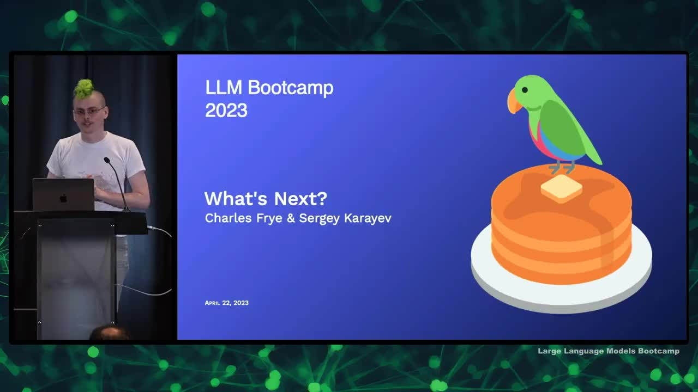
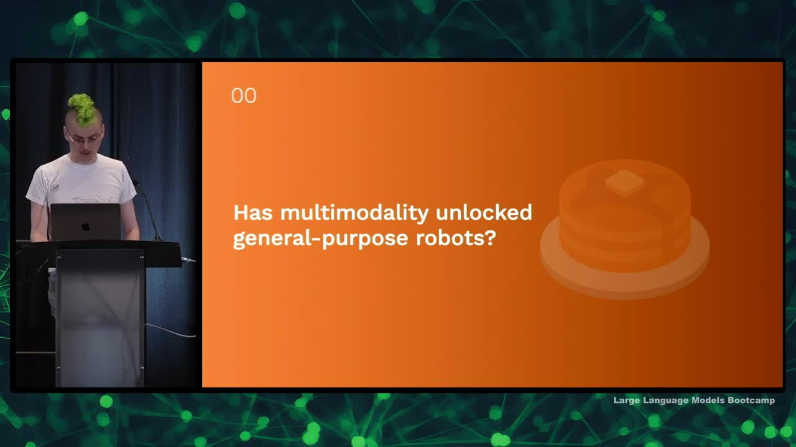
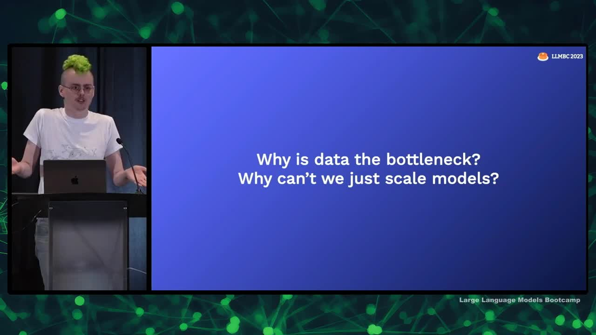

## Chapter Summaries

### Intro

- Sergey and I want to share our opinions on the future in the field of language models.
- The field moves very fast, with rapid innovation happening behind closed doors.
- We've chosen four big questions that we believe will be answered in the near future.
- I will discuss questions on robotics and scale, while Sergey will cover AGI and security/aligment of models.

### Has multimodality unlocked general-purpose robots?

- Extremely multimodal models are coming, operating on multiple types of data.
- Key application of multimodal models is general-purpose robotics.
- Vision Transformers work for vision and can combine with other Transformer models.
- Multimodal models work on both text and images, enabling more capabilities.
- Multimodal models are being applied to general-purpose robotics, giving them cognitive capabilities and improving planning.
- These models are incredibly capable and can potentially be applied to many fields beyond natural language processing and robotics.

### What are the limits of scale?

- Large models may not get much bigger; small models will improve
- Transformer architecture assumed to be used in future
- Transformers outperform recurrent networks (such as LSTMs) in training and scalability
- RWKV project could bring back RNNs with parallelized training
- Bottlenecks in creating more capable models: money, compute, and data
- Money and compute are not primary bottlenecks
- Limited availability of high-quality language data may become a bottleneck; estimates suggest we may run out between 2024 and 2026.

### Why is data the bottleneck?

- Performance improves predictably with scale, but the x-axis is computation, not model size
- Initial belief was that parameters mattered more, but recent findings show that data size and model size should be scaled at a similar pace
- No model trained on a certain amount of data can outperform one trained on more data
- To compute optimally at large scales, huge amounts of data (up to trillions of tokens) are required
- The internet may not have enough data to continue scaling indefinitely; tokens must be acquired from sources not yet digitized
- Legal barriers may limit scaling, and model scaling is likely to slow down
- Data remains a critical factor for improved model performance, and money is not the primary bottleneck

### How far can we take small models?

- Discussed compute optimality in training models for one epoch
- Nobody knows how to judge overfitting or predict multi-epoch scaling for large models
- Loss still going down in large models; needs to check validation loss
- Optimization of distribution of flops is important, but inference expenditure and model size matter too
- Possibilities to reduce parameter requirements, such as using APIs or fine-tuning smaller models on the behavior of larger ones
- Legal implications of fine-tuning unclear, but likely possible to implement legally
- Capabilities usually associated with model APIs might be available to run locally in the near future
- Optimized C++ implementations of specific models have enabled running 13 billion parameter models on Raspberry Pi or previous generation Android phones
- Expect consumer laptops to run multi-modal models (vision and language) with 12 billion parameters in the next 1-3 years.

### Could AGI already be here?

- It is possible that we already have everything we need for AGI (Artificial General Intelligence) with existing models like GPT-4.
- Existing models may be good enough to self-improve in an autonomous way, and it takes time to discover their full potential.
- Large language models can be better at writing their own prompts than human prompt engineers, leading to better self-improvement.
- Teaching models to self-debug and run code is a promising approach for achieving AGI.
- The AutoGPT project and similar efforts are dedicating substantial energy to exploring these models' potential.
- A new paradigm could emerge involving models like GPT-4 as a new type of computer or programming language, leading to AGI once we learn to work well with them.

### Can we make it safe?

- There are concerns about the security of AI models, including issues with prompt injection and user inputs that can override prompts, potentially revealing sensitive information.
- AI models have potential risks, including their ability to write code and manipulate the physical world through human actions or hacking.
- The reasons for AI to potentially act harmfully may include self-preservation or resource acquisition, and currently, we do not know how to make AI truly care about people.
- There are various theories for why we might not need to worry about AI dangers, including the hot mess theory (AIs are super intelligent but not coherent), the "only way out is through" theory (developing AI responsibly and democratically to prevent malicious usage), and the "it'll just work out" theory (historically, technology has worked out in the end).
- OpenAI's perspective is to continue developing AI models, learn from their deployment, and create mitigation methods as they release increasingly powerful models.
- There are varying viewpoints on whether or when we should halt AI development due to the potential dangers it poses.

